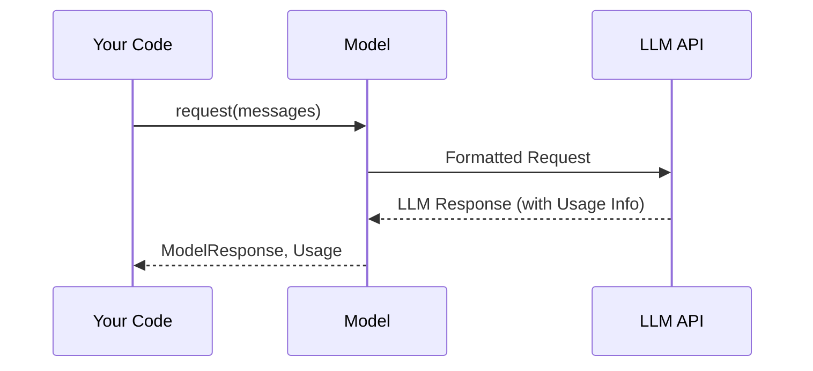

# Chapter 4: Usage

In the previous chapter, [ModelRequest/Response](03_modelrequest_response.md), you learned how to send requests to and receive responses from language models. But have you ever wondered how much your requests *cost* in terms of resources? That's where the `Usage` abstraction comes in!

Imagine you're paying for electricity. You want to know how much energy you've used to avoid surprises on your bill.  `Usage` in `pydantic-ai` is like a utility meter for language models. It keeps track of the number of requests you've made and the number of "tokens" (words or parts of words) the model has processed. This helps you understand and manage your LLM costs.

## What is Usage?

The `Usage` object provides information about the resources consumed during a language model request or run. Think of it as a report card showing how much "work" the model did for you. Key pieces of information it provides include:

*   **Requests:** The number of times you've called the language model API.
*   **Request Tokens:** The number of tokens in your input (the question you ask).
*   **Response Tokens:** The number of tokens in the model's output (the answer you receive).
*   **Total Tokens:** The sum of request and response tokens.
*   **Details:** Any extra information (as a dictionary) provided by the model (specific to the model).

Tokens are important because many language model APIs charge based on the number of tokens used.  Knowing your token usage helps you estimate your costs.

## Using Usage

Let's go back to a previous example and see how `Usage` is returned when we use a [Model](01_model.md).

```python
from pydantic_ai import Model, ModelMessage

model = Model(model='openai:gpt-3.5-turbo')

messages = [
    ModelMessage(role='user', content='What is the capital of France?')
]

response, usage = await model.request(messages=messages, model_settings=None, model_request_parameters=None)
print(f"Model Response: {response.content}")
print(f"Usage: {usage}")
```

In this example, we call the `request` method of the [Model](01_model.md) object. As you might remember, the `request` method returns *two* things: the `ModelResponse` and the `Usage` object. We capture both in the line `response, usage = await model.request(...)`.

The `usage` variable now holds a `Usage` object containing information about the resources used for this specific request. The output might look like this (the exact numbers will vary):

```
Model Response: Paris.
Usage: Usage(requests=1, request_tokens=12, response_tokens=3, total_tokens=15, details=None)
```

This tells us that we made 1 request, our question had 12 tokens, the answer had 3 tokens, and the total token count was 15.

Here's another example, where the model gives some specific token details:

```python
from pydantic_ai import Model, ModelMessage

model = Model(model='openai:gpt-3.5-turbo')

messages = [
    ModelMessage(role='user', content='Tell me a short story about a cat.')
]

response, usage = await model.request(messages=messages, model_settings=None, model_request_parameters=None)
print(f"Model Response: {response.content}")
print(f"Usage: {usage}")
print(f"Request Tokens: {usage.request_tokens}")
print(f"Response Tokens: {usage.response_tokens}")
```

The output could be similar to this:

```
Model Response: Once upon a time, there was a fluffy cat named Whiskers...
Usage: Usage(requests=1, request_tokens=14, response_tokens=45, total_tokens=59, details=None)
Request Tokens: 14
Response Tokens: 45
```

We can also use the `Usage` object to track the total resources used across multiple requests.

```python
from pydantic_ai import Model, ModelMessage, Usage

model = Model(model='openai:gpt-3.5-turbo')

total_usage = Usage()  # Initialize an empty Usage object

messages1 = [
    ModelMessage(role='user', content='What is the capital of France?')
]
response1, usage1 = await model.request(messages=messages1, model_settings=None, model_request_parameters=None)
total_usage.incr(usage1)

messages2 = [
    ModelMessage(role='user', content='What is the capital of Germany?')
]
response2, usage2 = await model.request(messages=messages2, model_settings=None, model_request_parameters=None)
total_usage.incr(usage2)

print(f"Total Usage: {total_usage}")
```

Here, we initialize a `Usage` object called `total_usage`.  After each request, we call the `incr` method to add the usage information to the `total_usage` object. The final output displays the cumulative usage across both requests. This allows to know the total token usage across several requests.

## Diving Deeper: Internal Implementation

Let's take a look at how `Usage` is handled internally within `pydantic-ai`.

Here's a simplified sequence diagram:



1.  **Your Code:** You call the `request` method of the [Model](01_model.md) object.
2.  **Model:** The [Model](01_model.md) sends a formatted request to the LLM API (e.g., OpenAI).
3.  **LLM API:** The LLM API processes the request and returns a response, including usage information (like token counts).
4.  **Model:** The [Model](01_model.md) parses the response from the LLM API, extracts the usage information, and creates a `Usage` object.
5.  **Your Code:** The [Model](01_model.md) returns both the `ModelResponse` and the `Usage` object to your code.

Now, let's look at some code snippets from `pydantic_ai_slim/pydantic_ai/usage.py`.

Here's the definition of the `Usage` class:

```python
from dataclasses import dataclass

@dataclass
class Usage:
    """LLM usage associated with a request or run."""

    requests: int = 0
    """Number of requests made to the LLM API."""
    request_tokens: int | None = None
    """Tokens used in processing requests."""
    response_tokens: int | None = None
    """Tokens used in generating responses."""
    total_tokens: int | None = None
    """Total tokens used in the whole run, should generally be equal to `request_tokens + response_tokens`."""
    details: dict[str, int] | None = None
    """Any extra details returned by the model."""
```

The `Usage` class is a simple data container. It has fields for the number of requests, request tokens, response tokens, total tokens, and any extra details provided by the model.

The `incr` method allows you to increment the usage information:

```python
    def incr(self, incr_usage: Usage, *, requests: int = 0) -> None:
        """Increment the usage in place."""
        self.requests += requests
        for f in 'requests', 'request_tokens', 'response_tokens', 'total_tokens':
            self_value = getattr(self, f)
            other_value = getattr(incr_usage, f)
            if self_value is not None or other_value is not None:
                setattr(self, f, (self_value or 0) + (other_value or 0))

        if incr_usage.details:
            self.details = self.details or {}
            for key, value in incr_usage.details.items():
                self.details[key] = self.details.get(key, 0) + value
```

This method adds the usage information from another `Usage` object to the current object. It iterates through the fields and increments the values accordingly.

## Conclusion

In this chapter, you've learned about the `Usage` abstraction and how it provides information about the resources consumed by language models. You've seen how to access the `Usage` object after making a request and how to use it to track the total resources used across multiple requests. Understanding `Usage` helps you estimate and manage your LLM costs.

In the next chapter, we'll explore the [Agent](05_agent.md) abstraction, which represents an intelligent agent that can interact with the world using language models.


---

Generated by [AI Codebase Knowledge Builder](https://github.com/The-Pocket/Tutorial-Codebase-Knowledge)