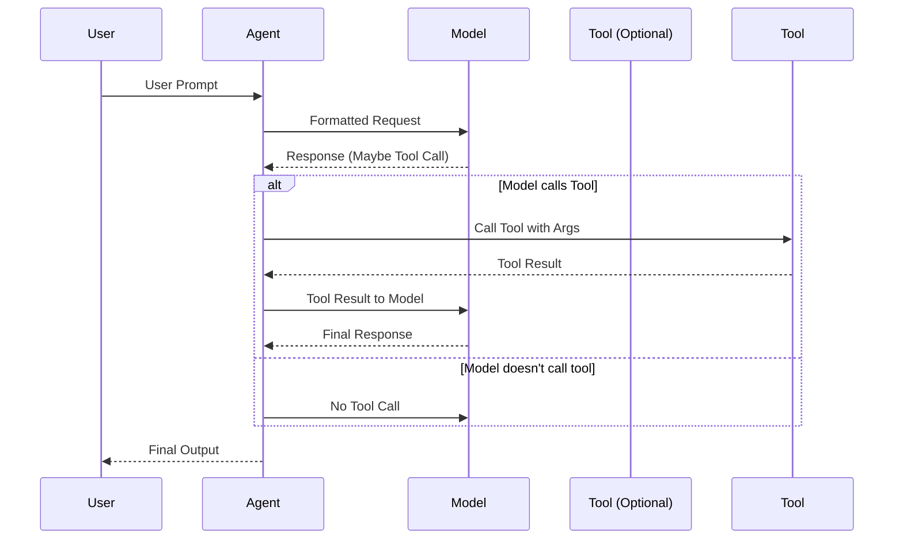

# Chapter 5: Agent

In the previous chapter, [Usage](04_usage.md), you learned how to track the costs associated with using language models. Now, let's move on to the heart of `pydantic-ai`: the `Agent`.

Imagine you have a complex task, like planning a trip. You wouldn't just ask a language model a single question. You'd need a system that can:

1.  Understand your overall goal ("Plan a trip to Paris").
2.  Break down the goal into smaller steps (research flights, find hotels, suggest activities).
3.  Use tools to gather information (search for flights, check hotel availability).
4.  Combine the information and provide a final result (a detailed itinerary).

The `Agent` abstraction is designed to handle exactly these kinds of scenarios. It's like a skilled worker who receives instructions, uses tools if necessary, and delivers a final result. You define the worker's skills (system prompts, tools) and what type of result you expect.

## What is an Agent?

At its core, an `Agent` in `pydantic-ai` represents an intelligent entity that can interact with language models and tools to achieve a specific goal. Think of it as a central orchestrator that manages complex interactions. Key aspects of the `Agent` abstraction include:

*   **Orchestration:** It defines the workflow for interacting with language models and tools.
*   **Planning:** It breaks down complex tasks into smaller, manageable steps.
*   **Execution:** It executes the steps in the workflow, using language models and tools as needed.
*   **Result Delivery:** It combines the information gathered and provides a final result.

## Using an Agent

Let's start with a simple example. Suppose we want to create an agent that can answer questions.

```python
from pydantic_ai import Agent

agent = Agent(model='openai:gpt-3.5-turbo')

result = agent.run_sync('What is the capital of France?')
print(result.output) # Expected: "Paris."
```

In this code, we create an `Agent` object, specifying that we want to use the `gpt-3.5-turbo` model. Then, we call the `run_sync` method with the question "What is the capital of France?". The `run_sync` method sends the question to the language model and returns the answer.

Now, let's make the agent a bit more sophisticated by adding a system prompt. A system prompt is a set of instructions that tells the language model how to behave.

```python
from pydantic_ai import Agent

agent = Agent(
    model='openai:gpt-3.5-turbo',
    system_prompt='Answer the question concisely, using only one word.'
)

result = agent.run_sync('What is the capital of France?')
print(result.output) # Expected: "Paris"
```

In this code, we add a `system_prompt` parameter to the `Agent` constructor. This tells the language model to answer the question concisely, using only one word. As a result, the language model will return "Paris" instead of "The capital of France is Paris".

Finally, let's add a tool to the agent. A tool is a function that the language model can call to gather information.

```python
from pydantic_ai import Agent, RunContext

def get_current_weather(ctx: RunContext, location: str) -> str:
    """Returns the current weather in a given location."""
    # In a real application, this would call a weather API.
    if location == 'London':
        return 'The weather in London is sunny and 20 degrees Celsius.'
    else:
        return 'Weather information is not available for that location.'

agent = Agent(model='openai:gpt-3.5-turbo')

agent.tool(get_current_weather)

result = agent.run_sync('What is the weather in London?')
print(result.output) # Expected: "The weather in London is sunny and 20 degrees Celsius."
```

In this code, we define a `get_current_weather` function that returns the current weather in a given location. Then, we call the `tool` method of the `Agent` object to register the function as a tool. As a result, the language model will be able to call the `get_current_weather` function to get the current weather in London.

## Diving Deeper: Internal Implementation

To better understand how the `Agent` abstraction works, let's take a peek under the hood. The following diagram illustrates the steps involved when you call the `run` method:



1.  **User Prompt:** The process begins when you, the user, provide a prompt or question.
2.  **Formatted Request:** The `Agent` formats this request, creates a `ModelRequest` and passes it to a [Model](01_model.md).
3.  **Response (Maybe Tool Call):** The [Model](01_model.md) might send back a message that it wants to call a Tool
4.  **Tool Call:** If the [Model](01_model.md) asks to call a Tool, the Agent calls the Tool with the appropriate arguments.
5.  **Tool Result:** The Tool finishes execution and returns the output to the Agent. The Agent then provides this output to the Model.
6.  **Final Output:** The model's response is returned to the Agent, which processes the response and delivers a user-friendly output to the user.

Let's look at a simplified code snippet from `pydantic_ai_slim/pydantic_ai/agent.py` to see how the `Agent` class is defined:

```python
from dataclasses import dataclass
from typing import Generic, TypeVar

from pydantic_ai.models import Model
from pydantic_ai.tools import RunContext, Tool

AgentDepsT = TypeVar('AgentDepsT')
OutputDataT = TypeVar('OutputDataT')

@dataclass
class Agent(Generic[AgentDepsT, OutputDataT]):
    model: Model | None
    system_prompt: str | None = None
    # Other parameters omitted for brevity

    def tool(self, func):
        # Register a tool function
        pass

    def run_sync(self, prompt: str):
        # Run the agent synchronously
        pass
```

This code defines the `Agent` class with parameters for the model, system prompt, and tools. The `tool` method is used to register a tool function, and the `run_sync` method is used to run the agent synchronously.

## Conclusion

In this chapter, you've learned about the `Agent` abstraction in `pydantic-ai`. You've seen how it represents an intelligent agent that can interact with language models and tools to achieve a specific goal. You've also seen how to create an `Agent` object, add system prompts and tools, and run the agent synchronously.

In the next chapter, we'll explore the [Tool](06_tool.md) abstraction in more detail.


---

Generated by [AI Codebase Knowledge Builder](https://github.com/The-Pocket/Tutorial-Codebase-Knowledge)