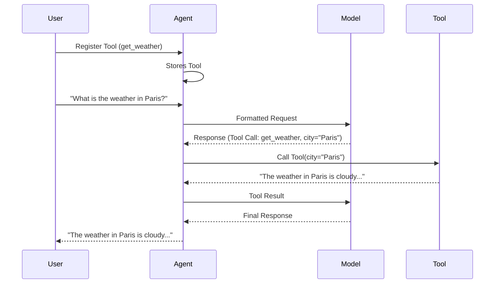

# Chapter 6: Tool

In the previous chapter, [Agent](05_agent.md), you learned how to create an intelligent agent that can interact with language models. But what if your agent needs to do more than just answer questions? What if it needs to perform actions, like searching the web or sending an email? That's where `Tool`s come in!

Imagine your agent is a Swiss Army knife. The `Agent` itself is the handle and main blade, but the `Tool`s are all the extra attachments – the screwdriver, the bottle opener, the saw – that allow it to handle a wider range of tasks.

## What is a Tool?

`Tool`s are functions that the `Agent` can use to augment its knowledge or perform actions. Think of them as specialized tools in a worker's toolbox, allowing them to gather information, interact with external systems, and ultimately produce a better result. They are defined and called within agents.

Key aspects of `Tool`s:

*   **Augmentation:** `Tool`s allow the `Agent` to access information or capabilities beyond its initial knowledge.
*   **Action:** `Tool`s enable the `Agent` to perform actions in the real world, like sending emails or controlling devices.
*   **Specialization:** Each `Tool` is designed for a specific purpose, making it easier to manage complex tasks.

Let's say you want to build an agent that can plan a trip for you. This agent would need `Tool`s for:

*   Searching for flights
*   Finding hotels
*   Looking up restaurants
*   Checking the weather

Each of these `Tool`s would be a separate function that the agent can call when needed.

## Using a Tool

Let's start with a simple example: creating a `Tool` that tells you the current time.

```python
from pydantic_ai import Agent, RunContext

def get_current_time(ctx: RunContext) -> str:
    """Returns the current time."""
    import datetime
    now = datetime.datetime.now()
    return now.strftime("%H:%M:%S")

agent = Agent(model='openai:gpt-3.5-turbo')
agent.tool(get_current_time)

result = agent.run_sync('What time is it?')
print(result.output) # Expected: something like "The current time is 14:30:00"
```

In this code, we define a function `get_current_time` that returns the current time. We then register this function as a `Tool` with the `Agent` using `agent.tool(get_current_time)`. Now, when we ask the agent "What time is it?", it will use the `get_current_time` `Tool` to get the current time and include it in its response. The agent recognizes the need for the tool from the prompt and calls the tool automatically.

Let's look at a slightly more complex example, where the `Tool` takes an argument:

```python
from pydantic_ai import Agent, RunContext

def get_weather(ctx: RunContext, city: str) -> str:
    """Returns the current weather in a given city.

    Args:
        city: The city to get the weather for.
    """
    # In a real application, this would call a weather API.
    if city == 'London':
        return 'The weather in London is sunny and 20 degrees Celsius.'
    elif city == 'Paris':
        return 'The weather in Paris is cloudy and 18 degrees Celsius.'
    else:
        return 'Weather information is not available for that city.'

agent = Agent(model='openai:gpt-3.5-turbo')
agent.tool(get_weather)

result = agent.run_sync('What is the weather in Paris?')
print(result.output)  # Expected: "The weather in Paris is cloudy and 18 degrees Celsius."
```

In this example, the `get_weather` function takes a `city` argument. The agent is smart enough to recognize that it needs to provide a value for this argument when calling the `Tool`. It extracts the city name "Paris" from the user's prompt and passes it to the `get_weather` function.

## Diving Deeper: Internal Implementation

Let's take a look at what happens internally when you register and use a `Tool`.

Here's a simplified sequence diagram:



1.  **Register Tool:** You register a `Tool` (e.g., `get_weather`) with the `Agent` using `agent.tool()`. The agent stores this tool internally.
2.  **User Prompt:** You ask the agent a question that requires using the registered `Tool` (e.g., "What is the weather in Paris?").
3.  **Formatted Request:** The `Agent` sends a formatted request to the [Model](01_model.md).
4.  **Response (Tool Call):** The [Model](01_model.md) analyzes the prompt and determines that it needs to use the `get_weather` `Tool` to answer the question. It responds with a message indicating a `Tool` call and providing the necessary arguments (e.g., `city="Paris"`).
5.  **Call Tool:** The `Agent` receives the `Tool` call message and executes the `get_weather` function with the provided arguments.
6.  **Tool Result:** The `get_weather` function returns the weather information.
7.  **Tool Result to Model:** The result from the Tool is provided back to the Model
8.  **Final Response:**  The Model constructs a final response that incorporates the Tool result
9.  **User Output:** The `Agent` provides the final response to the user.

Now, let's look at a simplified code snippet from `pydantic_ai_slim/pydantic_ai/tools.py` to see how the `Tool` class is defined:

```python
from dataclasses import dataclass

@dataclass
class Tool:
    function: callable
    # Other parameters omitted for brevity
```

This code defines the `Tool` class with a parameter for the function that will be called. There are more parameters on the full `Tool` class, but this shows the general idea.

The `Agent` class has a `tool` method that is used to register a `Tool` with the agent. When the agent receives a message from the [Model](01_model.md) indicating that a `Tool` should be called, it looks up the corresponding `Tool` object and executes its function.

## Conclusion

In this chapter, you've learned about the `Tool` abstraction in `pydantic-ai`. You've seen how `Tool`s can augment the capabilities of an `Agent` by providing access to external information and actions. You've also seen how to define and register `Tool`s with an `Agent`, and how the agent uses them to answer questions and perform tasks.

In the next chapter, we'll explore the [ToolDefinition](07_tooldefinition.md) abstraction in more detail.


---

Generated by [AI Codebase Knowledge Builder](https://github.com/The-Pocket/Tutorial-Codebase-Knowledge)