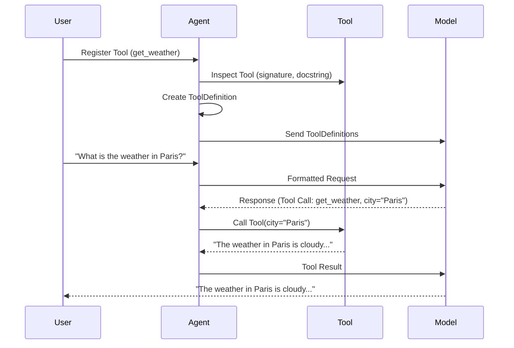

# Chapter 7: ToolDefinition

In the previous chapter, [Tool](06_tool.md), you learned how to create `Tool`s that your agent can use to perform specific tasks. But how does the [Model](01_model.md) actually know *what* the `Tool` does, what arguments it needs, and how to use it? That's where `ToolDefinition` comes in!

Imagine you're giving instructions to a robot. You need to tell it not only *what* to do (the `Tool` itself) but also *how* to do it (the `ToolDefinition`). The `ToolDefinition` is like a blueprint for the `Tool`, providing all the necessary information for the [Model](01_model.md) to use it effectively.

## What is a ToolDefinition?

A `ToolDefinition` is a data structure that describes a `Tool` to the [Model](01_model.md). It's like a recipe card for a function, telling the model:

*   **Name:** What's the `Tool` called? (e.g., "get_weather")
*   **Description:** What does the `Tool` do? (e.g., "Returns the current weather in a given city.")
*   **Parameters:** What information does the `Tool` need to work? (e.g., a "city" parameter of type string)

Essentially, it's a standardized way to represent the `Tool`'s interface, so the [Model](01_model.md) can understand how to call it.  `ToolDefinition` ensures the model can correctly interact with various tools by providing a common language to describe them.

## Key Concepts

Let's break down the key parts of a `ToolDefinition`:

*   **Name:** A unique identifier for the `Tool`. This is how the [Model](01_model.md) will refer to the `Tool` when it wants to use it.
*   **Description:** A human-readable explanation of what the `Tool` does. This helps the [Model](01_model.md) decide when to use the `Tool`.
*   **Parameters (parameters_json_schema):** A description of the inputs the `Tool` requires. This is specified using a JSON schema, which defines the name, type, and any other constraints for each parameter.
*   **outer_typed_dict_key (Optional):** Only useful for output tools. For example, consider if the response from a model is `{"response": "Hello"}`, this will say that the useful part of the response is the `response` value.
*   **strict (Optional):** A flag for extra validation on JSON schemas.

## Using ToolDefinition

You typically don't create `ToolDefinition` objects directly. Instead, `pydantic-ai` automatically generates them for you when you register a `Tool` with an [Agent](05_agent.md) using `agent.tool()`.  The framework inspects your function and creates the `ToolDefinition` based on its signature and docstring.

Let's revisit our weather `Tool` example:

```python
from pydantic_ai import Agent, RunContext

def get_weather(ctx: RunContext, city: str) -> str:
    """Returns the current weather in a given city.

    Args:
        city: The city to get the weather for.
    """
    # In a real application, this would call a weather API.
    if city == 'London':
        return 'The weather in London is sunny and 20 degrees Celsius.'
    elif city == 'Paris':
        return 'The weather in Paris is cloudy and 18 degrees Celsius.'
    else:
        return 'Weather information is not available for that city.'

agent = Agent(model='openai:gpt-3.5-turbo')
agent.tool(get_weather)

result = agent.run_sync('What is the weather in Paris?')
print(result.output)
```

In this code, when you call `agent.tool(get_weather)`, `pydantic-ai` automatically creates a `ToolDefinition` for the `get_weather` function. This `ToolDefinition` will contain:

*   **Name:** "get_weather"
*   **Description:** "Returns the current weather in a given city."
*   **Parameters:** A JSON schema that specifies that the `get_weather` function expects a single parameter named "city" of type "string".

The [Model](01_model.md) uses this `ToolDefinition` to understand how to call the `get_weather` function when you ask "What is the weather in Paris?". It knows that it needs to provide a value for the "city" parameter, and it extracts the city name "Paris" from your prompt.

## Diving Deeper: Internal Implementation

Let's explore how `ToolDefinition` is used internally.

Here's a simplified sequence diagram:



1.  **Register Tool:** You register a `Tool` with the [Agent](05_agent.md).
2.  **Inspect Tool:** The [Agent](05_agent.md) inspects the `Tool`'s signature and docstring to extract information about its parameters and purpose.
3.  **Create ToolDefinition:** The [Agent](05_agent.md) creates a `ToolDefinition` object based on the information extracted from the `Tool`.
4.  **Send ToolDefinitions:** Before processing a user's request, the Agent sends the collection of ToolDefinitions to the Model. This allows the Model to understand the capabilities of each registered tool.
5.  **User Prompt:** You ask the agent a question that requires using the registered `Tool` (e.g., "What is the weather in Paris?").
6.  **Formatted Request:** The [Agent](05_agent.md) sends a formatted request to the [Model](01_model.md).
7.  **Response (Tool Call):** The [Model](01_model.md) analyzes the prompt and, *using the ToolDefinitions*, determines that it needs to use the `get_weather` `Tool` to answer the question. It responds with a message indicating a `Tool` call and providing the necessary arguments (e.g., `city="Paris"`).
8.  **Call Tool:** The [Agent](05_agent.md) receives the `Tool` call message and executes the `get_weather` function with the provided arguments.
9.  **User Output:** The [Agent](05_agent.md) provides the final response to the user.

Now, let's look at the code where the `ToolDefinition` class is defined (from `pydantic_ai_slim/pydantic_ai/tools.py`):

```python
from dataclasses import dataclass

@dataclass
class ToolDefinition:
    """Definition of a tool passed to a model.

    This is used for both function tools and output tools.
    """

    name: str
    """The name of the tool."""

    description: str
    """The description of the tool."""

    parameters_json_schema: ObjectJsonSchema
    """The JSON schema for the tool's parameters."""

    outer_typed_dict_key: str | None = None
    """The key in the outer [TypedDict] that wraps an output tool.

    This will only be set for output tools which don't have an `object` JSON schema.
    """

    strict: bool | None = None
    """Whether to enforce (vendor-specific) strict JSON schema validation for tool calls."""
```

This code defines the `ToolDefinition` class with fields for the name, description, and parameters of the `Tool`.

## Conclusion

In this chapter, you've learned about the `ToolDefinition` abstraction and how it provides a standardized way to describe `Tool`s to the [Model](01_model.md). You've seen how `pydantic-ai` automatically generates `ToolDefinition` objects when you register `Tool`s with an [Agent](05_agent.md), and how the [Model](01_model.md) uses these definitions to understand how to call the `Tool`s effectively.

In the next chapter, we'll explore the [RunContext](08_runcontext.md) abstraction in more detail.


---

Generated by [AI Codebase Knowledge Builder](https://github.com/The-Pocket/Tutorial-Codebase-Knowledge)