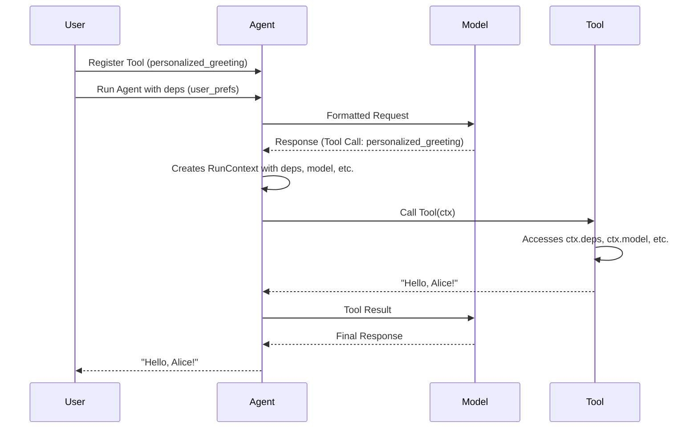

# Chapter 8: RunContext

In the previous chapter, [ToolDefinition](07_tooldefinition.md), you learned how `ToolDefinition`s help language models understand how to use your `Tool`s. Now, let's talk about something that helps your `Tool`s access information they need *during* a run: the `RunContext`.

Imagine you're a detective investigating a case. You have your tools (like a magnifying glass and a notepad), but you also need access to the case file, witness statements, and maybe even connections to other detectives. `RunContext` is like that detective's case file – it's a container holding all the information and connections a `Tool` might need to do its job during a specific run.

## What is RunContext?

`RunContext` provides contextual information within system prompts and `Tool`s during an agent's run. Think of it as a folder containing everything the worker needs to do their job, including access to external data, connections, and settings for the current request.

Key aspects of `RunContext`:

*   **Dependencies (deps):** Allows you to pass data into the agent that can be accessed by tools. Think of this as custom settings for the agent's current task.
*   **Model:** The [Model](01_model.md) that is being used during the agent's run. Useful if a tool needs to adjust its behavior based on the model.
*   **Usage:** The [Usage](04_usage.md) information for the current run. Allows a tool to track resource consumption.
*   **Messages:** The list of messages exchanged in the conversation so far. Enables tools to access the conversation history.
*   **Tool Information:** Information about the current tool call (if the tool is being called).
*   **Retry Count:** The number of times the tool has been retried.

Essentially, `RunContext` is a central hub for information that `Tool`s can use to make decisions and perform actions.

## Using RunContext

Let's illustrate how to use `RunContext` with a practical example. Suppose we want to build an agent that can provide personalized greetings based on user preferences. We'll use `RunContext` to pass the user's name and preferred greeting style to a `Tool`.

```python
from pydantic_ai import Agent, RunContext
from typing import Literal

# Define a type for our dependencies
UserPreferences = dict[str, str]

agent = Agent[UserPreferences, str](  # type: ignore
    model='openai:gpt-3.5-turbo',
    deps_type=UserPreferences,
)

def personalized_greeting(ctx: RunContext[UserPreferences]) -> str:
    """Returns a personalized greeting."""
    name = ctx.deps.get('name', 'User')
    style = ctx.deps.get('style', 'friendly')

    if style == 'formal':
        return f"Good day, {name}."
    else:
        return f"Hello, {name}!"

agent.tool(personalized_greeting)

user_prefs = {'name': 'Alice', 'style': 'formal'}
result = agent.run_sync('Please greet me.', deps=user_prefs)
print(result.output)  # Expected: "Good day, Alice."

user_prefs = {'name': 'Bob', 'style': 'friendly'}
result = agent.run_sync('Please greet me.', deps=user_prefs)
print(result.output)  # Expected: "Hello, Bob!"
```

In this code:

1.  We define a `UserPreferences` type as a `dict[str, str]` to hold the user's name and greeting style. We also specify the `deps_type` of `Agent` as `UserPreferences`.
2.  The `personalized_greeting` function takes a `RunContext` object as its first argument.
3.  Inside the function, we access the user's name and preferred greeting style from the `ctx.deps` dictionary.
4.  We then use these values to construct a personalized greeting.
5.  When calling `agent.run_sync`, we pass the `user_prefs` dictionary to the `deps` argument.
6.  The agent then calls the `personalized_greeting` tool, passing in a `RunContext` object containing the user's preferences.

This demonstrates how `RunContext` can be used to pass information to `Tool`s, allowing them to adapt their behavior based on the current context.

Let's look at another example, demonstrating how a `Tool` can access the model name from the `RunContext`:

```python
from pydantic_ai import Agent, RunContext

agent = Agent(model='openai:gpt-3.5-turbo')

def get_model_name(ctx: RunContext) -> str:
    """Returns the name of the model being used."""
    return ctx.model.model_name

agent.tool(get_model_name)

result = agent.run_sync('What model is being used?')
print(result.output)  # Expected: "gpt-3.5-turbo"
```

In this example, the `get_model_name` tool accesses the model name from the `ctx.model` object and returns it.

## Diving Deeper: Internal Implementation

Let's take a look at how `RunContext` is used internally within `pydantic-ai`.

Here's a simplified sequence diagram:



1.  **Register Tool:** You register a `Tool` (e.g., `personalized_greeting`) with the [Agent](05_agent.md).
2.  **Run Agent with deps:** You call `agent.run_sync` with a `deps` argument.
3.  **Formatted Request:** The [Agent](05_agent.md) sends a formatted request to the [Model](01_model.md).
4.  **Response (Tool Call):** The [Model](01_model.md) analyzes the prompt and determines that it needs to use the `personalized_greeting` `Tool`.
5.  **Creates RunContext:** The agent will create a `RunContext` comprised of the dependencies, information on the model, and other relevant run-time details.
6.  **Call Tool:** The [Agent](05_agent.md) calls the `personalized_greeting` `Tool`, passing in the `RunContext` object.
7.  **Accesses ctx.deps:** The `personalized_greeting` `Tool` accesses the user's preferences from the `ctx.deps` dictionary.
8.  **User Output:** The [Agent](05_agent.md) provides the final response to the user.

Now, let's look at the code where the `RunContext` class is defined (from `pydantic_ai_slim/pydantic_ai/tools.py`):

```python
from dataclasses import dataclass, field
from typing import Generic, TypeVar

from pydantic_ai.models import Model
from .result import Usage

AgentDepsT = TypeVar('AgentDepsT', default=None, contravariant=True)

@dataclass
class RunContext(Generic[AgentDepsT]):
    """Information about the current call."""

    deps: AgentDepsT
    """Dependencies for the agent."""
    model: models.Model
    """The model used in this run."""
    usage: Usage
    """LLM usage associated with the run."""
    prompt: str | Sequence[_messages.UserContent] | None
    """The original user prompt passed to the run."""
    messages: list[_messages.ModelMessage] = field(default_factory=list)
    """Messages exchanged in the conversation so far."""
    tool_call_id: str | None = None
    """The ID of the tool call."""
    tool_name: str | None = None
    """Name of the tool being called."""
    retry: int = 0
    """Number of retries so far."""
    run_step: int = 0
    """The current step in the run."""
```

This code defines the `RunContext` class with fields for the dependencies, model, usage, prompt, messages, tool call ID, tool name, and retry count.

## Conclusion

In this chapter, you've learned about the `RunContext` abstraction and how it provides contextual information to `Tool`s during an agent's run. You've seen how to use `RunContext` to pass dependencies to `Tool`s, allowing them to adapt their behavior based on the current context.

In the next chapter, we'll explore the [Graph](09_graph.md) abstraction in more detail, and how it can be used to chain together multiple agents and tools to create complex workflows.


---

Generated by [AI Codebase Knowledge Builder](https://github.com/The-Pocket/Tutorial-Codebase-Knowledge)