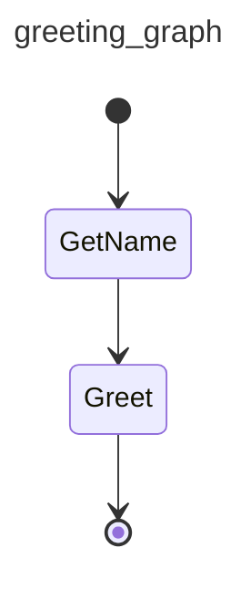
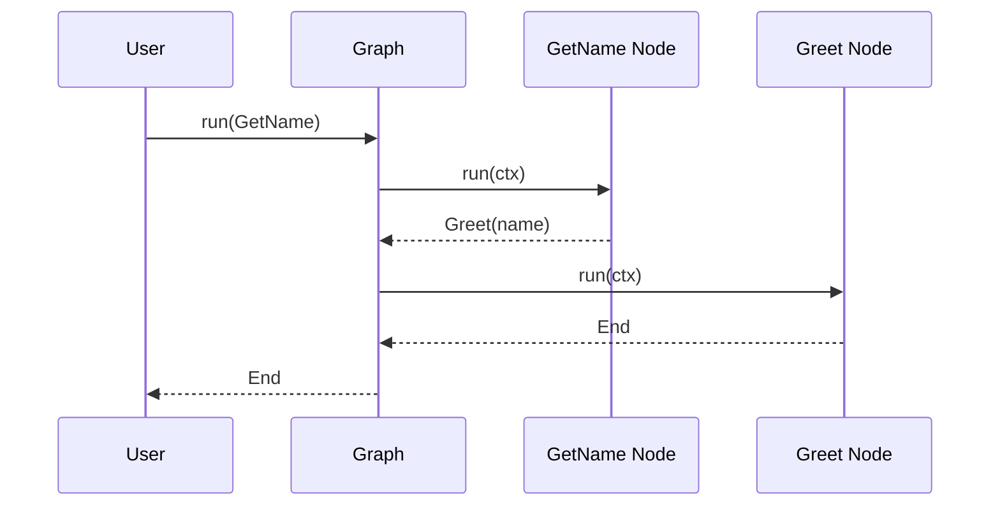

# Chapter 9: Graph

In the previous chapter, [RunContext](08_runcontext.md), you learned how to provide contextual information to your tools during an agent's run. Now, let's level up and explore how to create complex, multi-step workflows with `Graph`!

Imagine you're building a customer service chatbot. The conversation might go like this:

1.  **User:** "I want to return a product."
2.  **Chatbot:** (Uses a tool to check the user's order history)
3.  **Chatbot:** "What is the order number of the product you want to return?"
4.  **User:** (Provides the order number)
5.  **Chatbot:** (Uses a tool to look up the order details)
6.  **Chatbot:** "What is the reason for the return?"
7.  **User:** (Provides the reason)
8.  **Chatbot:** (Initiates the return process)

This isn't a single question-and-answer exchange. It's a *flow* of interactions, where each step depends on the previous one. A `Graph` lets you define this flow as a series of connected nodes, each representing a step in the process. Think of it like a flowchart for your agent's logic!

## What is a Graph?

A `Graph` provides a structured way to build complex agent flows by defining a state machine or control flow. It's like a recipe that your agent follows, step-by-step, to achieve a goal.

Key aspects of `Graph`:

*   **Nodes:** Each node represents a specific action or decision point in the flow. These nodes can be [Agent](05_agent.md) calls, [Tool](06_tool.md) executions, or even simple logic checks.
*   **Edges:** Edges define the connections between nodes, specifying the order in which they should be executed. They determine the flow of the graph.
*   **State:** The graph can maintain a state, which is like a memory that persists across nodes. This allows you to store information and make decisions based on previous steps.

A `Graph` provides a way to visually represent and manage the flow of your agent's logic. A `Graph` provides a way to create repeatable workflows with steps.

## Key Concepts

Let's break down the key parts of a `Graph`:

*   **BaseNode:** This is the building block of the `Graph`. Each node in your graph will be a class that inherits from `BaseNode`.
*   **GraphRunContext:**  Similar to the [RunContext](08_runcontext.md) in Agents, this provides context to each node during execution.
*   **End:** This signifies the end of the graph execution.
*   **mermaid code:** You can use `pydantic-graph` to generate a visual representation of your graph as a mermaid diagram.

## Using a Graph

Let's create a simple graph that asks a user for their name and then greets them.

```python
from dataclasses import dataclass
from pydantic_graph import BaseNode, Graph, GraphRunContext, End

@dataclass
class GetName(BaseNode):
    async def run(self, ctx: GraphRunContext) -> Greet:
        name = input("What is your name? ")
        return Greet(name)

@dataclass
class Greet(BaseNode):
    name: str
    async def run(self, ctx: GraphRunContext) -> End:
        print(f"Hello, {self.name}!")
        return End()

greeting_graph = Graph(nodes=[GetName, Greet])
```

In this code:

1.  We define two nodes: `GetName` and `Greet`.
2.  `GetName` prompts the user for their name and passes it to the `Greet` node.
3.  `Greet` greets the user and ends the graph.
4.  We create a `Graph` object, passing in the list of nodes.

Now, let's run the graph:

```python
import asyncio
async def main():
    greeting_graph = Graph(nodes=[GetName, Greet])
    await greeting_graph.run(GetName())

asyncio.run(main())
```

When you run this code, it will first execute the `GetName` node, prompting you to enter your name. After you enter your name, it will execute the `Greet` node, printing a personalized greeting.

```
What is your name? Alice
Hello, Alice!
```

Let's make it a bit more visual using a `mermaid` diagram:

```python
from dataclasses import dataclass
from pydantic_graph import BaseNode, Graph, GraphRunContext, End

@dataclass
class GetName(BaseNode):
    async def run(self, ctx: GraphRunContext) -> Greet:
        name = input("What is your name? ")
        return Greet(name)

@dataclass
class Greet(BaseNode):
    name: str
    async def run(self, ctx: GraphRunContext) -> End:
        print(f"Hello, {self.name}!")
        return End()

greeting_graph = Graph(nodes=[GetName, Greet])
print(greeting_graph.mermaid_code())
```

The output will be:



This diagram visually represents the flow of your agent's logic, making it easier to understand and manage.

## Diving Deeper: Internal Implementation

Let's take a look at what happens internally when you run a `Graph`.

Here's a simplified sequence diagram:



1.  **User:** You call the `run` method of the `Graph` object, passing in the starting node (`GetName`).
2.  **Graph:** The `Graph` object receives the starting node and initiates the execution.
3.  **GetName Node:** The `Graph` calls the `run` method of the `GetName` node.
4.  **Graph:** The `GetName` node returns the next node to execute (`Greet`).
5.  **Greet Node:**  The `Graph` calls the `run` method of the `Greet` node.
6.  **Graph:** The `Greet` node returns `End`, signaling the end of the graph execution.
7.  **User:**  The `Graph` returns, indicating that the process is complete.

Let's look at some code snippets from `pydantic_graph/pydantic_graph/graph.py`.

Here's a simplified definition of the `Graph` class:

```python
from dataclasses import dataclass

@dataclass
class Graph:
    nodes: list
```

This code defines the `Graph` class with a list of nodes. The actual implementation is a bit more complex, but this captures the basic idea.

Here's a simplified version of the `run` method:

```python
    async def run(self, start_node):
        current_node = start_node
        while not isinstance(current_node, End):
            next_node = await current_node.run()
            current_node = next_node
```

This code shows the basic control flow of the `Graph`. It starts with the `start_node` and then iteratively calls the `run` method of each node until it reaches an `End` node.

## Conclusion

In this chapter, you've learned about the `Graph` abstraction and how it provides a structured way to build complex, multi-step workflows. You've seen how to define nodes, connect them with edges, and run the graph to achieve a specific goal.

In the next chapter, we'll explore the [Evaluator](10_evaluator.md) abstraction in more detail.


---

Generated by [AI Codebase Knowledge Builder](https://github.com/The-Pocket/Tutorial-Codebase-Knowledge)