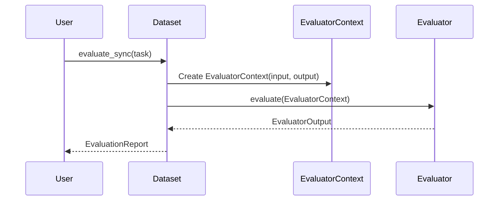

# Chapter 10: Evaluator

In the previous chapter, [Graph](09_graph.md), you learned how to create complex workflows by chaining together multiple agents and tools. Now, let's talk about how to *measure* whether those workflows are actually working well! That's where `Evaluator` comes in.

Imagine you've built a chatbot that's supposed to help users find information. How do you know if it's giving correct answers? You could manually check every conversation, but that's time-consuming. An `Evaluator` lets you automatically test your chatbot against a set of example conversations and see how well it performs.

An `Evaluator` helps you systematically test and evaluate the performance and accuracy of your systems, especially when working with LLMs. It provides a way to measure the quality of agent runs and identify areas for improvement.

## What is an Evaluator?

An `Evaluator` is a component that analyzes the results of a task and assigns a score or a set of metrics to indicate its quality. Think of it as an automated judge that assesses the performance of your agent.

Key aspects of `Evaluator`:

*   **Automated Assessment:** `Evaluator`s automate the process of checking whether your agent is working as expected.
*   **Metrics and Scores:** They provide quantitative measures of performance, allowing you to track progress over time.
*   **Customizable:** You can create your own `Evaluator`s to match the specific requirements of your application.

Imagine you are building an agent to summarize news articles. You can write an `Evaluator` to check whether the summary:

*   Captures the main points of the article.
*   Is factually accurate.
*   Is concise.

Based on these criteria, the `Evaluator` would assign a score to the summary, telling you how well the agent is performing.

## Key Concepts

Let's break down the key parts of an `Evaluator`:

*   **EvaluatorContext:** This provides the `Evaluator` with all the information it needs to assess a particular run. It includes the input to the task, the output generated by the agent, and any other relevant context.
*   **EvaluatorOutput:** This is the result of the evaluation process. It can be a score, a set of metrics, or any other information that indicates the quality of the task.
*   **EvaluationResult:** The result of the check itself, whether the evaluator result passed or failed.
*   **Span Tree:** During agent execution, spans are created automatically to trace what is happening inside. You can use this tree to trace calls to specific [Tools](06_tool.md) or other functions.

## Using an Evaluator

Let's start with a simple example: creating an `Evaluator` that checks if the output of a task is a string.

```python
from dataclasses import dataclass
from pydantic_evals.evaluators import Evaluator, EvaluatorContext, EvaluatorOutput

@dataclass
class IsString(Evaluator[object, object]): # Input, output types
    def evaluate(self, ctx: EvaluatorContext[object, object]) -> EvaluatorOutput:
        return isinstance(ctx.output, str)
```

In this code, we define an `Evaluator` called `IsString` that checks whether the output is a string. The `evaluate` method takes an `EvaluatorContext` object as input and returns `True` if the output is a string, and `False` otherwise.

Here is an example of how to use it with a [Dataset](docs/evals.md#datasets-and-cases):

```python
from pydantic_evals import Case, Dataset
from pydantic_evals.evaluators import Evaluator, EvaluatorContext, EvaluatorOutput
from dataclasses import dataclass

@dataclass
class IsString(Evaluator[object, object]): # Input, output types
    def evaluate(self, ctx: EvaluatorContext[object, object]) -> EvaluatorOutput:
        return isinstance(ctx.output, str)

dataset = Dataset(
    cases=[Case(inputs="test", expected_output="test")],
    evaluators=[IsString()],
)

async def my_task(input_value: str) -> str:
    return "This is a test"

report = dataset.evaluate_sync(my_task)
print(report)
```

The output will be:

```
Evaluation Summary: my_task
┏━━━━━━━━━┳━━━━━━━━━━━━━┳━━━━━━━━━━┓
┃ Case ID ┃ Assertions  ┃ Duration ┃
┡━━━━━━━━━╇━━━━━━━━━━━━━╇━━━━━━━━━━┩
│ inputs  │ ✔           │      1ms ┃
├─────────┼─────────────┼──────────┤
│ Averages│ 100.0% ✔    │      1ms ┃
└─────────┴─────────────┴──────────┘
```

Now, let's create a more complex `Evaluator` that checks whether a summary captures the main points of an article.

```python
from dataclasses import dataclass
from pydantic_evals.evaluators import Evaluator, EvaluatorContext, EvaluatorOutput

@dataclass
class CapturesMainPoints(Evaluator[str, str]): # Article, Summary
    def evaluate(self, ctx: EvaluatorContext[str, str]) -> EvaluatorOutput:
        article = ctx.inputs
        summary = ctx.output

        # In a real implementation, this would use an LLM to check whether the summary
        # captures the main points of the article.
        # For simplicity, we just check if the summary contains a few keywords from the article.
        keywords = ["important", "key", "significant"]
        for keyword in keywords:
            if keyword not in summary:
                return False # The summary doesn't capture the main points.
        return True # The summary captures the main points.
```

In this code, we define an `Evaluator` called `CapturesMainPoints` that checks whether a summary captures the main points of an article. The `evaluate` method takes an `EvaluatorContext` object as input, containing the article and the summary. It checks whether the summary contains a few keywords from the article.

Let's look at one more example. Here is an example where you can inspect the traces of an [Agent](05_agent.md) to see if the agent called a specific [Tool](06_tool.md) during the run.

```python
from dataclasses import dataclass
from pydantic_evals.evaluators import Evaluator, EvaluatorContext, EvaluatorOutput, AgentCalledTool
from pydantic_evals import Case, Dataset

@dataclass
class MyEvaluator(AgentCalledTool):
    def __init__(self):
        super().__init__(agent_name="my_agent", tool_name="my_tool")

dataset = Dataset(
    cases=[Case(inputs="test", expected_output="test")],
    evaluators=[MyEvaluator()],
)

async def my_task(input_value: str) -> str:
    return "This is a test"

report = dataset.evaluate_sync(my_task)
print(report)
```

## Diving Deeper: Internal Implementation

Let's take a look at what happens internally when you run an `Evaluator`.

Here's a simplified sequence diagram:



1.  **User:** You call the `evaluate_sync` method of the [Dataset](docs/evals.md#datasets-and-cases) object, passing in the task function.
2.  **Dataset:** The [Dataset](docs/evals.md#datasets-and-cases) object calls the task function for each case in the dataset and creates an EvaluatorContext
3.  **Evaluator:** The [Dataset](docs/evals.md#datasets-and-cases) object then calls the `evaluate` method of each registered `Evaluator`, passing in the `EvaluatorContext`.
4.  **Dataset:** The `Evaluator` returns an `EvaluatorOutput`, indicating the result of the evaluation.
5.  **User:** The [Dataset](docs/evals.md#datasets-and-cases) object aggregates the results from all `Evaluator`s and returns an EvaluationReport

Now, let's look at the code where the `Evaluator` class is defined (from `pydantic_evals/pydantic_evals/evaluators/evaluator.py`):

```python
from abc import ABC, abstractmethod
from dataclasses import dataclass
from typing import Generic, TypeVar

T = TypeVar('T')
U = TypeVar('U')

@dataclass
class Evaluator(ABC, Generic[T, U]):
    """Evaluates the outputs of a function against a given set of inputs."""

    @abstractmethod
    def evaluate(self, ctx: "EvaluatorContext[T, U]") -> "EvaluatorOutput":
        """Evaluate the inputs and outputs and returns a dict of metrics."""
        ...
```

This code defines the `Evaluator` class as an abstract base class with an `evaluate` method that must be implemented by subclasses.

## Conclusion

In this chapter, you've learned about the `Evaluator` abstraction and how it provides a way to automatically test and evaluate the performance of your agents. You've seen how to define custom `Evaluator`s to match the specific requirements of your application. This knowledge will help you to build high-quality agents that you can trust to perform reliably.

There are no more chapters in this tutorial. You should now be able to build sophisticated applications and agents using pydantic-ai!


---

Generated by [AI Codebase Knowledge Builder](https://github.com/The-Pocket/Tutorial-Codebase-Knowledge)