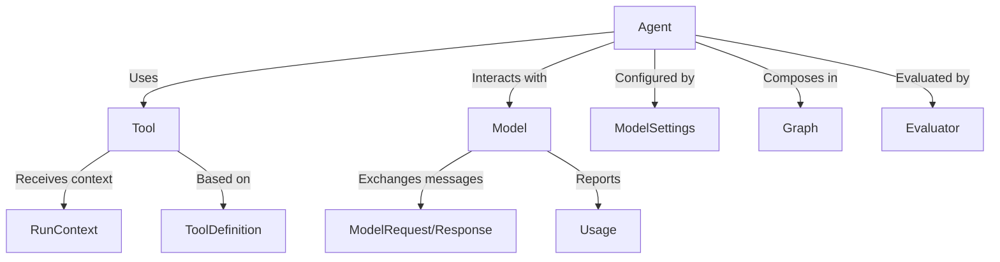

# Tutorial: pydantic-ai

PydanticAI is a Python framework designed to simplify building AI applications with Language Models (LLMs). It offers a **model-agnostic** interface and utilizes *Pydantic* for structuring and validating data, and provides tools for creating intelligent agents and managing complex workflows.

**Source Repository:** [None](None)

## Chapters

1. [Model](01_model.md)
2. [ModelSettings](02_modelsettings.md)
3. [ModelRequest/Response](03_modelrequest_response.md)
4. [Usage](04_usage.md)
5. [Agent](05_agent.md)
6. [Tool](06_tool.md)
7. [ToolDefinition](07_tooldefinition.md)
8. [RunContext](08_runcontext.md)
9. [Graph](09_graph.md)
10. [Evaluator](10_evaluator.md)

---

Generated by [AI Codebase Knowledge Builder](https://github.com/The-Pocket/Tutorial-Codebase-Knowledge)