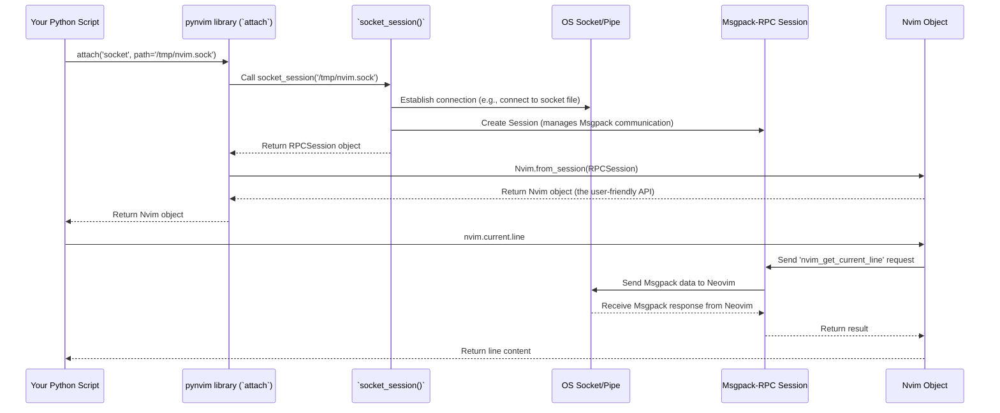

# Chapter 1: Connection Establishment (`attach`, `*_session`)

Welcome to the `pynvim` tutorial! Have you ever wanted to control Neovim using Python? Maybe automate some editing tasks, create powerful plugins, or integrate Neovim with other tools? `pynvim` is the library that makes this possible!

Before your Python code can talk to Neovim, it needs to establish a communication line, just like making a phone call before you can talk to someone. This chapter is all about how to make that "call" to Neovim.

Imagine you want to write a simple Python script that tells you the current line number in your Neovim editor. To do this, your script first needs to *connect* to Neovim.

## Why Different Connection Methods?

Neovim is flexible. You might want to connect to:

1.  **A Neovim instance that's already running:** Maybe you started Neovim in your terminal earlier.
2.  **A brand new Neovim instance:** Your script might need to start Neovim itself, do something, and then close it.
3.  **Neovim connecting to *your* script:** This is common for plugins, where Neovim starts your Python script and automatically provides a connection.

`pynvim` provides functions to handle all these scenarios.

## The Easy Way: `attach()`

The simplest and most recommended way to connect is using the `attach()` function. It acts like a smart dispatcher, figuring out the right way to connect based on what you tell it.

Think of `attach()` like a universal remote control for starting a conversation with Neovim. You just tell it *how* you want to connect (`session_type`) and provide the necessary details (like an address or a file path).

Here are the main ways you can use `attach()`:

### 1. Connecting to a Running Neovim (Socket)

Often, a running Neovim instance makes its "address" available as a special file called a "socket". You can usually find this address in the environment variable `$NVIM_LISTEN_ADDRESS` inside Neovim (try `:echo $NVIM_LISTEN_ADDRESS` in Neovim).

Let's say the address is `/tmp/nvimXYZ/0`. You can connect your Python script like this:

```python
# Import the attach function from the pynvim library
from pynvim import attach

# Specify the connection type ('socket') and the path to the socket file
# Make sure to replace '/tmp/nvimXYZ/0' with your actual $NVIM_LISTEN_ADDRESS
nvim_socket_path = '/tmp/nvimXYZ/0' # Example path, change this!

print(f"Connecting to Neovim at socket: {nvim_socket_path}")

# Connect to Neovim
nvim = attach('socket', path=nvim_socket_path)

print("Connected! Let's ask Neovim for the current line.")

# Now you can interact with Neovim! (We'll cover the 'nvim' object more later)
current_line = nvim.current.line
print(f"Neovim says the current line is: {current_line}")

# It's good practice to close the connection when done
nvim.close()
print("Connection closed.")
```

**What happens:**

1.  We import `attach`.
2.  We call `attach('socket', path=...)`, telling it we want to use a socket connection and providing the file path.
3.  `attach` handles the technical details of connecting.
4.  It returns an `nvim` object. This object is our main tool for interacting with Neovim. We'll learn more about it in [Chapter 2: Nvim Object](02_nvim_object_.md).
5.  We use `nvim.current.line` (don't worry about the details yet!) to ask Neovim for the current line content.
6.  We print the result.
7.  We `nvim.close()` the connection.

### 2. Connecting to a Running Neovim (TCP)

Sometimes, Neovim might be listening for connections over the network using TCP/IP (like a web server). This requires an IP address (like `127.0.0.1` for your own machine) and a port number (Neovim often uses `7450` by default, but it can vary).

```python
from pynvim import attach

# Connect using TCP/IP
nvim_address = '127.0.0.1'
nvim_port = 6666 # Make sure Neovim is listening on this port!

print(f"Connecting to Neovim via TCP at {nvim_address}:{nvim_port}")
try:
    # Connect
    nvim = attach('tcp', address=nvim_address, port=nvim_port)

    print("Connected!")
    pid = nvim.eval('getpid()') # Ask Neovim for its process ID
    print(f"Connected to Neovim process with PID: {pid}")

    nvim.close()
    print("Connection closed.")
except Exception as e:
    print(f"Could not connect: {e}")
    print("Is Neovim running and listening on that address/port?")
    print("You can start Neovim listening with: nvim --listen 127.0.0.1:6666")

```

**What happens:** This is very similar to the socket example, but we use `attach('tcp', address=..., port=...)`.

### 3. Starting and Connecting to a New Neovim (`child`)

What if you want your script to launch a *new*, independent Neovim instance and control it? `attach` can do that too!

```python
from pynvim import attach

# Specify the command to start Neovim.
# '-u', 'NONE' makes it start faster without loading configs.
# '--embed' tells Neovim it's being controlled externally.
nvim_command = ['nvim', '-u', 'NONE', '--embed']

print(f"Starting a new Neovim instance using command: {' '.join(nvim_command)}")

# Start and attach
nvim = attach('child', argv=nvim_command)

print("Connected to new Neovim instance!")

# Tell the new Neovim instance to open a file
nvim.command('edit new_file.txt')
# Set the first line
nvim.current.line = "Hello from pynvim!"

print("Told Neovim to edit 'new_file.txt' and set the first line.")
print("Check your running processes for the new 'nvim' instance.")

# Close the connection (this will also terminate the Neovim instance)
nvim.close()
print("Connection closed and Neovim instance terminated.")
```

**What happens:**

1.  We define the command needed to start Neovim (`argv` is a list of command-line arguments).
2.  `attach('child', argv=...)` starts the `nvim` process using those arguments.
3.  It automatically sets up communication with the new Neovim instance.
4.  We get the `nvim` object and can control the newly started Neovim.
5.  Closing the connection usually terminates the Neovim process started this way.

### 4. Connecting via Standard Input/Output (`stdio`)

This method is mainly used when Neovim itself starts your Python script (like for a plugin). Neovim connects the script's standard input and output directly to its own communication channels.

```python
from pynvim import attach

# This usually runs when Neovim starts the script
# For manual testing, you'd need to pipe Neovim's stdio, which is complex.
# nvim = attach('stdio')
# print("Attached via stdio (usually done by Neovim itself)")
# nvim.command('echo "Python script connected via stdio!"')
# nvim.close()
```

You typically won't call `attach('stdio')` directly in a standalone script; it's more relevant when writing plugins hosted by Neovim, which we'll explore in later chapters like [Chapter 4: Plugin Host (`Host`)](04_plugin_host___host___.md).

## The `*_session` Functions (Under the Hood)

The `attach()` function is a convenient wrapper. Internally, it calls one of several lower-level functions based on the `session_type` you provide:

*   `tcp_session(address, port)`
*   `socket_session(path)`
*   `child_session(argv)`
*   `stdio_session()`

These functions return a `Session` object, which represents the raw communication channel. You then need to manually create the `Nvim` object from this session:

```python
# Less common way: using the specific session function directly
from pynvim import socket_session, Nvim

nvim_socket_path = '/tmp/nvimXYZ/0' # Example path, change this!

# 1. Create the session object
session = socket_session(path=nvim_socket_path)

# 2. Create the Nvim API wrapper from the session
nvim = Nvim.from_session(session)

print("Connected using socket_session() and Nvim.from_session().")
print(f"Current line: {nvim.current.line}")

nvim.close()
print("Connection closed.")
```

While this works, using `attach()` is shorter and generally preferred for its simplicity.

## How `attach` Works (Simplified View)

Let's trace what happens when you call `nvim = attach('socket', path='/tmp/nvim.sock')`:



1.  **You call `attach()`:** You tell `pynvim` you want to connect via a socket at a specific path.
2.  **`attach()` calls `socket_session()`:** Based on `'socket'`, `attach` delegates the work to the specific `socket_session` function (defined in `pynvim/msgpack_rpc/__init__.py`).
3.  **`socket_session()` sets up transport:** It interacts with your operating system to create the actual connection (e.g., opens the socket file).
4.  **`socket_session()` creates a Session:** It initializes a [Msgpack-RPC Session (`Session`)](06_msgpack_rpc_session___session___.md) object, which knows how to encode/decode messages using the Msgpack-RPC protocol Neovim uses.
5.  **`attach()` creates the `Nvim` object:** `attach` takes the `Session` object and wraps it in the high-level [Nvim Object](02_nvim_object_.md) (using `Nvim.from_session`). This object provides the nice Python methods (`nvim.current.line`, `nvim.command(...)`, etc.).
6.  **`attach()` returns the `Nvim` object:** You get back the `nvim` object, ready to use!

The code for `attach` in `pynvim/__init__.py` looks roughly like this (simplified):

```python
# Inside pynvim/__init__.py (simplified)
from pynvim.msgpack_rpc import tcp_session, socket_session, stdio_session, child_session
from pynvim.api import Nvim

def attach(session_type, address=None, port=7450, path=None, argv=None):
    session = None # Initialize session variable

    # Decide which low-level function to call
    if session_type == 'tcp':
        session = tcp_session(address, port)
    elif session_type == 'socket':
        session = socket_session(path)
    elif session_type == 'stdio':
        session = stdio_session()
    elif session_type == 'child':
        session = child_session(argv)
    else:
        raise Exception('Unknown session type "%s"' % session_type)

    # Create the Nvim API object from the session
    return Nvim.from_session(session)
```

## Closing the Connection: Don't Forget!

It's important to close the connection when you're finished interacting with Neovim. This releases resources both in your script and in Neovim.

You can do this explicitly:

```python
nvim = attach('socket', path='/tmp/nvimXYZ/0')
# ... do stuff with nvim ...
nvim.close()
```

Or, even better, use a `with` statement, which automatically closes the connection even if errors occur:

```python
try:
    with attach('socket', path='/tmp/nvimXYZ/0') as nvim:
        print(f"Inside 'with' block. Current line: {nvim.current.line}")
        # ... do more stuff ...
    print("Connection automatically closed after 'with' block.")
except Exception as e:
    print(f"An error occurred: {e}")
    # Connection is still closed automatically if it was opened
```

Using the `with` statement is highly recommended!

## Conclusion

You've learned the first crucial step in using `pynvim`: establishing a connection to a Neovim instance. You saw that `attach()` is the primary, user-friendly function for connecting via sockets, TCP, starting a child process, or using stdio. You also got a glimpse of the lower-level `*_session` functions and the importance of closing the connection.

Now that you know how to connect, the next step is to learn what you can *do* with that connection. We'll explore the powerful `Nvim` object you get back from `attach` in the next chapter.

Next up: [Chapter 2: Nvim Object](02_nvim_object_.md)

---

Generated by [AI Codebase Knowledge Builder](https://github.com/The-Pocket/Tutorial-Codebase-Knowledge)