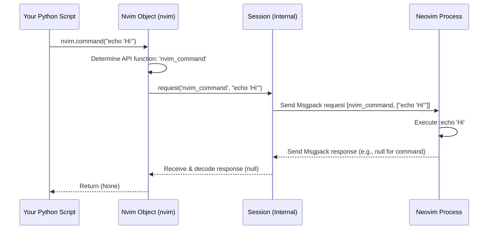

# Chapter 2: Nvim Object

In [Chapter 1: Connection Establishment (`attach`, `*_session`)](01_connection_establishment___attach______session___.md), we learned how to connect our Python script to Neovim using `pynvim.attach()`. When we successfully connect, we get back a special object, usually named `nvim`.

```python
# From Chapter 1... remember this?
from pynvim import attach

# Connect (replace with your actual socket path or use another method)
try:
    with attach('socket', path='/tmp/nvimXYZ/0') as nvim: # <--- This 'nvim' variable!
        print("Connected! We have the nvim object.")
        # What can we DO with this 'nvim' object?
except Exception as e:
    print(f"Could not connect: {e}")
```

But what *is* this `nvim` object, and what can we do with it? That's what this chapter is all about!

## Your Remote Control for Neovim

Think of the `nvim` object as the **main remote control** for your Neovim session. Just like your TV remote lets you change channels, adjust volume, and turn the TV on/off, the `nvim` object lets you interact with and control Neovim from your Python script.

It's the primary way you'll:

*   Tell Neovim to run commands (like `:edit file.txt` or `:wq`).
*   Ask Neovim for information (like "What's the text on the current line?" or "What's the value of the 'tabstop' option?").
*   Call Neovim's built-in functions or even custom functions you've defined.
*   Access specific parts of Neovim like the current text buffer or the active window.

The `nvim` object handles all the complicated communication details behind the scenes, giving you a clean and Python-like way to talk to Neovim.

## Basic Interactions: Commands, Evaluations, and Functions

Let's look at the most common ways to use your Neovim remote control. Imagine you want to write a Python script that simply tells Neovim to print "Hello from Python!" in its command area.

### 1. Running Ex Commands: `nvim.command()`

Neovim users constantly use Ex commands (the ones starting with `:` like `:w` or `:q`). You can run these directly from Python using `nvim.command()`.

```python
from pynvim import attach

# Assume Neovim is running and listening at this socket
NVIM_SOCKET = '/tmp/nvimXYZ/0' # Change this to your actual path!

try:
    with attach('socket', path=NVIM_SOCKET) as nvim:
        print("Connected to Neovim.")

        # Use command() to run the :echo command in Neovim
        command_to_run = 'echo "Hello from Python!"'
        print(f"Sending command: :{command_to_run}")
        nvim.command(command_to_run)

        print("Command sent! Check your Neovim instance for the message.")

except FileNotFoundError:
    print(f"Error: Could not find Neovim socket at {NVIM_SOCKET}")
    print("Is Neovim running? Check :echo $NVIM_LISTEN_ADDRESS")
except Exception as e:
    print(f"An error occurred: {e}")

```

**What happens:**

1.  We connect to Neovim and get the `nvim` object.
2.  We call `nvim.command('echo "Hello from Python!"')`.
3.  `pynvim` sends this command over the connection to Neovim.
4.  Neovim receives the command and executes it, just as if you typed `:echo "Hello from Python!"` yourself.
5.  You should see "Hello from Python!" appear in Neovim's command line area.

### 2. Evaluating Expressions: `nvim.eval()`

Sometimes you don't want to run a command, but instead ask Neovim for the *value* of something. This could be the value of a variable, an option, or the result of a simple Vimscript expression. For this, use `nvim.eval()`.

Let's ask Neovim what the current value of the `&tabstop` option is.

```python
from pynvim import attach

NVIM_SOCKET = '/tmp/nvimXYZ/0' # Change this!

try:
    with attach('socket', path=NVIM_SOCKET) as nvim:
        print("Connected.")

        # Use eval() to get the value of the 'tabstop' option
        expression_to_eval = '&tabstop'
        print(f"Asking Neovim to evaluate: {expression_to_eval}")
        tabstop_value = nvim.eval(expression_to_eval) # eval() returns the result

        print(f"Neovim says the value of 'tabstop' is: {tabstop_value}")
        print(f"The type of the returned value is: {type(tabstop_value)}")

except FileNotFoundError:
    print(f"Error: Could not find Neovim socket at {NVIM_SOCKET}")
except Exception as e:
    print(f"An error occurred: {e}")

```

**What happens:**

1.  We connect and get the `nvim` object.
2.  We call `nvim.eval('&tabstop')`. The `&` prefix is Vimscript syntax for accessing an option.
3.  `pynvim` sends a request to Neovim asking it to evaluate this expression.
4.  Neovim calculates the value (which is usually a number for `tabstop`).
5.  Neovim sends the value back to `pynvim`.
6.  `nvim.eval()` returns this value to our Python script (often converting it to a standard Python type like an integer).

You can evaluate more complex things too, like `'Current line: ' . line('.')` (which concatenates a string with the result of the `line('.')` function).

### 3. Calling Functions: `nvim.call()`

Neovim has many built-in functions (like `line()`, `strftime()`, `getpid()`) and you can define your own. You can execute these functions from Python using `nvim.call()`.

Let's ask Neovim for its process ID (PID) using the `getpid()` function.

```python
from pynvim import attach

NVIM_SOCKET = '/tmp/nvimXYZ/0' # Change this!

try:
    with attach('socket', path=NVIM_SOCKET) as nvim:
        print("Connected.")

        # Use call() to execute the getpid() Vim function
        function_name = 'getpid'
        print(f"Asking Neovim to call function: {function_name}()")
        nvim_pid = nvim.call(function_name) # No arguments needed for getpid()

        print(f"Neovim's process ID is: {nvim_pid}")
        print(f"The type of the returned value is: {type(nvim_pid)}")

        # Example with arguments: Calling strftime()
        time_format = '%Y-%m-%d %H:%M:%S'
        current_time = nvim.call('strftime', time_format) # Pass arguments after name
        print(f"Neovim's current time is: {current_time}")

except FileNotFoundError:
    print(f"Error: Could not find Neovim socket at {NVIM_SOCKET}")
except Exception as e:
    print(f"An error occurred: {e}")

```

**What happens:**

1.  Connect and get `nvim`.
2.  `nvim.call('getpid')`: We tell `pynvim` to ask Neovim to run the function named `getpid`.
3.  Neovim executes the function and gets its own process ID.
4.  Neovim sends the result (an integer) back.
5.  `nvim.call()` returns the integer PID to our script.
6.  `nvim.call('strftime', '%Y-%m-%d %H:%M:%S')`: We call `strftime` and pass the format string as an argument. Neovim returns the formatted date/time string.

## Accessing Neovim's State

Besides sending commands and calling functions, the `nvim` object provides convenient Pythonic ways to access different parts of Neovim's current state, like buffers, windows, options, and variables.

### `nvim.current`

This attribute gives you access to the *currently active* things in Neovim:

*   `nvim.current.line`: Get or set the content of the current line in the buffer.
*   `nvim.current.buffer`: Get an object representing the current text buffer (more on this in [Chapter 3: Remote Objects (`Remote`, `Buffer`, `Window`, `Tabpage`)](03_remote_objects___remote____buffer____window____tabpage___.md)).
*   `nvim.current.window`: Get the current window object.
*   `nvim.current.tabpage`: Get the current tab page object.

```python
from pynvim import attach

NVIM_SOCKET = '/tmp/nvimXYZ/0' # Change this!

try:
    with attach('socket', path=NVIM_SOCKET) as nvim:
        print("Connected.")

        # Get the current line content
        original_line = nvim.current.line
        print(f"Original line content: '{original_line}'")

        # Set the current line content
        new_line_content = "This line set by pynvim!"
        print(f"Setting line content to: '{new_line_content}'")
        nvim.current.line = new_line_content

        # Verify it changed (by getting it again)
        updated_line = nvim.current.line
        print(f"Updated line content: '{updated_line}'")

        # Get the current buffer object (we'll explore this more later)
        current_buffer = nvim.current.buffer
        print(f"Current buffer object: {current_buffer}")
        print(f"(Buffer name: {current_buffer.name})") # Example usage

        # Restore the original line
        nvim.current.line = original_line
        print("Restored original line content.")

except FileNotFoundError:
    print(f"Error: Could not find Neovim socket at {NVIM_SOCKET}")
except Exception as e:
    print(f"An error occurred: {e}")

```

**What happens:** Accessing `nvim.current.line` sends a request to Neovim to get the current line's text. Assigning to `nvim.current.line` sends a command to Neovim to *change* the current line's text. Accessing `nvim.current.buffer` gets a special *reference* to the buffer object.

### `nvim.options`, `nvim.vars`, `nvim.vvars`

These attributes work like Python dictionaries to access Neovim's options, global variables (`g:`), and Vim variables (`v:`).

```python
from pynvim import attach

NVIM_SOCKET = '/tmp/nvimXYZ/0' # Change this!

try:
    with attach('socket', path=NVIM_SOCKET) as nvim:
        print("Connected.")

        # --- Options ---
        # Get an option value
        filetype = nvim.options['filetype']
        print(f"nvim.options['filetype'] is: {filetype}")

        # Set an option value
        print("Setting nvim.options['number'] = True")
        nvim.options['number'] = True # Equivalent to :set number
        print("Check Neovim - line numbers should be visible!")
        # Set it back
        nvim.options['number'] = False

        # --- Global Variables (g:) ---
        # Set a global variable
        print("Setting nvim.vars['my_python_message'] = 'Hello Nvim!'")
        nvim.vars['my_python_message'] = "Hello Nvim!"

        # Get the global variable back
        message = nvim.vars['my_python_message']
        print(f"Read back nvim.vars['my_python_message']: {message}")
        # You can check in Nvim with :echo g:my_python_message

        # --- Vim Variables (v:) ---
        # Get a v: variable (read-only usually)
        error_num = nvim.vvars['errmsg']
        print(f"nvim.vvars['errmsg'] is: {error_num}")


except FileNotFoundError:
    print(f"Error: Could not find Neovim socket at {NVIM_SOCKET}")
except Exception as e:
    print(f"An error occurred: {e}")

```

**What happens:** Accessing `nvim.options['filetype']` sends a request to get the option value. Assigning `nvim.options['number'] = True` sends a request to set the option. Similarly, `nvim.vars[...]` interacts with `g:` variables, and `nvim.vvars[...]` interacts with `v:` variables.

## Under the Hood: How `nvim` Talks to Neovim

How does `nvim.command("echo 'Hi'")` actually work? The `Nvim` object acts as a high-level wrapper around the communication channel ([Msgpack-RPC Session (`Session`)](06_msgpack_rpc_session___session___.md)) we established in Chapter 1.

1.  **Method Call:** Your Python script calls a method on the `nvim` object, like `nvim.command("echo 'Hi'")`.
2.  **Request Creation:** The `Nvim` object (specifically, its internal `request` method) figures out the corresponding Neovim API function name (e.g., `nvim_command`). It packages the function name and your arguments ("echo 'Hi'") into a message using the Msgpack-RPC format.
3.  **Sending:** The `Nvim` object passes this message to the underlying `Session` object.
4.  **Transmission:** The `Session` object sends the binary Msgpack data over the connection (socket, TCP, stdio, etc.) to the running Neovim instance.
5.  **Neovim Execution:** Neovim receives the message, decodes it, finds the `nvim_command` function, executes it with the arguments, and potentially prepares a response.
6.  **Response Transmission (if any):** Neovim sends a Msgpack response back over the connection.
7.  **Receiving:** The `Session` object in your Python script receives the response data.
8.  **Decoding & Return:** The `Session` decodes the response. The `Nvim` object takes this result, potentially converts Neovim data types (like Vimscript dictionaries or lists) into Python types, and returns the final result to your original method call (though `nvim.command` doesn't return anything).

Here's a simplified view:



The core logic lives within the `Nvim` class in `pynvim/api/nvim.py`. Most methods like `command`, `eval`, `call`, and the property accessors (`.current`, `.options`, etc.) ultimately call the `Nvim.request()` method.

```python
# Simplified concept from pynvim/api/nvim.py

class Nvim:
    # ... (Initialization with session, metadata etc.) ...

    def request(self, name: str, *args: Any, **kwargs: Any) -> Any:
        # This is the central method!
        # 1. Check thread safety (important for plugins)
        # 2. Convert Python arguments to Msgpack format (_to_nvim)
        # 3. Send request via self._session.request()
        # 4. Receive response via self._session
        # 5. Convert Msgpack result back to Python (_from_nvim)
        # 6. Return result
        # Simplified steps:
        print(f"Nvim.request: Sending '{name}' with args {args}")
        internal_args = walk(self._to_nvim, args) # Convert Python -> Neovim types
        response = self._session.request(name, *internal_args, **kwargs)
        python_result = walk(self._from_nvim, response) # Convert Neovim -> Python
        return python_result

    def command(self, string: str, **kwargs: Any) -> None:
        # Just calls request with the right API function name
        return self.request('nvim_command', string, **kwargs)

    def eval(self, string: str, **kwargs: Any) -> Any:
        # Calls request for 'nvim_eval'
        return self.request('nvim_eval', string, **kwargs)

    def call(self, name: str, *args: Any, **kwargs: Any) -> Any:
        # Calls request for 'nvim_call_function'
        return self.request('nvim_call_function', name, args, **kwargs)

    # Properties like 'current', 'options', 'vars' use helper classes
    # (Current, RemoteMap) which also call self.request() internally.
    # ...
```

Don't worry too much about the internal details now. The key takeaway is that the `nvim` object provides convenient Python methods that translate into specific Neovim API calls over the established connection.

## Conclusion

You've now met the `Nvim` object – your primary tool for interacting with Neovim from Python. You've learned how to use it like a remote control to:

*   Execute Ex commands using `nvim.command()`
*   Evaluate Vimscript expressions and get values back using `nvim.eval()`
*   Call Vimscript functions using `nvim.call()`
*   Access Neovim's state conveniently through attributes like `nvim.current`, `nvim.options`, and `nvim.vars`.

We saw that these methods hide the complexity of the underlying Msgpack-RPC communication.

In the examples, we saw things like `nvim.current.buffer`. This returned a `Buffer` object. What exactly are these objects (`Buffer`, `Window`, `Tabpage`) that Neovim returns? Let's dive into those next!

Next up: [Chapter 3: Remote Objects (`Remote`, `Buffer`, `Window`, `Tabpage`)](03_remote_objects___remote____buffer____window____tabpage___.md)

---

Generated by [AI Codebase Knowledge Builder](https://github.com/The-Pocket/Tutorial-Codebase-Knowledge)