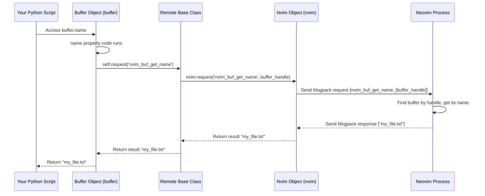

# Chapter 3: Remote Objects (`Remote`, `Buffer`, `Window`, `Tabpage`)

In [Chapter 2: Nvim Object](02_nvim_object_.md), we learned how to use the main `nvim` object as a remote control to send commands, evaluate expressions, and call functions in Neovim. We saw examples like `nvim.current.line` and `nvim.current.buffer`. But what exactly *is* `nvim.current.buffer`? It's not just a number or a string; it's something more powerful – a **Remote Object**.

This chapter explores these special Python objects that represent live components *inside* Neovim, making it easier and more intuitive to interact with them.

## Why Do We Need Remote Objects?

Imagine you want to get the name of the file currently open in Neovim and then change the first line of that file.

Using only the basic tools from Chapter 2, you might do something like this:

```python
# Hypothetical way without Remote Objects (less convenient)
from pynvim import attach

NVIM_SOCKET = '/tmp/nvimXYZ/0' # Change this!

try:
    with attach('socket', path=NVIM_SOCKET) as nvim:
        # Get the number of the current buffer
        buffer_number = nvim.eval('bufnr("%")')
        # Get the name using the buffer number
        buffer_name = nvim.call('bufname', buffer_number)
        print(f"Buffer name (using eval/call): {buffer_name}")

        # Get the first line using the buffer number
        first_line = nvim.call('getbufline', buffer_number, 1)[0] # Returns a list
        print(f"First line (using call): {first_line}")

        # Set the first line using the buffer number
        new_first_line = "Changed by pynvim!"
        nvim.call('setbufline', buffer_number, 1, new_first_line)
        print("Changed the first line.")

except Exception as e:
    print(f"An error occurred: {e}")
```

This works, but it feels a bit clunky. We keep passing around the `buffer_number`, and we need to know the right Neovim functions (`bufnr`, `bufname`, `getbufline`, `setbufline`) to call. Wouldn't it be nicer if we could just get a "buffer" object in Python and interact with it directly, like `buffer.name` or `buffer[0]`?

That's exactly what Remote Objects provide!

## What Are Remote Objects? Handles to Neovim Internals

Remote Objects (`Buffer`, `Window`, `Tabpage`) are special Python classes provided by `pynvim`. Think of them as **smart handles** or **proxies** to the actual objects living inside the running Neovim process.

*   **Proxy:** Like a representative who acts on behalf of someone else. When you interact with a `Buffer` object in Python, it sends messages to Neovim to interact with the *real* buffer.
*   **Handle:** Like a remote control specifically designed for one part of Neovim (e.g., a specific buffer, window, or tab).

Instead of just getting an ID number (like `buffer_number` in the example above), `pynvim` gives you a full Python object. This object has its own methods and properties that make interacting with the corresponding Neovim object feel much more natural and "Pythonic".

The main types of Remote Objects you'll encounter are:

*   `Buffer`: Represents a text buffer in Neovim (usually containing the contents of a file).
*   `Window`: Represents a window within the Neovim screen (a viewport onto a buffer).
*   `Tabpage`: Represents a tab page, which can contain multiple windows.

All these classes inherit from a base class called `Remote` (defined in `pynvim/api/common.py`), which provides the underlying mechanism for them to communicate with Neovim.

## Using Remote Objects: A Better Way

Let's revisit our use case: get the current buffer's name and change its first line, but this time using Remote Objects.

### Working with `Buffer` Objects

The [Nvim Object](02_nvim_object_.md) gives us easy access to the *current* buffer, window, and tabpage via `nvim.current`.

```python
from pynvim import attach

NVIM_SOCKET = '/tmp/nvimXYZ/0' # Change this!

try:
    with attach('socket', path=NVIM_SOCKET) as nvim:
        print("Connected.")

        # 1. Get the current Buffer object
        current_buffer = nvim.current.buffer
        print(f"Got Buffer object: {current_buffer}")

        # 2. Get its name using the .name property
        buffer_name = current_buffer.name
        print(f"Buffer name (using .name): {buffer_name}")

        # 3. Get the first line using list-like indexing
        #    (Note: Neovim lines are 0-indexed here)
        original_first_line = current_buffer[0]
        print(f"Original first line (using buffer[0]): {original_first_line}")

        # 4. Set the first line using list-like assignment
        new_first_line = "Changed by pynvim object!"
        current_buffer[0] = new_first_line
        print(f"Set first line to: '{new_first_line}'")

        # 5. Get all lines (acts like a Python list)
        all_lines = current_buffer[:]
        print(f"Buffer now has {len(all_lines)} lines. First few:")
        for i, line in enumerate(all_lines[:3]):
            print(f"  Line {i}: {line}")

        # Restore the original first line
        current_buffer[0] = original_first_line
        print("Restored original first line.")

except FileNotFoundError:
    print(f"Error: Could not find Neovim socket at {NVIM_SOCKET}")
except Exception as e:
    print(f"An error occurred: {e}")

```

**What happens:**

1.  `nvim.current.buffer` doesn't just return an ID; it asks Neovim for information about the current buffer and creates a `pynvim.api.buffer.Buffer` object in Python that *represents* that Neovim buffer.
2.  Accessing `current_buffer.name` tells the Python `Buffer` object to ask Neovim for the buffer's name (using the `nvim_buf_get_name` API call internally) and return it as a string.
3.  Accessing `current_buffer[0]` tells the `Buffer` object to ask Neovim for the content of the first line (line index 0, using `nvim_buf_get_lines`).
4.  Assigning `current_buffer[0] = "..."` tells the `Buffer` object to tell Neovim to *change* the first line (using `nvim_buf_set_lines`).
5.  You can even use slicing `[:]` to get or set the entire buffer content, just like a Python list! `len(current_buffer)` also works, returning the number of lines.

This object-oriented approach (`buffer.name`, `buffer[0] = ...`) is often much cleaner and easier to read than calling specific Neovim functions with buffer numbers.

### Working with `Window` and `Tabpage` Objects

Similarly, you can get `Window` and `Tabpage` objects and interact with their properties:

```python
from pynvim import attach

NVIM_SOCKET = '/tmp/nvimXYZ/0' # Change this!

try:
    with attach('socket', path=NVIM_SOCKET) as nvim:
        print("Connected.")

        # Get the current Window object
        current_window = nvim.current.window
        print(f"Got Window object: {current_window}")

        # Access Window properties
        width = current_window.width
        height = current_window.height
        cursor_pos = current_window.cursor # Returns (row, col) tuple
        print(f"Window dimensions: {width}x{height}")
        print(f"Window cursor position: {cursor_pos}")

        # Get the current Tabpage object
        current_tabpage = nvim.current.tabpage
        print(f"Got Tabpage object: {current_tabpage}")

        # Access Tabpage properties
        tab_number = current_tabpage.number # 1-based index
        print(f"Tabpage number: {tab_number}")

        # You can chain accesses too!
        window_in_tab = current_tabpage.window # Gets the current window in this tab
        print(f"Current window in tabpage: {window_in_tab}")
        print(f"Is it the same as nvim.current.window? {window_in_tab == current_window}")

except FileNotFoundError:
    print(f"Error: Could not find Neovim socket at {NVIM_SOCKET}")
except Exception as e:
    print(f"An error occurred: {e}")
```

**What happens:**

*   `nvim.current.window` and `nvim.current.tabpage` return `Window` and `Tabpage` objects, respectively.
*   Accessing properties like `current_window.width` or `current_tabpage.number` triggers corresponding Neovim API calls (`nvim_win_get_width`, `nvim_tabpage_get_number`) behind the scenes.
*   These objects also have methods and properties to interact with their associated elements (e.g., a `Tabpage` object has a `windows` property to list its windows).

## How Do Remote Objects Work Internally?

The magic lies in the `Remote` base class (`pynvim/api/common.py`) and the specific implementations in `buffer.py`, `window.py`, and `tabpage.py`.

When you get a `Buffer` object, it stores:

1.  A reference back to the main [Nvim Object](02_nvim_object_.md) (which holds the connection session).
2.  Identification data (`code_data`) for the specific Neovim buffer it represents. This includes a type code (e.g., 0 for Buffer) and the buffer's unique handle (like an internal ID, packed in Msgpack format).

When you call a method or access a property on the `Buffer` object (like `buffer.name`), here's what happens:

1.  **Method Call:** Your Python code accesses `buffer.name`.
2.  **Internal `request`:** The `Buffer` object's implementation for `name` calls its own `request` method (inherited from `Remote`). It passes the *specific* Neovim API function name needed (e.g., `nvim_buf_get_name`) and automatically includes its own identification data as the *first* argument.
3.  **Delegation to `Nvim`:** The `Remote.request` method simply delegates the call to the main `nvim.request` method we saw in Chapter 2, prepending the object's handle to the arguments.
4.  **API Call:** `nvim.request` sends the actual Msgpack-RPC request (e.g., `nvim_buf_get_name` with the buffer handle) to Neovim.
5.  **Neovim Action:** Neovim receives the request, identifies the target buffer using the handle, performs the action (gets the name), and sends the result back.
6.  **Return Value:** The result travels back through the session to the `nvim` object, then to the `Buffer` object, and finally is returned to your code as a Python string.

Let's visualize the call to `buffer.name`:



Looking at the code (simplified):

**In `pynvim/api/common.py`:**

```python
# Simplified from pynvim/api/common.py
class Remote:
    def __init__(self, session: Nvim, code_data: Tuple[int, Any]):
        self._session = session # Reference to the main Nvim object
        self.code_data = code_data # Identifier (type code, packed handle)
        self.handle = unpackb(code_data[1]) # Unpacked handle for convenience
        # ... (vars, options setup) ...

    # This method is called by properties/methods of Buffer, Window, Tabpage
    def request(self, name: str, *args: Any, **kwargs: Any) -> Any:
        """Wrapper for nvim.request, automatically adds self."""
        # Calls the main nvim.request, passing self (which becomes the handle)
        # as the first argument implicitly via _to_nvim conversion.
        return self._session.request(name, self, *args, **kwargs)

    @property
    @abstractmethod
    def _api_prefix(self) -> str: # Used by .api, .vars, .options
        raise NotImplementedError()
```

**In `pynvim/api/buffer.py`:**

```python
# Simplified from pynvim/api/buffer.py
class Buffer(Remote):
    _api_prefix = "nvim_buf_" # For .api, .vars, .options

    # The 'name' property implementation
    @property
    def name(self) -> str:
        """Get the buffer name."""
        # This calls the self.request method inherited from Remote
        return self.request('nvim_buf_get_name')

    # The __getitem__ implementation (for buffer[index] and buffer[slice])
    def __getitem__(self, idx: Union[int, slice]) -> Union[str, List[str]]:
        if not isinstance(idx, slice):
            # Single index: e.g., buffer[0]
            i = adjust_index(idx) # Convert Python index (-1) to Nvim index (-2)
            # Calls self.request -> nvim.request('nvim_buf_get_lines', self, i, i+1, True)
            return self.request('nvim_buf_get_lines', i, i + 1, True)[0]
        else:
            # Slice: e.g., buffer[1:5] or buffer[:]
            start = adjust_index(idx.start, 0)
            end = adjust_index(idx.stop, -1)
            # Calls self.request -> nvim.request('nvim_buf_get_lines', self, start, end, False)
            return self.request('nvim_buf_get_lines', start, end, False)

    # __setitem__ works similarly, calling nvim_buf_set_lines
    # ... other methods like append(), mark() ...
```

The key idea is that the `Remote` object (`Buffer`, `Window`, `Tabpage`) knows *who* it is (its handle) and uses the main `nvim` object's connection to send messages specifically targeted at its counterpart inside Neovim.

## Conclusion

You've now learned about Remote Objects (`Buffer`, `Window`, `Tabpage`) in `pynvim`. These objects act as convenient Python proxies for live Neovim components.

*   They provide a more object-oriented way to interact with Neovim's state compared to just using `nvim.call` or `nvim.eval` with IDs.
*   You can access properties (like `buffer.name`, `window.cursor`) and use methods (like `buffer.append(...)`) or familiar Python syntax (like `buffer[0]`, `len(buffer)`) to manipulate Neovim's buffers, windows, and tabpages.
*   Internally, these objects use the main `nvim` connection to send specific API requests targeted at the Neovim object they represent.

Using Remote Objects makes your `pynvim` code cleaner, more readable, and more Pythonic.

So far, we've focused on controlling Neovim from a separate Python script. But what if you want to write Python code that runs *inside* Neovim, reacting to events or providing new commands? That's where the Plugin Host comes in.

Next up: [Chapter 4: Plugin Host (`Host`)](04_plugin_host___host___.md)

---

Generated by [AI Codebase Knowledge Builder](https://github.com/The-Pocket/Tutorial-Codebase-Knowledge)