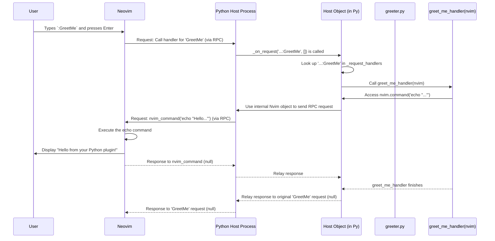

# Chapter 4: Plugin Host (`Host`)

In the previous chapters, we learned how to connect to Neovim from a separate Python script ([Chapter 1: Connection Establishment (`attach`, `*_session`)](01_connection_establishment___attach______session___.md)), use the main [Nvim Object](02_nvim_object_.md) to control it, and interact with specific Neovim components using [Remote Objects (`Remote`, `Buffer`, `Window`, `Tabpage`)](03_remote_objects___remote____buffer____window____tabpage___.md). This was all about controlling Neovim from the *outside*.

But what if you want Neovim to run *your* Python code directly? Maybe you want to create a new command like `:MyCoolCommand` that executes some Python logic, or automatically run Python code when a certain event happens (like saving a file). This is where **Neovim Plugins** come in, and the `pynvim` library provides a way to write these plugins in Python.

The core component that makes Python plugins possible is the **Plugin Host**.

## Motivation: Running Python *Inside* Neovim

Imagine you want to create a simple command in Neovim called `:GreetMe` that just prints "Hello from Python!" in the Neovim command area. You don't want to run a separate Python script every time; you want this command to be built right into your Neovim setup.

This requires a different approach:

1.  Neovim needs to know about your Python code.
2.  When you type `:GreetMe` in Neovim, Neovim needs to tell some Python process to run the corresponding function.
3.  That Python process needs to be able to talk back to Neovim (e.g., to run the `echo` command).

The `Plugin Host` is the mechanism that handles this communication and coordination.

## The Conductor: What is the Plugin Host (`Host`)?

Think of the `pynvim` Plugin Host (`Host` class) as an **orchestra conductor** specifically for your Python plugins within Neovim.

*   **Neovim (The Composer):** Decides which instruments (plugins) should play and when (events, commands).
*   **Python Plugin Files (The Musicians):** Contain the actual musical pieces (your Python functions and classes).
*   **Plugin Host (The Conductor):** Listens to the composer (Neovim), tells the right musicians (your plugin code) when to play, and ensures everything runs smoothly.

Technically, the Plugin Host is usually a long-running Python process started by Neovim itself. Neovim communicates with this host process using the same Msgpack-RPC protocol we've seen before, often over standard input/output (`stdio`). The `Host` class (`pynvim.plugin.Host`) is the main entry point within this process.

## How the Host Works: Loading and Routing

When Neovim starts up and detects that you have Python plugins installed, it typically does the following:

1.  **Starts the Host Process:** Neovim launches a Python process, instructing it to run the `pynvim` host logic. (e.g., `python3 -m pynvim ...`).
2.  **Host Connects:** The `pynvim.plugin.Host` object is created within this process. It establishes a connection back to Neovim, usually using the `stdio` method discussed in [Chapter 1: Connection Establishment (`attach`, `*_session`)](01_connection_establishment___attach______session___.md). It gets its own [Nvim Object](02_nvim_object_.md) to communicate back.
3.  **Plugin Loading:** Neovim tells the host which Python plugin files (e.g., `my_plugin.py`) it needs to load. These files are usually located in a special directory like `~/.config/nvim/rplugin/python3/`.
4.  **Discovery:** The `Host` imports your Python plugin file (`my_plugin.py`). It then inspects the file, looking for special functions or classes that you've marked with **decorators** like `@pynvim.command`, `@pynvim.function`, or `@pynvim.autocmd`. (We'll learn all about these decorators in [Chapter 5: Plugin Decorators (`@command`, `@function`, etc.)](05_plugin_decorators____command_____function___etc___.md)).
5.  **Registration:** The `Host` builds an internal map (like a phone directory) linking the Neovim command/function/autocmd name (e.g., the command name 'GreetMe') to the specific Python function you decorated (e.g., your `greet_me_handler` function).
6.  **Waiting for Calls:** The `Host` enters an event loop, waiting for messages (requests or notifications) from Neovim.
7.  **Routing:** When you run `:GreetMe` in Neovim, Neovim sends a request to the Python Host process. The `Host` receives this request, looks up 'GreetMe' in its internal map, finds your `greet_me_handler` function, and calls it.
8.  **Execution:** Your Python function runs. If it uses the `nvim` object (provided to it by the host) to interact with Neovim (like `nvim.command('echo "Hello"')`), the `Host` sends that message back to Neovim.
9.  **Unloading:** When Neovim shuts down or tells the host to unload a plugin, the `Host` cleans up its registered handlers.

## A Simple Plugin Example (Conceptual)

Let's see what a very basic plugin file might look like. You would typically save this in `~/.config/nvim/rplugin/python3/greeter.py` (or similar).

```python
# ~/.config/nvim/rplugin/python3/greeter.py

# Import the pynvim library
import pynvim

# Use a decorator to tell the Host this function is a Neovim command
@pynvim.command('GreetMe')
def greet_me_handler(nvim):
    # This 'nvim' object is automatically provided by the Host!
    # It lets the plugin talk back to Neovim.
    message = "Hello from your Python plugin!"
    nvim.command(f'echo "{message}"')

# --- Neovim Setup (Run once after creating the file) ---
# 1. Run :UpdateRemotePlugins in Neovim. This makes Neovim scan for
#    plugins and tell the host about 'GreetMe'.
# 2. Restart Neovim.
# 3. Now you can run :GreetMe in Neovim!
```

**What the Host does with this:**

1.  Neovim tells the host to load `greeter.py`.
2.  The `Host` imports `greeter.py`.
3.  It sees the `@pynvim.command('GreetMe')` decorator attached to the `greet_me_handler` function.
4.  It registers internally: "When Neovim asks for command 'GreetMe', call the Python function `greet_me_handler`".
5.  When you type `:GreetMe` in Neovim, Neovim sends the request, the Host finds and calls `greet_me_handler(nvim)`.
6.  The function executes `nvim.command('echo "..."')`, which the Host sends back to Neovim for display.

Don't worry about the decorator syntax (`@...`) just yet; we'll cover that thoroughly in the next chapter. The key point here is that the `Host` is responsible for finding these decorated functions and connecting them to Neovim's features.

## Under the Hood: How the Host Manages Plugins

Let's peek at the internal workings. The core logic resides in `pynvim/plugin/host.py`.

**1. Initialization (`__init__`)**

When the host process starts, a `Host` object is created. It initializes dictionaries to store the handlers it discovers.

```python
# Simplified from pynvim/plugin/host.py
import logging

logger = logging.getLogger(__name__)

class Host:
    def __init__(self, nvim: Nvim):
        self.nvim = nvim # The Nvim object for communicating back
        self._specs = {} # Stores plugin specifications (for :UpdateRemotePlugins)
        self._loaded = {} # Info about loaded plugin files
        self._load_errors = {} # Tracks errors during loading
        # --- Dictionaries to store handlers ---
        self._notification_handlers = {
            # Handlers for async messages from Neovim
            'nvim_error_event': self._on_error_event
        }
        self._request_handlers = {
            # Handlers for sync messages (requests) from Neovim
            'poll': lambda: 'ok', # Basic health check
            'specs': self._on_specs_request, # Provides specs to Neovim
            'shutdown': self.shutdown # Handles shutdown request
        }
        # ...
```

**2. Starting the Host (`start`)**

The `start` method is called to begin the host's main job: load initial plugins and run the event loop.

```python
# Simplified from pynvim/plugin/host.py
class Host:
    # ... (init) ...

    def start(self, plugins):
        # 'plugins' is a list of plugin file paths given by Neovim
        logger.info(f"Host starting, loading plugins: {plugins}")

        # Run the main event loop provided by the Nvim object's session
        # This loop listens for messages from Neovim
        self.nvim.run_loop(
            self._on_request,      # Function to call for requests
            self._on_notification, # Function to call for notifications
            lambda: self._load(plugins), # Function to run *before* the loop starts
            err_cb=self._on_async_err # Function for async errors
        )
        logger.info("Host event loop stopped.")

    def _on_async_err(self, msg: str):
        logger.error(f"Async error: {msg}")
        self.nvim.err_write(msg, async_=True) # Report error back to Neovim

    # ...
```

**3. Loading Plugins (`_load`)**

This method iterates through the plugin file paths provided by Neovim, imports them, and discovers the handlers within.

```python
# Simplified from pynvim/plugin/host.py
import importlib
import os
import pathlib

class Host:
    # ... (init, start) ...

    def _load(self, plugins: Sequence[str]) -> None:
        logger.info("Loading plugins...")
        for path_str in plugins:
            path = pathlib.Path(os.path.normpath(path_str)).as_posix()
            logger.debug(f"Attempting to load plugin: {path}")
            if path in self._loaded:
                logger.warning(f"{path} is already loaded, skipping.")
                continue
            try:
                # Determine module name and directory from path
                directory, name = os.path.split(os.path.splitext(path)[0])
                # Add directory to Python's path and import
                module = _handle_import(directory, name) # (Helper function)

                handlers_found = []
                # Find handlers (@command, @function etc.) in the module
                self._discover_classes(module, handlers_found, path)
                self._discover_functions(module, handlers_found, path, False)

                if not handlers_found:
                    logger.error(f"{path} exports no handlers.")
                    continue

                self._loaded[path] = {'handlers': handlers_found, 'module': module}
                logger.info(f"Successfully loaded plugin: {path}")
            except Exception as e:
                # Store loading errors to report back to Neovim if needed
                err = f"Error loading plugin {path}: {e}\n{format_exc(5)}"
                logger.error(err)
                self._load_errors[path] = err
        # Tell Neovim the host is ready
        self._register_host_with_nvim()

    def _register_host_with_nvim(self):
        # ... (sets client info so Neovim knows about the host) ...
        pass

    # ... (_discover_functions, _discover_classes) ...
```

**4. Discovering Handlers (`_discover_functions`)**

This crucial method uses Python's `inspect` module to find functions that have been decorated (marked) by `pynvim` decorators. It then registers them in the `_request_handlers` or `_notification_handlers` dictionaries.

```python
# Simplified from pynvim/plugin/host.py
import inspect
from functools import partial

class Host:
    # ... (init, start, _load) ...

    def _discover_functions(self, obj, handlers_list, plugin_path, delay):
        # 'obj' is the module or class being inspected
        # 'delay' is True if obj is a class (handlers registered on first call)
        logger.debug(f"Discovering functions in {obj} from {plugin_path}")

        # Find members of 'obj' that have the '_nvim_rpc_method_name' attribute
        # (This attribute is added by pynvim decorators like @command)
        for _, func in inspect.getmembers(obj,
                        lambda o: hasattr(o, '_nvim_rpc_method_name')):

            # Get info attached by the decorator
            method_name = func._nvim_rpc_method_name
            is_sync = func._nvim_rpc_sync # Is it a request (sync) or notification (async)?
            full_name = f"{plugin_path}:{method_name}" # Unique name for the handler

            # Wrap the original function to handle arguments, errors, etc.
            # (We'll skip the details of _wrap_function for simplicity)
            wrapped_func = partial(self._wrap_function, func, ...)
            wrapped_func._nvim_registered_name = full_name # Store the registered name

            logger.info(f"  Registering handler: '{full_name}' "
                        f"(Sync: {is_sync}) -> {func.__name__}")

            # Add to the correct dictionary based on sync/async
            if is_sync:
                if full_name in self._request_handlers:
                    raise Exception(f"Request handler for '{full_name}' already registered")
                self._request_handlers[full_name] = wrapped_func
            else:
                if full_name in self._notification_handlers:
                    raise Exception(f"Notification handler for '{full_name}' already registered")
                self._notification_handlers[full_name] = wrapped_func

            handlers_list.append(wrapped_func) # Keep track of handlers for unloading
            # Store spec for :UpdateRemotePlugins if decorator provided one
            if hasattr(func, '_nvim_rpc_spec'):
                self._specs.setdefault(plugin_path, []).append(func._nvim_rpc_spec)

    # ... (_wrap_function, _on_request, _on_notification) ...
```

**5. Handling Messages (`_on_request`, `_on_notification`)**

When Neovim sends a message, these methods (called by the event loop) look up the handler name in the dictionaries populated by `_discover_functions` and execute the corresponding wrapped Python function.

```python
# Simplified from pynvim/plugin/host.py
class Host:
    # ... (other methods) ...

    def _on_request(self, name: str, args: Sequence[Any]) -> Any:
        """Handle a sync request from Neovim."""
        handler_name = decode_if_bytes(name) # Decode name if needed
        logger.debug(f"Received request: {handler_name} with args: {args}")

        handler = self._request_handlers.get(handler_name)
        if not handler:
            msg = self._missing_handler_error(handler_name, 'request')
            logger.error(msg)
            raise ErrorResponse(msg) # Send error back to Neovim

        # Call the wrapped function found during discovery
        result = handler(*args)
        logger.debug(f"Request handler '{handler_name}' returned: {result}")
        return result # Return result to Neovim

    def _on_notification(self, name: str, args: Sequence[Any]) -> None:
        """Handle an async notification from Neovim."""
        handler_name = decode_if_bytes(name)
        logger.debug(f"Received notification: {handler_name} with args: {args}")

        handler = self._notification_handlers.get(handler_name)
        if not handler:
            msg = self._missing_handler_error(handler_name, 'notification')
            logger.error(msg)
            # Report error via async channel, don't crash
            self._on_async_err(msg + "\n")
            return

        # Call the wrapped function found during discovery
        handler(*args)
        # No return value for notifications

    def _missing_handler_error(self, name, kind):
        # ... (Generates a helpful error message, checks _load_errors) ...
        return f"No {kind} handler registered for '{name}'"
```

**Sequence Diagram: Running `:GreetMe`**

This diagram shows the flow when you run the `:GreetMe` command from our example plugin:



## Conclusion

You've now learned about the `pynvim` Plugin Host (`Host`), the essential component that allows you to run Python code *inside* Neovim.

*   The `Host` acts as a conductor, managing Python plugin files.
*   It's typically run as a separate process started by Neovim.
*   It loads plugin files, discovers specially decorated functions (`@command`, `@function`, etc.), and registers them.
*   It listens for requests and notifications from Neovim and routes them to the correct Python handler function.
*   It provides an `nvim` object to the handler functions, allowing them to communicate back to Neovim.

Understanding the Host's role is key to writing Python plugins for Neovim. Now that you know *how* the Host finds and runs your plugin code, the next step is to learn exactly how to *write* that code using the available decorators.

Next up: [Chapter 5: Plugin Decorators (`@command`, `@function`, etc.)](05_plugin_decorators____command_____function___etc___.md)

---

Generated by [AI Codebase Knowledge Builder](https://github.com/The-Pocket/Tutorial-Codebase-Knowledge)