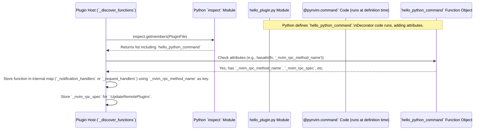

# Chapter 5: Plugin Decorators (`@command`, `@function`, etc.)

In [Chapter 4: Plugin Host (`Host`)](04_plugin_host___host___.md), we learned how Neovim runs Python code for plugins using the Plugin Host. The host discovers and manages your plugin code. But how do you actually *tell* the host which parts of your Python code should be exposed to Neovim as commands, functions, or event handlers?

Imagine you want to create a very simple custom command in Neovim, `:HelloPython`, which, when run, makes Neovim print "Hello from your Python plugin!". How does Neovim know that the `:HelloPython` command should trigger a specific Python function you write?

This is where **Plugin Decorators** come in! They act like special labels or stickers you put on your Python functions.

## What Are Decorators? (A Quick Python Refresher)

In Python, a decorator is a special kind of function that "wraps" or modifies another function or method. You use the `@` symbol followed by the decorator name right before defining your function.

```python
# This is a standard Python function
def my_original_function():
    print("I am the original function.")

# This is a function that could be used as a decorator
def my_decorator(func_to_wrap):
    print("Decorator: Wrapping the function!")
    # It could do something before or after calling the original
    return func_to_wrap # Often returns the original (or a modified version)

# Applying the decorator
@my_decorator
def my_decorated_function():
    print("I am the decorated function.")

# Calling the decorated function
# (You might see output from the decorator itself during setup)
# my_decorated_function()
```

Don't worry too much about how decorators *work* internally in Python right now. Just think of them as markers (`@decorator_name`) that add special meaning or properties to the function defined immediately below them.

## `pynvim` Decorators: Labeling Your Plugin Functions

`pynvim` provides several decorators specifically for writing Neovim plugins. These decorators tell the [Plugin Host (`Host`)](04_plugin_host___host___.md) how to register your Python functions with Neovim.

Think of them like these labels:

*   `@pynvim.command('CommandName')`: "Label this Python function as the handler for the Neovim command `:CommandName`."
*   `@pynvim.function('FunctionName')`: "Label this Python function as the implementation for the Neovim function `FunctionName()`."
*   `@pynvim.autocmd('EventName')`: "Label this Python function to run automatically when the Neovim event `EventName` occurs (e.g., saving a buffer)."

These decorators make it incredibly easy to link your Python code to Neovim's features.

## Making Neovim Commands with `@pynvim.command`

Let's solve our use case: creating the `:HelloPython` command.

1.  **Create a Plugin File:**
    You need to place your Python plugin code in a special directory where Neovim can find it. A common location is `~/.config/nvim/rplugin/python3/`. Let's create a file named `~/.config/nvim/rplugin/python3/hello_plugin.py`.

2.  **Write the Python Code:**

    ```python
    # ~/.config/nvim/rplugin/python3/hello_plugin.py
    import pynvim

    # Use the @command decorator to register :HelloPython
    @pynvim.command('HelloPython')
    def hello_python_command(nvim):
        """
        This function will be called when :HelloPython is executed in Neovim.
        """
        message = "Hello from your Python plugin!"
        # The 'nvim' object is automatically passed in by the host.
        # Use it to interact with Neovim.
        nvim.command(f'echo "{message}"')

    print("hello_plugin.py loaded by pynvim host") # Optional: for debugging
    ```

    *   We import `pynvim`.
    *   We define a regular Python function `hello_python_command`.
    *   Crucially, we put `@pynvim.command('HelloPython')` right before the function definition. This labels `hello_python_command` as the handler for the Neovim command `:HelloPython`.
    *   Notice the `nvim` parameter. The [Plugin Host (`Host`)](04_plugin_host___host___.md) automatically provides an instance of the [Nvim Object](02_nvim_object_.md) here, allowing your plugin to talk back to Neovim (e.g., using `nvim.command`).

3.  **Tell Neovim About the Plugin:**
    Neovim doesn't automatically know about new plugin files. You need to tell it to scan for them *once* after creating or modifying your plugin file:
    *   Open Neovim.
    *   Run the command `:UpdateRemotePlugins`.
    *   Restart Neovim.

4.  **Run Your Command:**
    Now, in Neovim, you can simply type:
    ```vim
    :HelloPython
    ```
    Press Enter, and you should see the message "Hello from your Python plugin!" appear in the command area!

## Making Neovim Functions with `@pynvim.function`

You can also define new functions that can be called from Vimscript (or other plugins) using `call MyPythonFunction(...)`.

Let's add a function `AddPy(a, b)` to our plugin file that adds two numbers.

```python
# ~/.config/nvim/rplugin/python3/hello_plugin.py
import pynvim

# --- Previous @command decorator ---
@pynvim.command('HelloPython')
def hello_python_command(nvim):
    message = "Hello from your Python plugin!"
    nvim.command(f'echo "{message}"')

# --- New @function decorator ---
@pynvim.function('AddPy')
def add_py_function(nvim, args):
    """
    Called when Neovim runs call('AddPy', [arg1, arg2])
    """
    # 'args' will be a list containing the arguments passed from Neovim
    if len(args) == 2:
        try:
            num1 = int(args[0])
            num2 = int(args[1])
            result = num1 + num2
            # Functions are expected to return a value
            return result
        except ValueError:
            # You can signal errors back to Neovim
            nvim.err_write("AddPy requires two numbers as arguments.\n")
            return None # Or raise an exception
    else:
        nvim.err_write("AddPy requires exactly two arguments.\n")
        return None

print("hello_plugin.py loaded by pynvim host")
```

*   We use `@pynvim.function('AddPy')` to label `add_py_function`.
*   The function again receives the `nvim` object.
*   It also receives an `args` parameter, which is a Python list containing the arguments passed from the Neovim `call()`.
*   The function returns the sum, which becomes the result of the `call()` in Neovim.

After adding this code, run `:UpdateRemotePlugins` again and restart Neovim. Now you can test it:

```vim
:echo AddPy(5, 3)  " Output: 8
:echo call('AddPy', [10, 20]) " Output: 30
:echo AddPy("hello", "world") " Output: AddPy requires two numbers... null
```

## Reacting to Events with `@pynvim.autocmd`

Autocommands let you run code automatically when certain events happen in Neovim. You can hook into these using `@pynvim.autocmd`.

Let's add a handler that prints a message whenever you save a Python file.

```python
# ~/.config/nvim/rplugin/python3/hello_plugin.py
import pynvim

# --- Previous decorators ---
@pynvim.command('HelloPython')
def hello_python_command(nvim):
    message = "Hello from your Python plugin!"
    nvim.command(f'echo "{message}"')

@pynvim.function('AddPy')
def add_py_function(nvim, args):
    # ... (implementation as above) ...
    if len(args) == 2:
        try: return int(args[0]) + int(args[1])
        except ValueError: nvim.err_write("AddPy needs numbers.\n"); return None
    else: nvim.err_write("AddPy needs 2 args.\n"); return None

# --- New @autocmd decorator ---
@pynvim.autocmd('BufWritePost', pattern='*.py')
def on_python_save(nvim):
    """
    Called after a Python file (*.py) is written (saved).
    """
    nvim.out_write("Python file saved!\n") # Use out_write for informational messages

print("hello_plugin.py loaded by pynvim host")
```

*   We use `@pynvim.autocmd('BufWritePost', pattern='*.py')`.
    *   `'BufWritePost'` is the Neovim event name (runs after a buffer is written).
    *   `pattern='*.py'` tells Neovim to only trigger this for files ending in `.py`.
*   The function `on_python_save` receives the `nvim` object.
*   `nvim.out_write()` prints a message to the Neovim message area (usually better for non-error output than `echo`).

Again, run `:UpdateRemotePlugins` and restart. Now, every time you save a file named `something.py`, you should see "Python file saved!" in the messages.

## How Decorators Work Under the Hood

How does `@pynvim.command('HelloPython')` actually work? It doesn't magically change Neovim itself. It simply **attaches hidden information** to your Python function object.

1.  **Decorator Execution:** When Python loads your `hello_plugin.py`, it executes the decorator code (`@pynvim.command(...)`).
2.  **Attaching Attributes:** The `pynvim.command` decorator function takes your `hello_python_command` function as input and adds special attributes to it, like:
    *   `_nvim_rpc_method_name`: e.g., `"~/.config/nvim/rplugin/python3/hello_plugin.py:command:HelloPython"` (a unique name the host uses)
    *   `_nvim_rpc_sync`: `False` (meaning it's an asynchronous notification by default)
    *   `_nvim_bind`: `True` (meaning the host should pass the `nvim` object)
    *   `_nvim_prefix_plugin_path`: `True` (meaning the path is part of the method name)
    *   `_nvim_rpc_spec`: A dictionary describing the command for `:UpdateRemotePlugins` (e.g., `{'type': 'command', 'name': 'HelloPython', ...}`).
3.  **Host Discovery:** Later, when the [Plugin Host (`Host`)](04_plugin_host___host___.md) loads `hello_plugin.py` (as described in Chapter 4), it uses Python's `inspect` module to scan the file for functions.
4.  **Finding Attributes:** The host's `_discover_functions` method specifically looks for functions that have these `_nvim_*` attributes attached.
5.  **Registration:** When it finds `hello_python_command` with its attributes, the host registers it in its internal routing table (like `_request_handlers` or `_notification_handlers`), mapping the `_nvim_rpc_method_name` to the actual Python function.
6.  **Execution:** When you run `:HelloPython` in Neovim, Neovim sends an RPC message to the host using the registered name. The host looks up the name in its table and calls your `hello_python_command` function, passing in the `nvim` object.

**Sequence Diagram: Host Discovering `@pynvim.command`**



**Code Snippet (Simplified Decorator Logic):**

The actual decorator functions are defined in `pynvim/plugin/decorators.py`. Here's a highly simplified idea of what `@command` does:

```python
# Simplified concept from pynvim/plugin/decorators.py

def command(name, sync=False, **opts):
    def decorator_wrapper(original_function):
        # 1. Construct the unique method name
        method_name = f"command:{name}" # (Host adds path prefix later)

        # 2. Attach attributes to the original function object
        original_function._nvim_rpc_method_name = method_name
        original_function._nvim_rpc_sync = sync
        original_function._nvim_bind = True # Need 'nvim' arg
        original_function._nvim_prefix_plugin_path = True

        # 3. Create the specification dictionary for :UpdateRemotePlugins
        spec = {'type': 'command', 'name': name, 'sync': sync, 'opts': opts}
        original_function._nvim_rpc_spec = spec

        # 4. Return the (now decorated) original function
        return original_function
    return decorator_wrapper

# When you write:
# @command('HelloPython')
# def hello_python_command(nvim): ...
#
# It's like doing:
# hello_python_command = command('HelloPython')(hello_python_command)
# which attaches the attributes inside the decorator_wrapper.
```

The key is that decorators simply attach metadata (attributes) to your functions, which the [Plugin Host (`Host`)](04_plugin_host___host___.md) later reads to understand how to expose them to Neovim.

## Common Decorator Options

The decorators accept various arguments to customize their behavior:

*   **`sync=True`**: Makes the handler synchronous. Neovim will *wait* for your Python function to finish and potentially return a value. By default (`sync=False`), Neovim just notifies your function and continues immediately (asynchronous). Useful for `@function` that need to return a value, or commands/autocmds that must complete before Neovim proceeds.
*   **`nargs='*'` (for `@command`)**: Specifies the number of arguments the command accepts (e.g., `0`, `1`, `+` (1 or more), `*` (0 or more), `?` (0 or 1)). Arguments are passed as a list in the second parameter to your function.
*   **`range=''` (for `@command`, `@function`)**: Allows the command/function to accept a line range (like `:1,5MyCommand`). The range appears in function arguments.
*   **`eval='expression'` (for `@command`, `@function`, `@autocmd`)**: Evaluate a Vimscript expression (like `expand('<afile>')`) and pass its result as an argument to your handler.

**Example with `nargs` and `sync`:**

```python
# ~/.config/nvim/rplugin/python3/hello_plugin.py
import pynvim

# ... (other handlers) ...

# A command that takes arguments and runs synchronously
@pynvim.command('GreetUser', nargs='1', sync=True)
def greet_user(nvim, args):
    """
    Handles :GreetUser <name>
    """
    # args is a list, e.g., ['Alice'] if you run :GreetUser Alice
    user_name = args[0]
    nvim.command(f'echo "Hello, {user_name}!"')
    # sync=True means Neovim waits for this echo to finish.
    return f"Greeted {user_name}" # Sync handlers can return values (often ignored for commands)

# ...
```

Remember to run `:UpdateRemotePlugins` and restart Neovim after adding or changing decorated functions.

## Conclusion

You've learned how `pynvim` uses Python decorators (`@pynvim.command`, `@pynvim.function`, `@pynvim.autocmd`) as essential tools for plugin authors.

*   Decorators act like labels, marking Python functions to be exposed to Neovim.
*   They tell the [Plugin Host (`Host`)](04_plugin_host___host___.md) how to register your code as Neovim commands, functions, or autocommand handlers.
*   They work by attaching special attributes to your function objects, which the host inspects during loading.
*   They automatically provide the `nvim` object as an argument, allowing your plugin to interact with Neovim.
*   Options like `sync`, `nargs`, and `pattern` allow you to customize the behavior.

These decorators provide a clean and Pythonic way to build powerful Neovim plugins.

So far, we've seen how to establish connections, interact with Neovim using the `Nvim` object and Remote Objects, and how the Plugin Host uses decorators to manage plugins. What underlies all this communication? It's the Msgpack-RPC protocol and the session that manages it. Let's explore that next.

Next up: [Chapter 6: Msgpack-RPC Session (`Session`)](06_msgpack_rpc_session___session___.md)

---

Generated by [AI Codebase Knowledge Builder](https://github.com/The-Pocket/Tutorial-Codebase-Knowledge)