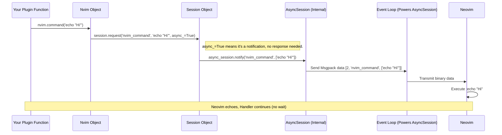
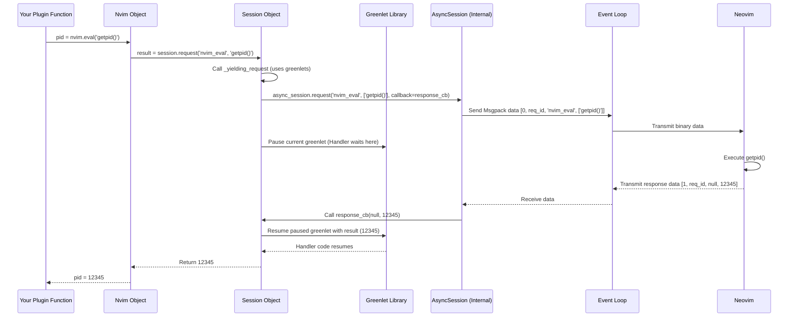

# Chapter 6: Msgpack-RPC Session (`Session`)

In [Chapter 5: Plugin Decorators (`@command`, `@function`, etc.)](05_plugin_decorators____command_____function___etc___.md), we saw how to use decorators like `@pynvim.command` to label our Python functions so the [Plugin Host (`Host`)](04_plugin_host___host___.md) can expose them to Neovim. We used the `nvim` object provided by the host to send commands back to Neovim, like `nvim.command('echo "Hi"')`.

But how does that message actually get from our Python code to the Neovim process? And how do responses or notifications from Neovim get back to our Python code? Underneath all the convenient objects like `Nvim` and `Buffer`, there's a fundamental communication manager: the **Msgpack-RPC Session (`Session`)**.

## The Dedicated Phone Line

Imagine your Python script and the Neovim process are in two separate buildings. To talk, they need a communication link. The `Session` object in `pynvim` acts like a **dedicated, private phone line** set up specifically for this conversation.

*   **It handles the low-level details:** Just like a phone line carries electrical signals representing voice, the `Session` manages the stream of binary data exchanged between Python and Neovim.
*   **It speaks the right language:** Both Neovim and `pynvim` agree to talk using a specific protocol called **Msgpack-RPC**. This protocol defines how messages (like requests, responses, and notifications) should be formatted using the efficient **Msgpack** serialization format. The `Session` is fluent in this protocol.
*   **It connects the ends:** It's the bridge between the high-level Python objects you use (like the [Nvim Object](02_nvim_object_.md)) and the actual network connection (socket, TCP, stdio pipe) established in [Chapter 1: Connection Establishment (`attach`, `*_session`)](01_connection_establishment___attach______session___.md).

Essentially, the `Session` object is responsible for:

1.  **Encoding:** Taking your Python requests (e.g., `nvim.command("echo 'Hi'")`) and translating them into the correct Msgpack-RPC format.
2.  **Sending:** Sending the encoded binary data over the connection to Neovim.
3.  **Receiving:** Listening for incoming binary data from Neovim.
4.  **Decoding:** Translating the received Msgpack-RPC data back into meaningful information for your Python code (like responses to your requests or notifications about events).

## Do I Need to Use `Session` Directly? Usually Not!

You might be wondering, "If this `Session` is so important, why haven't we used it much?"

That's because `pynvim` is designed to be user-friendly!

*   When you use `pynvim.attach()` (as shown in [Chapter 1: Connection Establishment (`attach`, `*_session`)](01_connection_establishment___attach______session___.md)), it automatically creates the appropriate `Session` object for you and wraps it inside the convenient [Nvim Object](02_nvim_object_.md).
*   When you use methods like `nvim.command()`, `nvim.eval()`, or access properties like `nvim.current.line`, the `Nvim` object uses its *internal* `Session` object to handle the communication behind the scenes.
*   Similarly, when you write plugins using decorators (Chapter 5), the [Plugin Host (`Host`)](04_plugin_host___host___.md) manages the `Session` and routes incoming messages to your decorated functions.

You *can* create and interact with a `Session` directly if you need fine-grained control or are using the lower-level `*_session` functions, as we briefly saw in Chapter 1:

```python
# Example from Chapter 1 (revisited)
from pynvim import socket_session, Nvim

NVIM_SOCKET = '/tmp/nvimXYZ/0' # Change this!

try:
    # 1. Create the Session object directly
    print(f"Creating Session using socket_session({NVIM_SOCKET})")
    session = socket_session(path=NVIM_SOCKET) # <--- The Session object!
    print(f"Session object created: {session}")

    # 2. Create the Nvim API wrapper from the Session
    nvim = Nvim.from_session(session)
    print("Nvim object created from session.")

    # 3. Use the Nvim object (which uses the session internally)
    print(f"Getting PID via nvim object: {nvim.eval('getpid()')}")

    # 4. (Advanced) You *could* call session.request directly, but it's less common
    # pid = session.request('nvim_eval', 'getpid()')
    # print(f"Getting PID via session.request: {pid}")

    nvim.close() # Closing nvim also closes the underlying session
    print("Connection closed.")

except FileNotFoundError:
    print(f"Error: Could not find Neovim socket at {NVIM_SOCKET}")
except Exception as e:
    print(f"An error occurred: {e}")
```

Most of the time, however, you'll interact with the `Nvim` object and let it manage the `Session` for you. Understanding the `Session` is valuable because it clarifies *how* the communication actually happens.

## Synchronous Feel, Asynchronous Core (with Greenlets)

Computer network communication is often *asynchronous*. When you send a request, you don't necessarily stop everything and wait; you might send the request and then do other things until the response arrives (like sending an email). Neovim's communication is inherently like this.

However, writing code that handles this "send now, get response later" model can be complex, especially for typical plugin tasks where you often want to ask Neovim something and get the answer right away before continuing.

`pynvim` performs a clever trick using a library called `greenlet`. Greenlets allow parts of your Python code to pause and resume without blocking the entire program.

*   **The `Session` object provides a synchronous API:** When you call `nvim.eval('getpid()')`, your Python code *appears* to wait right there until Neovim sends back the PID.
*   **Under the hood:**
    1.  The `Nvim` object calls `session.request('nvim_eval', 'getpid()')`.
    2.  The `Session` sends the request using an underlying `AsyncSession`.
    3.  If running inside a plugin host or a similar context where the event loop is active, the `Session` uses a greenlet to *pause* your specific function (e.g., your `@command` handler).
    4.  The main program (the event loop) continues running, processing other events or waiting for messages.
    5.  When Neovim's response arrives, the `Session` receives it, finds the paused greenlet that was waiting for this response, and *resumes* it, passing the result (the PID) back.
    6.  Your function continues executing from where it paused, now having the result.

Think of it like making a phone call (synchronous) versus sending an email (asynchronous):

*   **Asynchronous (Email):** You send an email request. You continue working. Later, you get a notification and read the reply.
*   **Synchronous via Greenlets (Phone Call):** You make a phone call. You wait on the line (your greenlet pauses). The other person answers (response arrives). You get the information and hang up (your greenlet resumes and returns the value).

This use of greenlets makes writing `pynvim` plugins feel more straightforward, like writing standard synchronous Python code, while still leveraging the efficient asynchronous communication with Neovim underneath. The `Session` is the component that orchestrates this greenlet magic.

## Under the Hood: How `Session` Works

The `Session` class is defined in `pynvim/msgpack_rpc/session.py`. It acts as a wrapper around an `AsyncSession` object (from `pynvim/msgpack_rpc/async_session.py`), which in turn interacts with the lower-level event loop and message stream.

**Sending a Request (`nvim.command -> session.request`)**

Let's trace a simplified flow when you call `nvim.command('echo "Hi"')` from within a plugin handler function:



Now, consider a request expecting a response, like `nvim.eval('getpid()')`:



**Key Code Snippets (Simplified)**

*   **`pynvim/msgpack_rpc/session.py`**: Defines the `Session` class.

    ```python
    # Simplified from pynvim/msgpack_rpc/session.py
    import greenlet # For synchronous API magic
    from collections import deque
    from pynvim.msgpack_rpc.async_session import AsyncSession

    class Session:
        def __init__(self, async_session: AsyncSession):
            """Wrap `async_session` for a synchronous API."""
            self._async_session = async_session
            # Callbacks for incoming messages (set by Nvim object or Host)
            self._request_cb: Optional[Callable] = None
            self._notification_cb: Optional[Callable] = None
            # Queue for messages received when loop isn't running fully
            self._pending_messages: Deque = deque()
            self._is_running = False # Is the main event loop running?

        def request(self, method: AnyStr, *args: Any, **kwargs: Any) -> Any:
            """Send request, block until response received (using greenlets)."""
            # (Handles async_=True for notifications)
            # ...
            if self._is_running:
                # If loop is running (e.g., inside plugin host),
                # use greenlet to yield/wait.
                v = self._yielding_request(method, args)
            else:
                # If loop not running (e.g., standalone script),
                # block and run loop temporarily.
                v = self._blocking_request(method, args)
            # ... (Process result v: error handling) ...
            err, rv = v
            if err: raise self.error_wrapper(err)
            return rv

        def _yielding_request(self, method, args):
            """Send request and yield using greenlet."""
            gr = greenlet.getcurrent() # Get the current execution context (greenlet)
            parent = gr.parent        # Get the parent context (often the event loop)

            def response_cb(err, rv):
                # This callback runs when the response arrives
                # It switches execution back to the waiting greenlet 'gr'
                gr.switch(err, rv)

            # Ask AsyncSession to send, calling response_cb when done
            self._async_session.request(method, args, response_cb)

            # Pause this greenlet ('gr') and switch control to 'parent'.
            # Execution stops here until response_cb calls gr.switch()
            return parent.switch()

        def run(self, request_cb, notification_cb, setup_cb=None):
            """Run the main event loop, processing incoming messages."""
            self._request_cb = request_cb
            self._notification_cb = notification_cb
            self._is_running = True
            # ... (handle setup_cb) ...
            # Process any messages received before loop started
            while self._pending_messages:
                 # ... process message ...
                 pass
            # Start the underlying async loop, using _on_request/_on_notification
            self._async_session.run(self._on_request, self._on_notification)
            self._is_running = False
            # ... (cleanup) ...

        def _on_request(self, name, args, response):
            """Handle incoming request from Neovim."""
            def handler(): # This runs inside a new greenlet
                try:
                    # Call the actual handler (e.g., your @command function)
                    rv = self._request_cb(name, args)
                    response.send(rv) # Send result back
                except Exception as e:
                    # Handle errors, send error response back
                    response.send(repr(e), error=True)
            # Create and start the greenlet for the handler
            gr = greenlet.greenlet(handler)
            gr.switch()

        def _on_notification(self, name, args):
            """Handle incoming notification from Neovim."""
            # Similar to _on_request, but no response is sent back
            def handler(): # This runs inside a new greenlet
                 try:
                    self._notification_cb(name, args)
                 except Exception:
                    # Log errors, can't send response
                    pass
            gr = greenlet.greenlet(handler)
            gr.switch()
    ```

The `Session` acts as the crucial bridge, translating between the synchronous world your Python code often lives in and the asynchronous reality of Neovim communication, using greenlets to manage the flow.

## Conclusion

You've now explored the `Session` object, the core communication manager in `pynvim`.

*   It acts like the dedicated phone line between Python and Neovim, handling the low-level Msgpack-RPC protocol.
*   It encodes and sends requests, receives and decodes responses and notifications.
*   While essential, it's often managed automatically by `pynvim.attach()` and the `Nvim` object.
*   It cleverly uses an underlying `AsyncSession` and `greenlets` to provide a synchronous API, making plugin development feel more straightforward.

The `Session` relies on the underlying `AsyncSession` and, more fundamentally, an event loop to actually handle the sending and receiving of data over the network or pipes. Let's dive into that event loop next.

Next up: [Chapter 7: Event Loop (`BaseEventLoop`/`AsyncioEventLoop`)](07_event_loop___baseeventloop___asyncioeventloop___.md)

---

Generated by [AI Codebase Knowledge Builder](https://github.com/The-Pocket/Tutorial-Codebase-Knowledge)