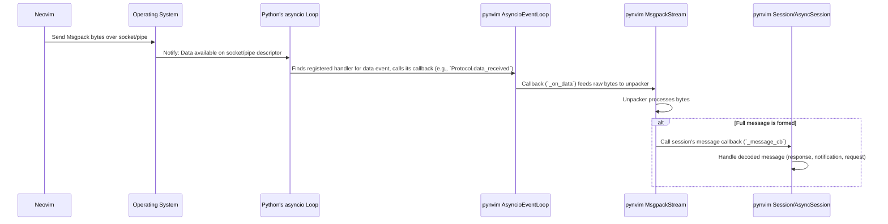

# Chapter 7: Event Loop (`BaseEventLoop`/`AsyncioEventLoop`)

In the previous chapter, [Chapter 6: Msgpack-RPC Session (`Session`)](06_msgpack_rpc_session___session___.md), we learned about the `Session` object, which acts like a dedicated phone line handling the Msgpack-RPC protocol between Python and Neovim. It encodes and decodes messages, giving us a (seemingly) synchronous way to communicate.

But how does the `Session` *actually* send and receive the raw bytes of data over the connection (like a TCP socket or a standard input/output pipe)? How does it manage to do this without blocking the entire program, especially when running as a plugin inside Neovim? This is where the **Event Loop** comes in.

## The Engine Room: What is the Event Loop?

Imagine our `Session` is like the bridge of a ship, deciding where to go and what messages to send. The **Event Loop** is the **engine room** below deck. It's the powerful engine that actually drives the ship, managing the low-level tasks of reading and writing data over the communication channel, handling signals, and scheduling tasks, all without stopping the entire ship if one task takes a while.

In `pynvim`, the Event Loop is responsible for:

1.  **Watching for Events:** It constantly monitors the connection to Neovim (e.g., the socket or pipe). Is there new data waiting to be read? Is the connection ready for us to send data?
2.  **Reacting to Events:** When an event happens (like data arriving), the Event Loop wakes up and runs the appropriate code (a "callback" function) to handle it. For example, it tells the `Session`'s machinery, "Here's some data I just received!"
3.  **Non-Blocking I/O:** Crucially, it does this *without blocking*. If it's waiting for data from Neovim, it doesn't just freeze the whole Python program. It efficiently tells the operating system, "Wake me up when there's data," and lets other Python code (or other events) run in the meantime.
4.  **Scheduling Tasks:** It can also schedule tasks to run later or periodically.

## Why `asyncio`? Python's Built-in Engine

Building an efficient, cross-platform event loop is complex. Thankfully, Python has a built-in standard library module called `asyncio` specifically designed for writing asynchronous, event-driven code.

`pynvim` smartly leverages `asyncio` for its event loop implementation. This means it benefits from a well-tested, standard, and efficient engine without having to reinvent it.

*   **`BaseEventLoop`:** This is an *abstract base class* defined within `pynvim` (`pynvim/msgpack_rpc/event_loop/base.py`). Think of it as a blueprint or contract that specifies *what* an event loop needs to do for `pynvim` (methods like `run`, `stop`, `send`, `connect_tcp`, etc.).
*   **`AsyncioEventLoop`:** This is the *concrete implementation* of `BaseEventLoop` provided by `pynvim` (`pynvim/msgpack_rpc/event_loop/asyncio.py`). It uses Python's `asyncio` module under the hood to fulfill the requirements of the `BaseEventLoop` blueprint.

You almost never need to interact with `BaseEventLoop` or `AsyncioEventLoop` directly. When you call `pynvim.attach()`, it automatically selects and creates an `AsyncioEventLoop` instance appropriate for your connection type (TCP, socket, stdio, child). This loop instance is then used internally by the [Msgpack-RPC Session (`Session`)](06_msgpack_rpc_session___session___.md) to manage the actual I/O.

## How `pynvim` Uses the Event Loop

Let's trace how data flows from Neovim back to your Python code, focusing on the role of the Event Loop:

1.  **Connection:** When `pynvim.attach()` connects, it creates an `AsyncioEventLoop` instance.
2.  **Callbacks:** It tells the `AsyncioEventLoop` instance: "When data arrives on the connection, please call this specific function (`_on_data` inside `MsgpackStream`)".
3.  **Running the Loop:** The `Session` (or the [Plugin Host (`Host`)](04_plugin_host___host___.md)) eventually calls the `run()` method of the `AsyncioEventLoop`. This starts the underlying `asyncio` engine.
4.  **Waiting:** The `asyncio` loop now waits efficiently for events (using operating system mechanisms like `select`, `poll`, `epoll`, `kqueue`, or IOCP).
5.  **Data Arrives:** Neovim sends some data (e.g., a response to `nvim.eval()`).
6.  **OS Notification:** The operating system detects the incoming data on the socket/pipe.
7.  **Loop Wakes Up:** The OS notifies the `asyncio` event loop.
8.  **Callback Execution:** The `asyncio` loop sees the "data ready" event and calls the registered callback function (`_on_data` in `MsgpackStream`).
9.  **Data Processing:** The callback function receives the raw bytes, feeds them to the Msgpack unpacker (managed by the `Session`), which eventually triggers your Python code (e.g., resuming a paused greenlet with the result of `nvim.eval()`).

The key benefit is that while the loop is waiting (Step 4), your Python program isn't frozen. If running as a plugin, Neovim remains responsive.

## Under the Hood: Inside `AsyncioEventLoop`

Let's peek at how the `AsyncioEventLoop` connects the high-level `pynvim` needs to the low-level `asyncio` machinery.

**Simplified Walkthrough (Receiving Data):**

Imagine Neovim sends the bytes representing a response message.



The `AsyncioEventLoop` acts as the bridge, configuring `asyncio` and providing the necessary callbacks that link `asyncio`'s events back to `pynvim`'s message processing logic.

**Code Snippets (Simplified):**

The core logic lives in `pynvim/msgpack_rpc/event_loop/asyncio.py`.

*   **Initialization:** It creates an `asyncio` event loop instance.

    ```python
    # Simplified from pynvim/msgpack_rpc/event_loop/asyncio.py
    import asyncio

    class AsyncioEventLoop(BaseEventLoop):
        def __init__(self, transport_type, *args, **kwargs):
            # Get the appropriate asyncio loop class (Selector or Proactor)
            loop_cls = asyncio.SelectorEventLoop # (Or ProactorEventLoop on Windows)
            # Create the actual asyncio event loop instance
            self._loop: asyncio.AbstractEventLoop = loop_cls()

            # Buffer for data received before run() starts
            self._data_buffer = deque()
            self._on_data = None # Will hold the callback from MsgpackStream

            # Factory to create the Protocol object (see below)
            self._protocol_factory = lambda: Protocol(
                on_data=self._handle_data_received, # Method to call on data
                on_error=self._on_error,         # Method to call on error
            )
            self._transport = None # Will hold the asyncio transport object

            # Call BaseEventLoop constructor to trigger connection
            super().__init__(transport_type, *args, **kwargs)

        def _handle_data_received(self, data: bytes):
            # This method is called by the Protocol object
            if self._on_data:
                self._on_data(data) # Call the callback registered by MsgpackStream
            else:
                self._data_buffer.append(data) # Buffer if loop not fully running yet
    ```

*   **Connecting (e.g., TCP):** It uses `asyncio` functions to establish the connection within the loop's context.

    ```python
    # Simplified from pynvim/msgpack_rpc/event_loop/asyncio.py
    class AsyncioEventLoop(BaseEventLoop):
        # ... (init) ...
        def _connect_tcp(self, address: str, port: int) -> None:
            # Define an async function to perform the connection
            async def connect_tcp_async():
                # Use asyncio's built-in function to create a TCP connection
                # It returns a 'transport' (for writing) and a 'protocol' instance
                transport, protocol = await self._loop.create_connection(
                    self._protocol_factory, address, port)
                self._transport = transport # Store the transport for sending data
                self._protocol = protocol   # Store the protocol instance

            # Run the async connection function until it completes
            self._loop.run_until_complete(connect_tcp_async())
        # ... (_connect_socket, _connect_stdio, _connect_child are similar) ...
    ```

*   **Running the Loop:** It simply starts the underlying `asyncio` loop.

    ```python
    # Simplified from pynvim/msgpack_rpc/event_loop/asyncio.py
    class AsyncioEventLoop(BaseEventLoop):
        # ... (init, connects) ...
        def _run(self) -> None:
            # Process any data received before the loop fully started
            while self._data_buffer:
                data = self._data_buffer.popleft()
                if self._on_data:
                    self._on_data(data)

            # This is the core: tell asyncio to run indefinitely,
            # processing I/O events and calling callbacks.
            self._loop.run_forever()

        def _stop(self) -> None:
            # Tell the asyncio loop to stop running.
            self._loop.stop()
    ```

*   **Sending Data:** It uses the `transport` object provided by `asyncio`.

    ```python
    # Simplified from pynvim/msgpack_rpc/event_loop/asyncio.py
    class AsyncioEventLoop(BaseEventLoop):
        # ... (init, connects, run) ...
        def _send(self, data: bytes) -> None:
            # Ensure connection was established
            assert self._transport, "Connection not established."
            # Use the asyncio transport object's write method
            self._transport.write(data)
    ```

*   **The `Protocol` Class:** This helper class links `asyncio`'s event handling to `pynvim`'s callbacks.

    ```python
    # Simplified from pynvim/msgpack_rpc/event_loop/asyncio.py

    # This class is used by asyncio's connection functions
    class Protocol(asyncio.Protocol): # (Also SubprocessProtocol for child)
        def __init__(self, on_data, on_error):
            # Store the callbacks provided by AsyncioEventLoop
            self._on_data = on_data
            self._on_error = on_error
            self._transport = None

        def connection_made(self, transport):
            # Called by asyncio when connection is successful
            self._transport = transport

        def connection_lost(self, exc):
            # Called by asyncio if connection drops
            self._on_error(exc if exc else EOFError("connection lost"))

        def data_received(self, data: bytes):
            # *** Crucial Link ***
            # Called by asyncio when data arrives from Neovim.
            # It calls the '_on_data' callback passed during initialization,
            # which triggers MsgpackStream processing.
            self._on_data(data)

        # ... (pipe_data_received, process_exited for child processes) ...
    ```

The `AsyncioEventLoop` acts as an adapter, translating the generic needs defined by `BaseEventLoop` into specific calls to the `asyncio` library, ensuring efficient, non-blocking communication.

## Conclusion

You've reached the engine room! The Event Loop (`BaseEventLoop`/`AsyncioEventLoop`) is the fundamental component that drives `pynvim`'s communication with Neovim.

*   It manages low-level, non-blocking I/O operations (reading/writing bytes).
*   It uses Python's built-in `asyncio` library for efficiency and portability.
*   It watches for events (like incoming data) and triggers callbacks in the `Session` layer to process them.
*   While crucial, it operates behind the scenes; you typically don't interact with it directly, thanks to abstractions like `pynvim.attach` and the `Session`.

Understanding the Event Loop completes our journey through the core concepts of `pynvim`, from establishing connections and interacting with Neovim objects to writing plugins and understanding the underlying communication mechanics. You now have a solid foundation for exploring `pynvim` further and building powerful integrations with Neovim!

---

Generated by [AI Codebase Knowledge Builder](https://github.com/The-Pocket/Tutorial-Codebase-Knowledge)