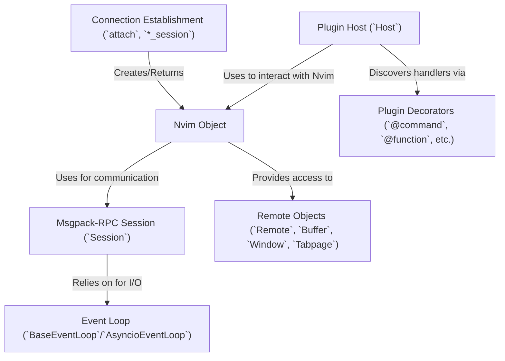

# Tutorial: pynvim

`pynvim` is a Python library that lets you **control** and **interact** with a *Neovim* instance programmatically.
It allows you to send commands, evaluate code, handle events, access Neovim's state (like buffers and windows), and write Neovim *plugins* in Python.
It manages the low-level *MessagePack-RPC* communication needed to talk to Neovim.

**Source Repository:** [None](None)

## Chapters

1. [Connection Establishment (`attach`, `*_session`)
](01_connection_establishment___attach______session___.md)
2. [Nvim Object
](02_nvim_object_.md)
3. [Remote Objects (`Remote`, `Buffer`, `Window`, `Tabpage`)
](03_remote_objects___remote____buffer____window____tabpage___.md)
4. [Plugin Host (`Host`)
](04_plugin_host___host___.md)
5. [Plugin Decorators (`@command`, `@function`, etc.)
](05_plugin_decorators____command_____function___etc___.md)
6. [Msgpack-RPC Session (`Session`)
](06_msgpack_rpc_session___session___.md)
7. [Event Loop (`BaseEventLoop`/`AsyncioEventLoop`)
](07_event_loop___baseeventloop___asyncioeventloop___.md)

---

Generated by [AI Codebase Knowledge Builder](https://github.com/The-Pocket/Tutorial-Codebase-Knowledge)