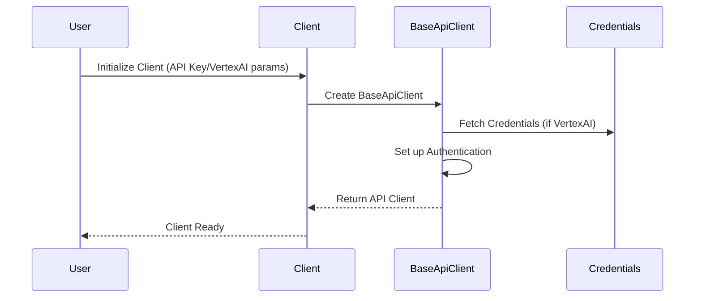

# Chapter 1: Client

Welcome to the exciting world of Generative AI with the `python-genai` library! In this first chapter, we'll explore the `Client` class, which is your gateway to interacting with Google's powerful AI models. Think of the `Client` as the key to unlocking all the amazing things you can do with AI.

Imagine you want to build a simple chatbot that answers questions about animals. To do this, you need a way to connect to Google's AI service and tell it what you want to do. The `Client` class is precisely what helps you do that! It handles the connection, authentication, and sets you up to use all the features provided by the library.

## What Problem Does the Client Solve?

Without the `Client`, you'd have to manually manage the connection to the AI service, handle authentication (proving you have permission to use the service), and figure out how to send requests in the correct format. This can be complicated and time-consuming!

The `Client` simplifies all of this by:

*   **Managing the Connection:** It sets up and maintains the connection to the Google Generative AI APIs.
*   **Handling Authentication:** It securely authenticates your requests, so the AI service knows it's you.
*   **Providing Easy Access:** It gives you simple ways to access the different modules (like [Chats Module](02_chats_module.md) and [Models Module](03_models_module.md)) that offer various functionalities.
*   **Configuring API Endpoints:** It allows you to choose whether to use the Gemini API or the Vertex AI API.

## Using the Client: A Simple Example

Let's look at how to use the `Client` to get started. For this example, we'll just create a client object. We'll dive into actually _using_ it in later chapters.

```python
from google import genai

# Initialize the Client with your API key
client = genai.Client(api_key="YOUR_API_KEY")

print(client) # Output will be a client object
```

**Explanation:**

1.  We first import the `genai` library.
2.  Then, we create a `Client` object.  You **must** replace `"YOUR_API_KEY"` with your actual API key.  You can get an API key from the [Google AI Studio](https://makersuite.google.com/).
3.  Finally, we print the client object. This confirms that the client has been initialized correctly.

**Important:** Make sure you have the `google-generative-ai` package installed. If not, run `pip install google-generative-ai`.

## Two Ways to Use the Client: Gemini API and Vertex AI

The `Client` can be configured to use either the Gemini API or the Vertex AI API. These are two different ways to access Google's AI models.

*   **Gemini API:** This is generally easier to get started with, especially for smaller projects and experimentation.  It uses an API key for authentication.
*   **Vertex AI API:** This is typically used for larger, more complex projects that require more control and integration with other Google Cloud services. It requires a Google Cloud project and uses Google Cloud credentials.

The `Client` automatically defaults to using the Gemini API unless you specify otherwise!

### Using the Gemini API

As seen above, to use the Gemini API, you can simply initialize the `Client` with your API key:

```python
from google import genai

client = genai.Client(api_key="YOUR_API_KEY")
```

### Using the Vertex AI API

To use the Vertex AI API, you need to specify `vertexai=True`, along with your project ID and location:

```python
from google import genai

client = genai.Client(vertexai=True, project="YOUR_PROJECT_ID", location="YOUR_LOCATION")
```

**Explanation:**

*   `vertexai=True` tells the `Client` to use the Vertex AI API endpoints.
*   `project="YOUR_PROJECT_ID"` specifies your Google Cloud project ID. Replace `"YOUR_PROJECT_ID"` with your actual project ID.
*   `location="YOUR_LOCATION"` specifies the location of your project (e.g., `"us-central1"`). Replace `"YOUR_LOCATION"` with the correct location.

## Behind the Scenes: How the Client Works

Let's take a peek under the hood to understand how the `Client` works its magic.

Here's a simplified sequence diagram illustrating the client's initialization process:



**Explanation:**

1.  The user initializes the `Client` with either an API key (for Gemini API) or Vertex AI parameters (project ID, location).
2.  The `Client` then creates an instance of `BaseApiClient`.  The [BaseApiClient](05_baseapiclient.md) handles the actual communication with the Google Generative AI APIs.
3.  If Vertex AI is enabled, the `BaseApiClient` fetches the necessary Google Cloud credentials.
4.  The `BaseApiClient` sets up authentication using either the API key or the Google Cloud credentials.
5.  Finally, the `BaseApiClient` is returned to the `Client`, making the client ready to use.

Now, let's look at a code snippet from `google/genai/client.py` to see how the `BaseApiClient` is initialized:

```python
# From google/genai/client.py

  @staticmethod
  def _get_api_client(
      vertexai: Optional[bool] = None,
      api_key: Optional[str] = None,
      credentials: Optional[google.auth.credentials.Credentials] = None,
      project: Optional[str] = None,
      location: Optional[str] = None,
      debug_config: Optional[DebugConfig] = None,
      http_options: Optional[HttpOptions] = None,
  ) -> BaseApiClient:
    return BaseApiClient(
        vertexai=vertexai,
        api_key=api_key,
        credentials=credentials,
        project=project,
        location=location,
        http_options=http_options,
    )
```

**Explanation:**

This code shows the `_get_api_client` method within the `Client` class. It is responsible for creating the `BaseApiClient` instance. It passes the API key or Vertex AI related information (`vertexai`, `project`, `location`, `credentials`) that the user provided to the `BaseApiClient`. The `BaseApiClient` will then use this information to authenticate with the Google Generative AI services. We'll look into [BaseApiClient](05_baseapiclient.md) in more detail in a later chapter.

## Conclusion

In this chapter, you've learned about the `Client` class, which is the starting point for using the `python-genai` library. You've seen how it simplifies the process of connecting to the Google Generative AI APIs and handles authentication. You've also learned how to configure the `Client` to use either the Gemini API or the Vertex AI API.

Now that you have a `Client` object, you're ready to start exploring the various modules that provide different functionalities. In the next chapter, we'll dive into the [Chats Module](02_chats_module.md), which allows you to create conversational AI applications.


---

Generated by [AI Codebase Knowledge Builder](https://github.com/The-Pocket/Tutorial-Codebase-Knowledge)