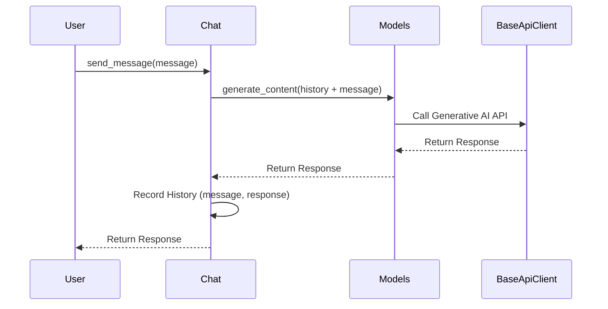

# Chapter 2: Chats Module

Welcome back! In the previous chapter, [Client](01_client.md), we learned how to set up a `Client` object, which acts as our connection to Google's Generative AI services. Now, let's explore how to use that connection to have a conversation with an AI! This is where the `Chats` module comes in.

## Why Use the Chats Module?

Imagine you're building a chatbot that helps users brainstorm ideas for their next vacation. You don't just want the AI to answer a single question; you want it to remember the previous suggestions and build upon them in a meaningful way.

The `Chats` module solves this problem. It lets you create a chat "session" with the AI, where each message you send and receive is remembered. It's like having a continuous conversation, allowing the AI to understand the context and provide more relevant and helpful responses.

## Key Concepts: Chat Sessions and Messages

Think of the `Chats` module as providing a way to manage conversations with the AI, similar to how you'd manage conversations in a messaging app.

Here are the key concepts:

*   **Chat Session:** This is an ongoing conversation with the AI. You create a chat session using the `Chats` module, and it keeps track of all the messages exchanged.

*   **Messages:** These are the individual turns in the conversation. You send a message to the AI, and it responds with its own message.

## Using the Chats Module: A Vacation Brainstorming Example

Let's see how to use the `Chats` module to build our vacation brainstorming chatbot.

First, we need to create a chat session:

```python
from google import genai

# Initialize the Client with your API key
client = genai.Client(api_key="YOUR_API_KEY")

# Access the Chats module through the client
chats = client.chats

# Create a chat session using the 'gemini-1.5-flash' model
chat = chats.create(model='gemini-1.5-flash')

print(chat) # Output will be a chat object
```

**Explanation:**

1.  We import the `genai` library and create a `Client` object, just like in the previous chapter.
2.  We access the `chats` attribute of the `client` object. This gives us access to the `Chats` module.
3.  We use the `chats.create()` method to create a new chat session.  We specify the model we want to use (in this case, `'gemini-1.5-flash'`). You can pick other models too!

Now that we have a chat session, let's send a message and see what the AI says:

```python
response = chat.send_message("I want to go on vacation. Where should I go?")

print(response.text)
```

**Explanation:**

1.  We use the `chat.send_message()` method to send a message to the AI.
2.  The `send_message()` method returns a `GenerateContentResponse` object, which contains the AI's response.
3.  We access the `text` attribute of the `response` object to get the AI's message as a string and print it.

Let's say the AI responds with: "Consider visiting Hawaii. It has beautiful beaches and volcanoes." Now, let's ask a follow-up question that relies on the previous message:

```python
response = chat.send_message("That sounds great! What are some fun activities I can do there?")

print(response.text)
```

**Explanation:**

1.  Again, we use `chat.send_message()` to send another message.
2.  Because this is the same chat session, the AI remembers our previous message about Hawaii. It can now suggest activities specifically for Hawaii.

The AI might respond with something like: "You can go surfing, hiking, or visit a volcano. Don't forget to try the local cuisine!"

## Getting the Conversation History

The `Chats` module also allows you to retrieve the entire conversation history. This can be useful for debugging, logging, or displaying the conversation to the user.

```python
history = chat.get_history()

for message in history:
    print(f"{message.role}: {message.parts[0].text}")
```

**Explanation:**

1.  We use the `chat.get_history()` method to get a list of all the messages in the chat session.
2.  We loop through the list of messages and print the role (either "user" or "model") and the text of each message.

## Understanding `curated` History

Behind the scenes, the `Chats` module keeps track of two versions of the chat history:

*   **Comprehensive History:** This includes every message sent and received, *even if the AI's response was invalid*. An invalid response might occur because it doesn't have text in it, or due to internal API reasons, it was rejected.

*   **Curated History:** This includes only the messages that are considered valid. This is the history that's used when sending new messages to the AI.

You can choose which history you want to retrieve using the `curated` argument of the `get_history()` method:

*   `chat.get_history(curated=False)` (or just `chat.get_history()`): Returns the comprehensive history.
*   `chat.get_history(curated=True)`: Returns the curated history.

**Why is this useful?**

Sometimes, the AI might generate an invalid response (for example, due to errors or restrictions).  By default the `send_message` methods automatically skip invalid turns (model's response that is not fit), so your conversation can proceed uninterrupted. You can inspect `get_history()` to observe whether your interaction has been smooth.

## Under the Hood: How the Chats Module Works

Let's take a look at what happens behind the scenes when you send a message using the `Chats` module.

Here's a simplified sequence diagram:



**Explanation:**

1.  The user calls the `send_message()` method on the `Chat` object.
2.  The `Chat` object calls the `generate_content()` method on the [Models Module](03_models_module.md), passing the conversation history and the new message. The `Models` module is responsible for interacting with the generative models.
3.  The `Models` module uses the [BaseApiClient](05_baseapiclient.md) to send a request to the Google Generative AI API.
4.  The Google Generative AI API processes the request and returns a response to the `BaseApiClient`.
5.  The `BaseApiClient` passes the response back to the `Models` module.
6.  The `Models` module passes the response back to the `Chat` object.
7.  The `Chat` object records the message and the response in the conversation history.
8.  The `Chat` object returns the response to the user.

Now, let's look at a code snippet from `google/genai/chats.py` to see how the `send_message` method works:

```python
# From google/genai/chats.py

  def send_message(
      self,
      message: Union[list[PartUnionDict], PartUnionDict],
      config: Optional[GenerateContentConfigOrDict] = None,
  ) -> GenerateContentResponse:
    input_content = t.t_content(self._modules._api_client, message)
    response = self._modules.generate_content(
        model=self._model,
        contents=self._curated_history + [input_content],  # type: ignore[arg-type]
        config=config if config else self._config,
    )
    # ... (rest of the code)
```

**Explanation:**

1.  The `send_message` method takes the user's message as input.
2.  It prepares the message for sending to the API.
3.  It calls the `generate_content` method of the `Models` module, passing in the `curated_history` and the new message.
4.  The `generate_content` method returns the AI's response.
5.  The rest of the code handles recording the message and response in the history.

## Conclusion

In this chapter, you've learned about the `Chats` module and how to use it to create conversational AI applications. You've seen how to create chat sessions, send messages, retrieve the conversation history, and stream results back. You also learned about the difference between `curated` and `comprehensive` history and why each is useful.

Now that you know how to manage conversations with the AI, let's move on to the [Models Module](03_models_module.md) in the next chapter. You'll learn how to select and configure different AI models for your applications.


---

Generated by [AI Codebase Knowledge Builder](https://github.com/The-Pocket/Tutorial-Codebase-Knowledge)