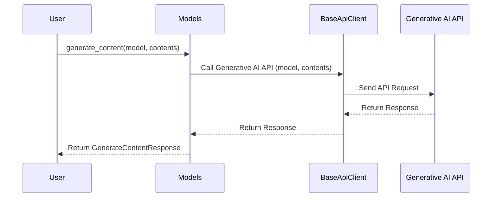

# Chapter 3: Models Module

Welcome back! In the previous chapter, [Chats Module](02_chats_module.md), we learned how to create conversational AI applications using the `Chats` module. Now, let's dive into the heart of generative AI: the models themselves! This is where the `Models` module comes into play.

## Why Use the Models Module?

Imagine you want to generate a blog post about your favorite hobby. You need a way to tell the AI: "Hey, use this powerful model to write a blog post based on this prompt." That's precisely what the `Models` module allows you to do.

The `Models` module provides you with the tools to interact directly with generative AI models. Think of it as a toolbox filled with different tools (functions) for working with AI models.

## What Can You Do with the Models Module?

The `Models` module is your all-in-one toolkit for generative AI tasks. It enables you to:

*   **Generate Content:**  Create text, code, and more from a given prompt.  This is like using a hammer to build something – you're directly creating content.
*   **Count Tokens:** Determine the number of tokens in a given text. Think of this as a measuring tape, helping you understand the length of your text for cost estimation or model input limits.
*   **Embed Content:** Create vector representations of text, which can be used for semantic search and other advanced AI tasks.
*   **Generate Images (Imagen):** Create images from text prompts.
*   **Generate Videos (Veo):** Create videos from text prompts.

## Using the Models Module: Writing a Blog Post

Let's use the `Models` module to generate that blog post we talked about. We'll focus on generating text content in this example.

First, we need to access the `Models` module through our `Client` object:

```python
from google import genai

# Initialize the Client with your API key
client = genai.Client(api_key="YOUR_API_KEY")

# Access the Models module through the client
models = client.models

print(models) # Output will be a models object
```

**Explanation:**

1.  We import the `genai` library and create a `Client` object. (Remember to replace `"YOUR_API_KEY"` with your actual API key!)
2.  We access the `models` attribute of the `client` object. This gives us access to the `Models` module.
3. We print the models object. This confirms that the models module has been initialized correctly.

Now, let's use the `generate_content()` method to generate our blog post:

```python
prompt = "Write a short blog post about the benefits of learning Python."
response = models.generate_content(model='gemini-1.5-flash', contents=prompt)

print(response.text)
```

**Explanation:**

1.  We define a `prompt` variable containing the text we want the AI to use as a starting point.
2.  We call the `generate_content()` method of the `models` object.
    *   `model='gemini-1.5-flash'` specifies which model to use. You can choose different models depending on your needs.
    *   `contents=prompt` provides the prompt we defined earlier.
3.  The `generate_content()` method returns a `GenerateContentResponse` object, which contains the AI's generated content.
4.  We access the `text` attribute of the `response` object to get the generated blog post as a string and print it.

The output will be a blog post generated by the AI, based on your prompt!

## Exploring the Models Module: Other Useful Functions

Besides `generate_content()`, the `Models` module offers other powerful functions:

*   **`count_tokens()`:**  Counts the number of tokens in a given text. This is useful for estimating costs or ensuring that your input text doesn't exceed the model's token limit.

    ```python
    text = "This is a short sentence."
    response = models.count_tokens(model='gemini-1.5-flash', contents=text)

    print(response)
    ```

    This will output the token count for the provided sentence.

*   **`embed_content()`:** Creates a numerical representation (embedding) of a given text. This is useful for tasks like semantic search, where you want to find texts that are similar in meaning.

    ```python
    text = "The quick brown fox jumps over the lazy dog."
    response = models.embed_content(model='text-embedding-004', contents=text)

    print(response)
    ```

    This will output a vector (a list of numbers) representing the meaning of the sentence.

## Behind the Scenes: How the Models Module Works

Let's peek behind the curtain and see what happens when you call `models.generate_content()`.

Here's a simplified sequence diagram:



**Explanation:**

1.  The user calls the `generate_content()` method on the `Models` object, providing the model name and content.
2.  The `Models` module uses the [BaseApiClient](05_baseapiclient.md) to send a request to the Google Generative AI API. The `BaseApiClient` handles the low-level communication with the API.
3.  The Google Generative AI API processes the request and generates the content.
4.  The Google Generative AI API returns the response to the `BaseApiClient`.
5.  The `BaseApiClient` passes the response back to the `Models` module.
6.  The `Models` module returns a `GenerateContentResponse` object to the user.

Now, let's look at a code snippet from `google/genai/models.py` to see how the `generate_content` method works:

```python
# From google/genai/models.py

  def generate_content(
      self,
      model: str,
      contents: ContentUnion,
      config: Optional[GenerateContentConfigOrDict] = None,
  ) -> GenerateContentResponse:
    # ... (code for preparing the request) ...
    response_dict = self._api_client.request(
        'post', path, request_dict, http_options
    )
    # ... (code for processing the response) ...
    return GenerateContentResponse._from_response(
        response=response_dict, kwargs=parameter_model.model_dump()
    )
```

**Explanation:**

This code snippet shows the core logic of the `generate_content` method. It constructs the request to the Google Generative AI API using the provided `model` and `contents`, sends the request using the `_api_client`, and then processes the response to create a `GenerateContentResponse` object. The [BaseApiClient](05_baseapiclient.md) is used to make the underlying API call.

## Conclusion

In this chapter, you've learned about the `Models` module and how to use it to interact directly with generative AI models. You've seen how to generate content, count tokens, and embed content.

Now that you have a solid understanding of the `Models` module, you're ready to explore more advanced features, such as Automatic Function Calling. In the next chapter, we'll dive into [Automatic Function Calling (AFC)](04_automatic_function_calling__afc_.md), which allows you to seamlessly integrate external tools and functions into your AI applications.


---

Generated by [AI Codebase Knowledge Builder](https://github.com/The-Pocket/Tutorial-Codebase-Knowledge)