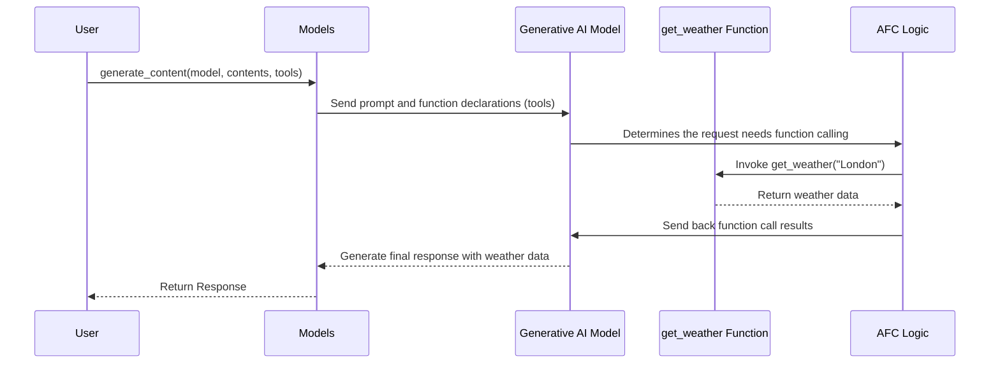

# Chapter 4: Automatic Function Calling (AFC)

Welcome back! In the previous chapter, [Models Module](03_models_module.md), we learned how to use the `Models` module to generate content, count tokens, and embed content. Now, let's explore a super cool feature that takes things to the next level: Automatic Function Calling (AFC)!

## What Problem Does AFC Solve?

Imagine you're building a chatbot that helps users find information about the weather. You could ask the AI: "What's the weather like in London?".  Without AFC, the AI can only *guess* the answer based on its training data, which might be outdated or inaccurate.

AFC solves this by allowing the AI to automatically use external tools (like a weather API) to get the *real-time* information and provide a much more accurate response.  Think of it like giving your chatbot the ability to use Google Search!

So, instead of just "knowing" the weather, the chatbot can:

1.  Recognize that you're asking about the weather.
2.  Automatically call a weather API (a predefined function) to get the current weather in London.
3.  Present the real-time weather information to you in a clear and concise way.

That's the power of Automatic Function Calling! It allows the AI to go beyond just generating text and actually *do things* based on your requests. It converts python functions to function declarations for remote execution by the LLM automatically. Picture it as enabling a chatbot to not only understand your requests but also automatically find a helper that can resolve or fulfill the requests.

## Key Concepts: Functions and Tools

To understand AFC, we need to grasp two important ideas:

*   **Functions:** These are simply Python functions that perform specific tasks. In our weather example, the function would call the weather API and return the weather data. You can write these functions yourself!
*   **Tools:** In the context of `python-genai`, 'Tools' are just a *list* of functions that you want the AI to be able to use. It's like giving the AI a toolbox with specific tools for different jobs.

## Using AFC: The Weather Chatbot Example

Let's walk through how to use AFC to build our weather chatbot.

First, we need to define our "get weather" function.  This is where you'd normally connect to a real weather API, but for simplicity, let's just return a fixed response:

```python
def get_weather(location: str) -> str:
  """Gets the current weather for a location."""
  if location.lower() == "london":
    return "The weather in London is cloudy with a temperature of 15°C."
  else:
    return f"I don't have weather information for {location}."
```

**Explanation:**

*   This `get_weather` function takes a `location` as input (e.g., "London").
*   It returns a string describing the weather in that location. For locations other than London, it returns a canned response.
*   Note that function must have type annotations, e.g. `location: str`, so that the LLM knows what kind of information it should pass to the function.

Now, let's integrate this function with our `Models` module and use Automatic Function Calling:

```python
from google import genai

# Initialize the Client with your API key
client = genai.Client(api_key="YOUR_API_KEY")

# Access the Models module through the client
models = client.models

# Define the list of tools (our weather function)
tools = [get_weather]

# Generate content with AFC enabled
response = models.generate_content(
    model='gemini-1.5-flash',
    contents="What's the weather like in London?",
    tools=tools
)

print(response.text)
```

**Explanation:**

1.  We initialize the `Client` and access the `Models` module, just like in [Models Module](03_models_module.md).
2.  We create a `tools` list containing our `get_weather` function. This tells the AI that it can use this function.
3.  We call `models.generate_content()`, but this time, we pass the `tools` list as an argument. This enables Automatic Function Calling.
4.  The AI will automatically recognize that the user is asking about the weather, call the `get_weather` function with "London" as the location, and then respond with the weather information!

The output would be something like: "The weather in London is cloudy with a temperature of 15°C."

**Key Point:** The magic happens automatically! The AI understands the user's intent, chooses the appropriate function, and uses it to answer the question. You don't need to write any extra code to tell it *how* to do this.

## Under the Hood: How AFC Works

Let's break down what happens behind the scenes when you use Automatic Function Calling:



**Explanation:**

1.  The user calls `generate_content()` with a prompt and a list of `tools`.
2.  The `Models` module sends the prompt *and* descriptions of the functions in `tools` (function declarations) to the Generative AI Model.  The descriptions tell the model what each function does and what arguments it expects.
3.  The Generative AI Model analyzes the prompt and, thanks to some behind-the-scenes "AFC Logic," determines that it needs to use one of the functions.
4.  The AFC Logic calls the appropriate function (in this case, `get_weather("London")`).
5.  The `get_weather` function retrieves the weather data (or in our simplified example, returns a canned response).
6.  The AFC Logic sends the function's *result* back to the Generative AI Model.
7.  The Generative AI Model uses the function's result to generate a final response that includes the weather information.
8.  The `Models` module returns the response to the user.

**Important Implementation Detail:** The `python-genai` library automatically converts your Python functions into a format that the Generative AI Model understands. This includes extracting information about the function's name, description, and arguments. This conversion relies on the `_automatic_function_calling_util.py` file, which parses the function signature and generates a JSON schema representing the function. Let's examine this further:

```python
# From google/genai/_automatic_function_calling_util.py

def _parse_schema_from_parameter(
    api_option: Literal['VERTEX_AI', 'GEMINI_API'],
    param: inspect.Parameter,
    func_name: str,
) -> types.Schema:
  """parse schema from parameter.
  from the simplest case to the most complex case.
  """
  # ... implementation details ...
  schema = types.Schema()
  if _is_builtin_primitive_or_compound(param.annotation):
    schema.type = _py_builtin_type_to_schema_type[param.annotation]
    return schema
  # ... more logic for handling different types ...
```

**Explanation:**

*   The `_parse_schema_from_parameter` function in `_automatic_function_calling_util.py` is responsible for converting a Python function parameter into a JSON schema. This schema describes the expected type and format of the parameter, which is essential for the Generative AI Model to understand how to use the function.
*   The code snippet checks if the parameter is a built-in type like `str`, `int`, or `bool`. If it is, it sets the `type` attribute of the schema accordingly.
*   The function handles more complex types such as `Union` and `List`, creating JSON schema of appropriate representation.
*   This schema is then used to generate the function declaration sent to the LLM as part of the request.

## Conclusion

In this chapter, you've learned about Automatic Function Calling (AFC) and how it allows the AI to use external tools to provide more accurate and helpful responses. You've seen how to define functions, add them to the `tools` list, and use them with the `Models` module.

In the next chapter, we'll dive into the [BaseApiClient](05_baseapiclient.md), which handles the underlying communication with the Google Generative AI APIs.


---

Generated by [AI Codebase Knowledge Builder](https://github.com/The-Pocket/Tutorial-Codebase-Knowledge)