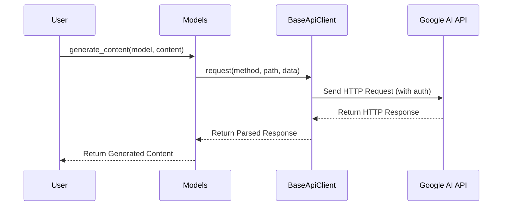

# Chapter 5: BaseApiClient

Welcome back! In the previous chapter, [Automatic Function Calling (AFC)](04_automatic_function_calling__afc_.md), we learned how to make our AI models use external tools. Now, let's peek under the hood and explore the engine that powers the communication between your code and Google's AI services: the `BaseApiClient`.

Imagine you want to send a simple message to a friend using a messaging app. You type your message, hit send, and *poof!* It arrives. But behind the scenes, there's a lot happening: your phone needs to connect to the internet, format your message in a specific way, and send it to the messaging service. The `BaseApiClient` is like that process – it handles all the nitty-gritty details of communicating with the Google Generative AI service.

## Why Do We Need a BaseApiClient?

Think of the `BaseApiClient` as the unsung hero that makes everything else work. Without it, you'd have to manually construct HTTP requests, handle authentication, and parse responses – a lot of complicated work!

The `BaseApiClient` solves this problem by:

*   **Managing the Connection:** It establishes and maintains the connection to the Google Generative AI APIs.
*   **Handling Authentication:** It proves that you have permission to use the AI service, either through an API key or Google Cloud credentials.
*   **Sending Requests:** It formats your requests in the correct way and sends them to the API.
*   **Receiving and Parsing Responses:** It receives the responses from the API and converts them into a format that your code can easily understand.
*   **Error Handling and Retries:** It deals with common issues like network errors and retries requests when necessary.

## Key Concepts: HTTP Communication and Authentication

To understand the `BaseApiClient`, let's break down the key concepts:

*   **HTTP Communication:** This is the standard way that computers communicate over the internet. The `BaseApiClient` uses the `httpx` library (a powerful HTTP client) to send and receive messages (requests and responses) to the Google Generative AI service. Think of it as the language spoken between your code and the AI service.
*   **Authentication:** This is how you prove to the AI service that you are authorized to use it. The `BaseApiClient` handles authentication using either:
    *   **API Key:** A simple string that identifies you. This is typically used with the Gemini API.
    *   **Google Cloud Credentials:** More secure credentials that are used with the Vertex AI API.

## Using the BaseApiClient: Not Directly!

You *don't* directly use the `BaseApiClient` in your code! Instead, the higher-level modules like [Chats Module](02_chats_module.md) and [Models Module](03_models_module.md) use it behind the scenes. It's like the engine of your car - you don't directly interact with it when driving, but it makes the whole car move!

## Under the Hood: How the BaseApiClient Works

Let's take a look at what happens when you use a method like `models.generate_content()` from the [Models Module](03_models_module.md).

Here's a simplified sequence diagram:



**Explanation:**

1.  The user calls a method like `generate_content()` on the `Models` object.
2.  The `Models` module prepares the request and then calls the `request()` method of the `BaseApiClient`.
3.  The `BaseApiClient` constructs an HTTP request, including authentication information (API key or Google Cloud credentials), and sends it to the Google AI API.
4.  The Google AI API processes the request and returns an HTTP response.
5.  The `BaseApiClient` parses the HTTP response and returns the data to the `Models` module.
6.  The `Models` module then formats the response and returns the generated content to the user.

Now, let's look at a code snippet from `google/genai/_api_client.py` to see how the `request` method works:

```python
# From google/genai/_api_client.py

  def request(
      self,
      http_method: str,
      path: str,
      request_dict: dict[str, object],
      http_options: Optional[HttpOptionsOrDict] = None,
  ) -> Union[BaseResponse, Any]:
    http_request = self._build_request(
        http_method, path, request_dict, http_options
    )
    response = self._request(http_request, stream=False)
    json_response = response.json
    if not json_response:
      return BaseResponse(http_headers=response.headers).model_dump(
          by_alias=True
      )
    return json_response
```

**Explanation:**

1.  The `request` method takes the HTTP method (`http_method`), path (`path`), request data (`request_dict`), and HTTP options (`http_options`) as input.
2.  It calls `_build_request` to construct a `HttpRequest` object containing all the details needed for the HTTP request (URL, headers, data).
3.  It then calls the internal `_request` method to send the request using the `httpx` library. This `_request` also handles details such as auth.
4.  It parses the response and returns the JSON data, or a `BaseResponse` object if the response is empty.

Another crucial part of the `BaseApiClient` is how it handles authentication. Let's look at the `_access_token` method:

```python
# From google/genai/_api_client.py

  def _access_token(self) -> str:
    """Retrieves the access token for the credentials."""
    with self._sync_auth_lock:
      if not self._credentials:
        self._credentials, project = _load_auth(project=self.project)
        if not self.project:
          self.project = project

      if self._credentials:
        if self._credentials.expired or not self._credentials.token:
          # Only refresh when it needs to. Default expiration is 3600 seconds.
          _refresh_auth(self._credentials)
        if not self._credentials.token:
          raise RuntimeError('Could not resolve API token from the environment')
        return self._credentials.token  # type: ignore[no-any-return]
      else:
        raise RuntimeError('Could not resolve API token from the environment')
```

**Explanation:**

1.  This method retrieves the access token for authentication. It uses a lock (`self._sync_auth_lock`) to ensure thread safety (important for multi-threaded applications).
2.  If credentials haven't been loaded yet, it loads them using `_load_auth`.
3.  If the credentials have expired, it refreshes them using `_refresh_auth`.
4.  Finally, it returns the access token.

## Conclusion

In this chapter, you've learned about the `BaseApiClient`, the behind-the-scenes engine that powers communication with the Google Generative AI APIs. You've seen how it handles HTTP requests, authentication, and response parsing.

While you don't directly interact with the `BaseApiClient`, understanding its role helps you understand how the `python-genai` library works as a whole.

In the next chapter, we'll explore [HttpOptions](06_httpoptions.md), which allows you to customize the behavior of the `BaseApiClient`, such as setting timeouts and adding custom headers.


---

Generated by [AI Codebase Knowledge Builder](https://github.com/The-Pocket/Tutorial-Codebase-Knowledge)