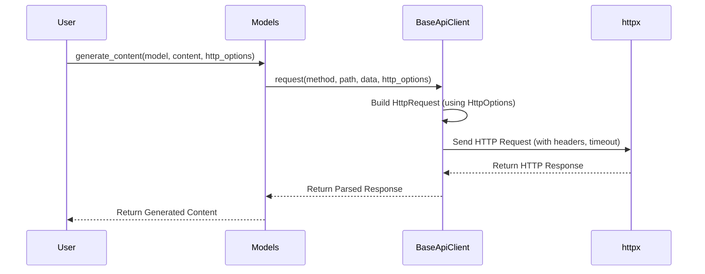

# Chapter 6: HttpOptions

Welcome back! In the previous chapter, [BaseApiClient](05_baseapiclient.md), we dove deep into the `BaseApiClient` and how it handles communication with Google's AI services. Now, let's learn how to *customize* that communication with `HttpOptions`.

Imagine you're ordering food online. You can specify things like "no onions" or "extra sauce". `HttpOptions` is like that special instructions box for your API requests. It allows you to fine-tune how your requests are sent and received.

## Why Use HttpOptions?

Let's say you're building an app that needs to be super responsive. You want to make sure that your API requests don't take too long, or you have a special authorization header you want to send in each request. You can use `HttpOptions` to set a timeout for requests and to add custom headers.

In short, `HttpOptions` allows you to:

*   **Set Timeouts:**  Control how long to wait for a response from the API.
*   **Add Headers:** Include extra information in your request (like authentication tokens or API versions).
*   **Customize Base URL:** Override the default API endpoint.

## Key Concepts: Headers, Timeouts, and Base URLs

Think of `HttpOptions` as a settings panel for your API requests. Here are the key concepts:

*   **Headers:** These are like extra labels you attach to your request. They can provide information about the request itself, like the type of content you're sending, your preferred language, or authorization details. An example header would be `'Content-Type': 'application/json'`, which tells the API that you're sending data in JSON format.
*   **Timeout:** This is the maximum amount of time (in milliseconds) you're willing to wait for a response from the API. If the API doesn't respond within this time, an error is raised. This prevents your application from hanging indefinitely if the API is slow or unavailable.
*   **Base URL:** The foundation URL of the API endpoint. This is especially useful if you want to point to a custom API endpoint. For example, if the gemini API becomes `https://my-custom-gemini.com`, you would change the `base_url` to this value.

## Using HttpOptions: A Timeout Example

Let's create a simple example where we set a timeout for our API request.

```python
from google import genai
from google.generativeai.types import HttpOptions

# Initialize the Client with your API key
client = genai.Client(api_key="YOUR_API_KEY")

# Define HttpOptions with a timeout of 5 seconds (5000 milliseconds)
http_options = HttpOptions(timeout=5000)

# Access the Models module through the client
models = client.models

# Generate content with the specified HttpOptions
response = models.generate_content(
    model='gemini-1.5-flash',
    contents="Write a short poem about cats.",
    http_options=http_options
)

print(response.text)
```

**Explanation:**

1.  We import the `genai` library and `HttpOptions` class.
2.  We create a `Client` object with your API key.
3.  We create an `HttpOptions` object and set the `timeout` to 5000 milliseconds (5 seconds).
4.  We call `models.generate_content()`, passing in the `http_options` object.

If the API takes longer than 5 seconds to respond, you'll get a `TimeoutError`.

## Using HttpOptions: Adding Custom Headers

Now, let's add a custom header to our request. This is useful for things like specifying the API version or providing an authentication token.

```python
from google import genai
from google.generativeai.types import HttpOptions

# Initialize the Client with your API key
client = genai.Client(api_key="YOUR_API_KEY")

# Define HttpOptions with a custom header
http_options = HttpOptions(headers={"X-My-Custom-Header": "MyValue"})

# Access the Models module through the client
models = client.models

# Generate content with the specified HttpOptions
response = models.generate_content(
    model='gemini-1.5-flash',
    contents="Translate 'Hello' to French.",
    http_options=http_options
)

print(response.text)
```

**Explanation:**

1.  We import the `genai` library and `HttpOptions` class.
2.  We create a `Client` object with your API key.
3.  We create an `HttpOptions` object and set the `headers` dictionary to include our custom header, `"X-My-Custom-Header": "MyValue"`.
4.  We call `models.generate_content()`, passing in the `http_options` object.

The API will now receive your request with the `"X-My-Custom-Header"` header included.

## Using HttpOptions: Overriding the Base URL

Sometimes you may want to override the base URL. This can be useful for testing against mock servers or using a custom endpoint.

```python
from google import genai
from google.generativeai.types import HttpOptions

# Initialize the Client with your API key
client = genai.Client(api_key="YOUR_API_KEY")

# Define HttpOptions with a custom base URL
http_options = HttpOptions(base_url="https://my-custom-api.example.com/")

# Access the Models module through the client
models = client.models

# Generate content with the specified HttpOptions
response = models.generate_content(
    model='gemini-1.5-flash',
    contents="Tell me a joke.",
    http_options=http_options
)

print(response.text)
```

**Explanation:**

1.  We import the `genai` library and `HttpOptions` class.
2.  We create a `Client` object with your API key.
3.  We create an `HttpOptions` object and set the `base_url` to our custom URL.
4.  We call `models.generate_content()`, passing in the `http_options` object.

Now, all API requests will be sent to `"https://my-custom-api.example.com/"` instead of the default Google Generative AI API endpoint.

## Behind the Scenes: How HttpOptions Affect Requests

Let's see how `HttpOptions` are used by the `BaseApiClient` to customize the HTTP requests.

Here's a simplified sequence diagram:



**Explanation:**

1.  The user calls `generate_content()` on the `Models` object, providing the model name, content, and `http_options`.
2.  The `Models` module calls the `request()` method of the `BaseApiClient`, passing along the `http_options`.
3.  The `BaseApiClient` uses the `http_options` to build an `HttpRequest` object, setting the headers, timeout, and base URL accordingly.
4.  The `BaseApiClient` uses the `httpx` library to send the HTTP request to the Google Generative AI API, using the settings defined in the `HttpRequest`.
5.  `httpx` returns an HTTP response to the `BaseApiClient`.
6.  The `BaseApiClient` parses the HTTP response and returns the data to the `Models` module.
7.  The `Models` module then formats the response and returns the generated content to the user.

Now, let's look at a code snippet from `google/genai/_api_client.py` to see how the `HttpOptions` are used when building the `HttpRequest`:

```python
# From google/genai/_api_client.py

  def _build_request(
      self,
      http_method: str,
      path: str,
      request_dict: dict[str, object],
      http_options: Optional[HttpOptionsOrDict] = None,
  ) -> HttpRequest:
    # ... skipping some code ...
    # patch the http options with the user provided settings.
    if http_options:
      if isinstance(http_options, HttpOptions):
        patched_http_options = _patch_http_options(
            self._http_options,
            http_options,
        )
      else:
        patched_http_options = _patch_http_options(
            self._http_options, HttpOptions.model_validate(http_options)
        )
    else:
      patched_http_options = self._http_options

    # ... skipping some code ...

    timeout_in_seconds = _get_timeout_in_seconds(patched_http_options.timeout)

    if patched_http_options.headers is None:
      raise ValueError('Request headers must be set.')

    return HttpRequest(
        method=http_method,
        url=url,
        headers=patched_http_options.headers,
        data=request_dict,
        timeout=timeout_in_seconds,
    )
```

**Explanation:**

This code snippet shows how the `_build_request` method uses the `HttpOptions` to construct the `HttpRequest` object. It extracts the headers, timeout, and base URL from the `HttpOptions` and sets them accordingly on the `HttpRequest` object.

## Conclusion

In this chapter, you've learned about `HttpOptions` and how they allow you to customize the HTTP requests made by the `python-genai` library. You've seen how to set timeouts, add custom headers, and override the base URL.

In the next chapter, we'll explore [Types](07_types.md), which defines data types used in different methods of the `python-genai` library.


---

Generated by [AI Codebase Knowledge Builder](https://github.com/The-Pocket/Tutorial-Codebase-Knowledge)