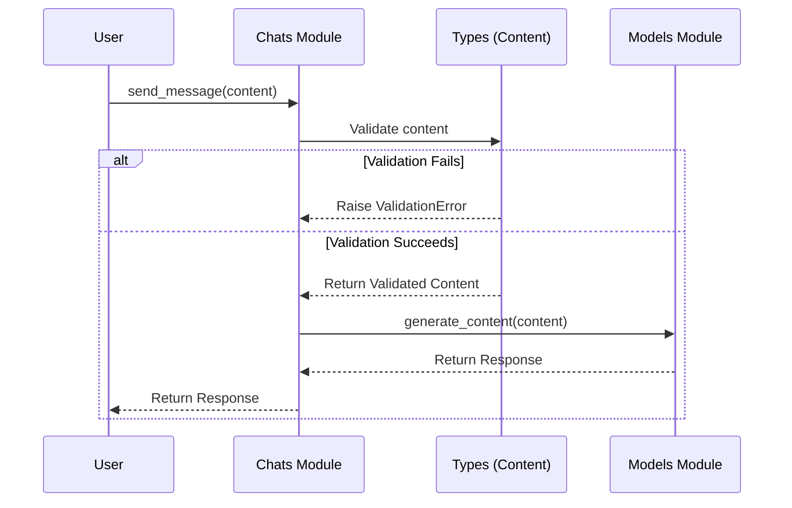

# Chapter 7: Types

Welcome back! In the previous chapter, [HttpOptions](06_httpoptions.md), we learned how to customize our API requests. Now, let's talk about **Types**.

Think of "Types" as the blueprints and building blocks for your AI projects. They define the structure and kind of data you send to and receive from the AI models. Why is this important? Because it helps ensure everything is correctly formatted and organized, preventing errors and making your code more reliable!

## Why Are Types Important?

Imagine you're ordering a custom-built computer. You need to specify things like the amount of RAM, the type of processor, and the size of the hard drive. If you provide the wrong information (e.g., specifying a text string for the RAM), the order will be rejected or, even worse, the computer might not work correctly!

Types in `python-genai` are like that order form. They ensure you're sending the correct data in the correct format to the AI models, and that you're receiving the AI model responses in a way you can easily work with.

The `types` module in `python-genai` provides the data structures used throughout the SDK (Software Development Kit) for request parameters and responses. These structures use Pydantic models and TypedDicts to enforce type safety and data validation.

## Key Concepts: Pydantic Models and TypedDicts

Let's break down the key concepts:

*   **Pydantic Models:** These are like blueprints for data. They define what fields a data structure should have, what type of data each field should hold (e.g., string, integer, list), and any validation rules that should be applied. When you use a Pydantic model, you can be confident that your data is well-formed and meets the required specifications.
*   **TypedDicts:** These are similar to regular Python dictionaries, but they also specify the types of the keys and values they can contain. This adds an extra layer of type safety to your code.

## How Types are Used: A Simple Example

Let's see a practical example of how types are used. In the [Chats Module](02_chats_module.md), when you send a message, you're actually creating a `Content` object. This `Content` object has a specific structure defined by a Pydantic model in the `types` module.

```python
from google import genai
from google.generativeai import types

# Initialize the Client with your API key
client = genai.Client(api_key="YOUR_API_KEY")

# Access the Chats module through the client
chats = client.chats

# Create a chat session using the 'gemini-1.5-flash' model
chat = chats.create(model='gemini-1.5-flash')

# Send a message
message_text = "Tell me a joke."
content = types.Content(parts=[message_text], role="user") # Create Content object

response = chat.send_message(content)

print(response.text)
```

**Explanation:**

1.  We import the `types` module from `google.generativeai`.
2.  We create a `Content` object, which is a fundamental type for representing the content of a message.
3.  We pass the `Content` object to the `chat.send_message()` method.

Behind the scenes, the `send_message` method uses this type information to ensure that it sends the data in the expected format to the Generative AI API.

## Diving Deeper: Exploring the `Content` Type

Let's look at the definition of the `Content` type (simplified) to get a better understanding of Pydantic models:

```python
from typing import List, Optional
from pydantic import BaseModel, Field

class Content(BaseModel):
    """
    Represents the content of a message.
    """
    parts: List[str] = Field(default_factory=list, description="The parts of the content.")
    role: Optional[str] = Field(default="user", description="The role of the content creator.")
```

**Explanation:**

*   We define a class called `Content` that inherits from `BaseModel` (from Pydantic). This makes it a Pydantic model.
*   `parts: List[str]` defines a field called "parts" that is a list of strings. This is where the actual text of your message goes. The `Field` provides additional metadata, such as a description.
*   `role: Optional[str]` defines a field called "role" that is an optional string. It defaults to "user" and describes who created the content (either the user or the AI model).

By using this `Content` type, we can be sure that our messages have the correct structure and data types, which helps prevent errors.

## How Types Enforce Data Validation

Pydantic models also provide data validation. If you try to create a `Content` object with an invalid `role` (e.g., an integer instead of a string), Pydantic will raise a `ValidationError`, letting you know that something is wrong. This helps you catch errors early in the development process.

## Behind the Scenes: Types in Action

Let's take a peek behind the curtain to see how types are used within the `python-genai` library.

Here's a simplified sequence diagram illustrating how types are used when sending a message:



**Explanation:**

1.  The user calls the `send_message()` method on the [Chats Module](02_chats_module.md), passing a `Content` object.
2.  The [Chats Module](02_chats_module.md) uses the `Content` type to validate the data.
3.  If the validation fails, a `ValidationError` is raised, indicating an error in the data.
4.  If the validation succeeds, the validated `Content` object is passed to the [Models Module](03_models_module.md).
5.  The [Models Module](03_models_module.md) uses the `Content` object to generate a response.
6.  The response is returned to the [Chats Module](02_chats_module.md), and then to the user.

## A Look at the Code

While you don't directly interact with the `types` module's internals, knowing they exist can be helpful. The `google/genai/types.py` file is where these data structures are defined using Pydantic and TypedDicts.

## Conclusion

In this chapter, you've learned about the importance of **Types** in the `python-genai` library. You've seen how Pydantic models and TypedDicts help ensure data quality and prevent errors.

While you might not directly define these types yourself, understanding their role will help you better understand how the `python-genai` library works and how to use it effectively.

You now have a comprehensive understanding of the core abstractions. In the future, you can refer back to these chapters to get a better understanding of the library. There are no more guided tutorial chapters for now, but more are being developed.


---

Generated by [AI Codebase Knowledge Builder](https://github.com/The-Pocket/Tutorial-Codebase-Knowledge)