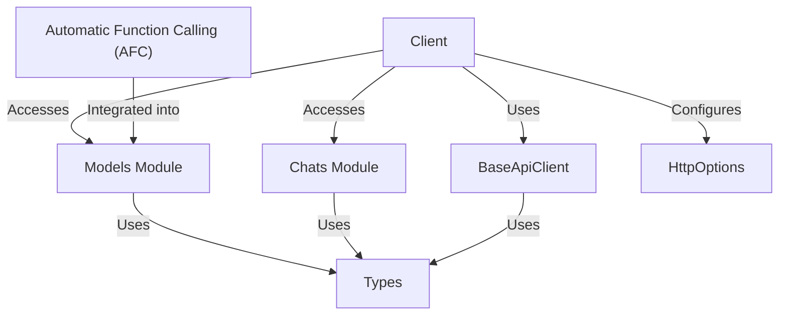

# Tutorial: python-genai

The python-genai project is a Python SDK that allows developers to easily integrate Google's **generative AI models** into their applications. It provides a simple interface for tasks such as *generating text, creating images, having conversations*, and leveraging automatic function calling, supporting both the Gemini API and Vertex AI.

**Source Repository:** [https://github.com/googleapis/python-genai](https://github.com/googleapis/python-genai)

## Chapters

1. [Client](01_client.md)
2. [Chats Module](02_chats_module.md)
3. [Models Module](03_models_module.md)
4. [Automatic Function Calling (AFC)](04_automatic_function_calling__afc_.md)
5. [BaseApiClient](05_baseapiclient.md)
6. [HttpOptions](06_httpoptions.md)
7. [Types](07_types.md)

---

Generated by [AI Codebase Knowledge Builder](https://github.com/The-Pocket/Tutorial-Codebase-Knowledge)