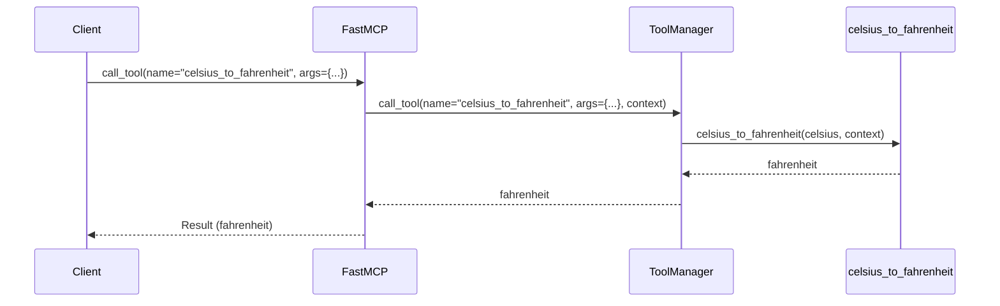

# Chapter 1: `FastMCP`

Welcome! This chapter introduces `FastMCP`, a friendly way to build MCP (Modular Content Platform) servers. Think of it as using building blocks instead of crafting every single brick yourself.

## The Problem: Building MCP Servers Can Be Complex

Imagine you want to create a server that can provide tools and resources to other applications. Let's say you want to build a simple tool that converts temperatures from Celsius to Fahrenheit. Building this from scratch using the raw MCP protocol would involve a lot of low-level details:

*   Parsing incoming JSON-RPC messages.
*   Validating the format of the messages.
*   Handling the different MCP commands.
*   Serializing responses back into JSON-RPC.

That's a lot of work for a simple temperature converter!

`FastMCP` simplifies this by handling all those low-level details for you. It allows you to focus on *what* your server does, not *how* it communicates.

## `FastMCP` to the Rescue: A Pre-Built House

`FastMCP` offers a more ergonomic way to build MCP servers. It's like using a pre-built house template instead of designing every wall and window yourself. It provides tools and structures to define the server's functionality clearly and concisely.

The main idea behind `FastMCP` is to abstract away much of the low-level protocol handling using Python decorators. You simply write your tool or resource functions, and `FastMCP` takes care of exposing them to the MCP world.

**Key Concepts:**

*   **Tools:** Functions that perform specific actions, like our Celsius to Fahrenheit converter.  Tools are exposed via the `@tool` decorator.

*   **Resources:** Data sources, like a weather API or a database. Resources are exposed via the `@resource` decorator.

*   **`Context`:** A helper object that provides access to MCP capabilities like logging, progress reporting, and resource access. You can request a `Context` object as parameter into your tool function to access these capabilities.

## Building a Celsius to Fahrenheit Converter with `FastMCP`

Here's how we can build our Celsius to Fahrenheit converter using `FastMCP`:

```python
from mcp.server.fastmcp import FastMCP, Context

server = FastMCP()

@server.tool()
def celsius_to_fahrenheit(celsius: float, ctx: Context) -> float:
    """Converts Celsius to Fahrenheit."""
    fahrenheit = (celsius * 9/5) + 32
    ctx.info(f"{celsius}°C is {fahrenheit}°F")
    return fahrenheit
```

Explanation:

1.  We create an instance of `FastMCP`: `server = FastMCP()`.  This is the foundation of our server.
2.  We use the `@server.tool()` decorator to register the `celsius_to_fahrenheit` function as an MCP tool. This is how `FastMCP` knows that this function is meant to be exposed. The `ctx: Context` parameter injects a `Context` object.
3.  Inside the function, we perform the Celsius to Fahrenheit conversion and log to the client using the injected `Context`.

Now, to run the server (using standard input/output):

```python
server.run()
```

When this server is running, an MCP client can call the `celsius_to_fahrenheit` tool, providing a Celsius value. The server will convert it to Fahrenheit and return the result. The client will also receive the log message via the `Context`.

Example Input from Client:
```json
{
  "jsonrpc": "2.0",
  "method": "call_tool",
  "params": {
    "name": "celsius_to_fahrenheit",
    "arguments": {
      "celsius": 25.0
    }
  },
  "id": "1"
}
```

High-Level Expected Output: The server will send back a JSON-RPC response with the Fahrenheit value, as well as log a message to the client.

## Under the Hood: How `FastMCP` Works

Let's take a peek behind the curtain to understand how `FastMCP` simplifies the process.

**Simplified Sequence Diagram**



1.  **Client Calls Tool:** The client sends a `call_tool` request to the `FastMCP` server, specifying the tool's name and arguments.
2.  **`FastMCP` Delegates to `ToolManager`:**  `FastMCP` receives the request and uses its internal `ToolManager` (from `src/mcp/server/fastmcp/tools.py`) to locate and execute the requested tool.
3.  **`ToolManager` Calls the Function:** The `ToolManager` calls the registered function, in this case, `celsius_to_fahrenheit`, providing the necessary arguments and a `Context` object.
4.  **Function Executes:** The `celsius_to_fahrenheit` function performs the calculation and returns the result.
5.  **`FastMCP` Sends Response:** `FastMCP` receives the result from the `ToolManager` and sends it back to the client in a JSON-RPC response.

**Code Snippets**

The `FastMCP` class in `src/mcp/server/fastmcp/server.py` handles the registration and execution of tools and resources.

The `tool` decorator is defined in `FastMCP`:
```python
    def tool(
        self, name: str | None = None, description: str | None = None
    ) -> Callable[[AnyFunction], AnyFunction]:
        """Decorator to register a tool."""

        def decorator(fn: AnyFunction) -> AnyFunction:
            self.add_tool(fn, name=name, description=description)
            return fn

        return decorator
```

This decorator simply calls `self.add_tool`, which adds the function to the `ToolManager`.

The `call_tool` function also in `FastMCP` in `src/mcp/server/fastmcp/server.py` is responsible to call the tool using the `ToolManager`:

```python
    async def call_tool(
        self, name: str, arguments: dict[str, Any]
    ) -> Sequence[TextContent | ImageContent | EmbeddedResource]:
        """Call a tool by name with arguments."""
        context = self.get_context()
        result = await self._tool_manager.call_tool(name, arguments, context=context)
        converted_result = _convert_to_content(result)
        return converted_result
```

This method gets a `Context` and calls the underlying `_tool_manager.call_tool`.

## Conclusion

In this chapter, you've learned how `FastMCP` simplifies building MCP servers. By using decorators like `@tool`, you can quickly expose functions as MCP tools without dealing with the complexities of the MCP protocol. This reduces boilerplate and improves development speed.

In the next chapter, we'll dive deeper into the [`Tool`](02__tool__.md) concept, exploring how to define tool inputs and outputs in more detail.


---

Generated by [AI Codebase Knowledge Builder](https://github.com/The-Pocket/Tutorial-Codebase-Knowledge)