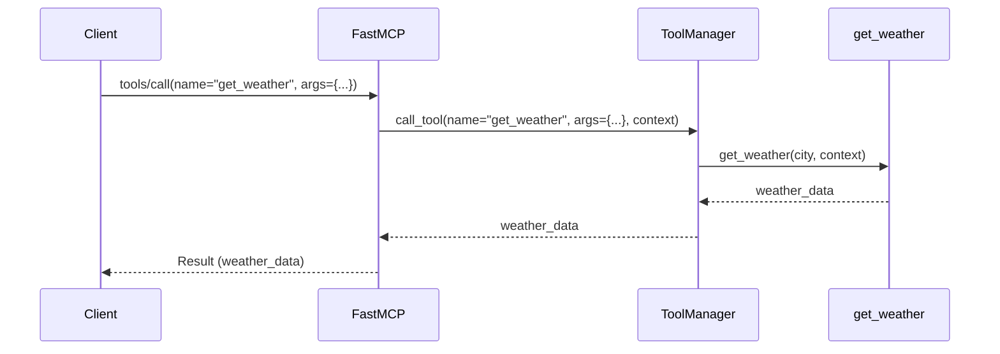

# Chapter 2: `Tool`

Welcome back! In [Chapter 1: `FastMCP`](01__fastmcp__.md), you learned how `FastMCP` helps you build MCP servers easily. We saw how the `@server.tool()` decorator simplifies exposing functions as MCP tools. But what *exactly* *is* a `Tool` and how do you define it properly? That's what we'll explore in this chapter.

## The Problem: LLMs Need Skills

Imagine you're building a smart assistant powered by a Large Language Model (LLM). The LLM is great at understanding language, but it can't *do* anything in the real world on its own. It needs tools!

Let's say you want the LLM to be able to fetch the current weather for a given city. The LLM can't magically know the weather. You need to provide it with a `Tool` that can:

1.  Accept a city name as input.
2.  Call an external weather API.
3.  Return the weather information to the LLM.

Without a `Tool`, the LLM is like a brilliant mind trapped in a box. The `Tool` unlocks its potential by giving it access to the outside world.

## What is a `Tool`?

A `Tool` in `python-sdk` represents a function that the LLM can invoke. Think of it like a skill or a capability that you're giving to the LLM.

Here's the breakdown of a `Tool`:

*   **Name:** A unique identifier for the tool (e.g., "get_weather").
*   **Description:** A human-readable explanation of what the tool does (e.g., "Fetches the current weather for a given city.").  This helps the LLM understand *when* to use the tool.
*   **Input Schema:** This defines the arguments the tool accepts.  It's like a recipe that tells the LLM what ingredients it needs to provide to the tool. This uses the [JSON Schema](https://json-schema.org/) standard to define the structure and types of the input parameters.

In essence, a `Tool` provides a way for you to connect the power of an LLM to your own code and external services.

## Defining a `Tool`

Let's see how to define our "get_weather" tool using `FastMCP`:

```python
from mcp.server.fastmcp import FastMCP, Context

server = FastMCP()

@server.tool(
    name="get_weather",
    description="Fetches the current weather for a given city."
)
def get_weather(city: str, ctx: Context) -> str:
    """This actually fetches weather data (simplified)."""
    # In a real application, you would call a weather API here.
    weather_data = f"The weather in {city} is sunny with a temperature of 25°C."
    ctx.info(f"Fetched weather for {city}")
    return weather_data
```

Explanation:

1.  We use the `@server.tool()` decorator to register the `get_weather` function as a tool.
2.  We provide a `name` and `description` for the tool, which are crucial for the LLM to understand its purpose.
3.  The `city: str` argument defines the input the tool expects - a string representing the city name.
4. We use `ctx.info()` to send a message to the client (which may be the LLM execution environment) that the weather data was fetched.

`FastMCP` automatically generates the `inputSchema` based on the function's arguments and type hints.

## Calling a `Tool`

Once the server is running, an MCP client (potentially an LLM orchestration framework) can call the tool. Here's an example of the JSON-RPC request a client would send:

```json
{
  "jsonrpc": "2.0",
  "method": "tools/call",
  "params": {
    "name": "get_weather",
    "arguments": {
      "city": "London"
    }
  },
  "id": "2"
}
```

Explanation:

*   `method`: `"tools/call"` indicates that we want to call a tool.
*   `name`: `"get_weather"` specifies the tool we want to call.
*   `arguments`: `{ "city": "London" }` provides the input arguments for the tool. The LLM, or the framework interacting with the LLM, provides the correct value here!

The server will execute the `get_weather` function with `city="London"` and send back a response like this:

```json
{
  "jsonrpc": "2.0",
  "id": "2",
  "result": {
    "content": [
      {
        "type": "text",
        "text": "The weather in London is sunny with a temperature of 25°C."
      }
    ],
    "isError": false
  }
}
```

The LLM can then use this weather information to provide a more informative response to the user.

## Under the Hood: How `Tool` Works

Let's explore what happens internally when a `Tool` is called.

**Simplified Sequence Diagram**



1.  **Client Calls `tools/call`:** The client sends a `tools/call` request to the `FastMCP` server, specifying the tool's name and arguments.
2.  **`FastMCP` Delegates to `ToolManager`:** `FastMCP` receives the request and uses its internal `ToolManager` to locate and execute the requested tool.
3.  **`ToolManager` Calls the Function:** The `ToolManager` calls the registered function, in this case, `get_weather`, providing the necessary arguments and a [Context (FastMCP)](04__context___fastmcp__.md) object.
4.  **Function Executes:** The `get_weather` function performs its logic (in this case, simulating fetching weather data) and returns the result.
5.  **`FastMCP` Sends Response:** `FastMCP` receives the result from the `ToolManager` and sends it back to the client in a JSON-RPC response.

**Code Snippets**

The `Tool` class itself is defined in `src/mcp/server/fastmcp/tools/base.py`:

```python
from pydantic import BaseModel, Field
from collections.abc import Callable
from typing import Any

class Tool(BaseModel):
    """Internal tool registration info."""

    fn: Callable[..., Any] = Field(exclude=True)
    name: str = Field(description="Name of the tool")
    description: str = Field(description="Description of what the tool does")
    inputSchema: dict[str, Any]
    # ... other fields ...
```

This class stores all the information about the tool, including the function to be called (`fn`), its name, description, and the `inputSchema`.

The `Tool.from_function` method automatically extracts the `inputSchema` by parsing the function's signature and type hints, using the `func_metadata` utility.

The `call_tool` method inside `FastMCP` (from `src/mcp/server/fastmcp/server.py` as seen in [Chapter 1: `FastMCP`](01__fastmcp__.md)) is responsible for calling the tool using the `ToolManager`.

## Conclusion

In this chapter, you've learned what a `Tool` is and how it enables LLMs to interact with the outside world. You've seen how to define a tool using `FastMCP` and how to call it from a client. Understanding `Tool` is crucial for building powerful MCP servers that can provide useful capabilities to LLMs.

In the next chapter, we'll explore another fundamental concept: [`Resource`](03__resource__.md), which allows you to provide data to the LLM.


---

Generated by [AI Codebase Knowledge Builder](https://github.com/The-Pocket/Tutorial-Codebase-Knowledge)