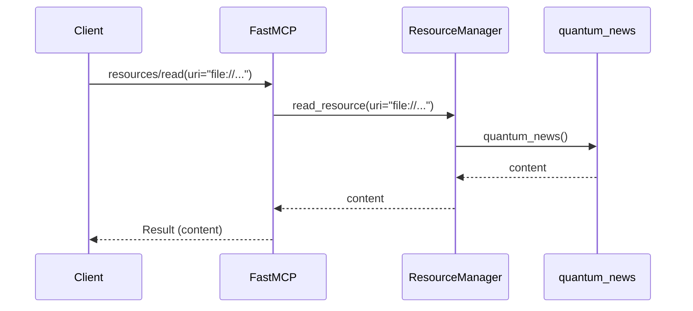

# Chapter 3: `Resource`

Welcome back! In [Chapter 2: `Tool`](02__tool__.md), you learned how `Tool`s allow LLMs to perform actions in the real world. Now, let's explore how to give LLMs access to *data* with `Resource`s.

## The Problem: LLMs Need Information

Imagine an LLM that's trying to answer the question, "What's the latest news about quantum computing?" The LLM itself doesn't inherently *know* the answer. It needs access to a source of information, like a news website or a research paper.

A `Resource` provides a way to expose data to the LLM. Think of it like a library that the LLM can access to find the information it needs.

**Use Case: Exposing a Text File to the LLM**

Let's say you have a file called `quantum_news.txt` that contains recent articles about quantum computing. You want to make this information available to the LLM. A `Resource` allows you to do just that.

## What is a `Resource`?

A `Resource` is a data source that an LLM can access. It's like a webpage that exposes its content. Here's the breakdown:

*   **URI (Uniform Resource Identifier):** A unique address that identifies the resource (e.g., "file:///path/to/quantum_news.txt"). It's like the URL of a website.
*   **Name:** A human-readable name for the resource (e.g., "Quantum News").
*   **Content:** The actual data contained in the resource (e.g., the text from `quantum_news.txt`).

In essence, a `Resource` provides a way to make data accessible to LLMs in a structured and controlled way.

## Defining a `Resource`

Let's see how to define a `Resource` using `FastMCP`:

```python
from mcp.server.fastmcp import FastMCP, Context
import asyncio

server = FastMCP()

@server.resource(
    uri="file:///path/to/quantum_news.txt",
    name="Quantum News"
)
async def quantum_news() -> str:
    """Reads the content of the quantum news file."""
    with open("/path/to/quantum_news.txt", "r") as f:
        return f.read()
```

Explanation:

1.  We use the `@server.resource()` decorator to register the `quantum_news` function as a resource.
2.  We provide a `uri` that specifies the location of the resource. **Important:** You will need to replace `/path/to/quantum_news.txt` with the actual path to a file on your system for this example to work.
3.  We provide a `name` for the resource.
4.  The `quantum_news` function reads the content of the file and returns it as a string.  This is the crucial step where you define *how* the resource's data is accessed. `async` is important for performing async operations.

**Example: `quantum_news.txt`**

```
Quantum computing breakthroughs in 2024:
- New qubit design shows promise.
- Entanglement achieved over record distances.
```

## Accessing a `Resource`

Once the server is running, an MCP client can request the content of the resource. Here's an example of the JSON-RPC request a client would send:

```json
{
  "jsonrpc": "2.0",
  "method": "resources/read",
  "params": {
    "uri": "file:///path/to/quantum_news.txt"
  },
  "id": "3"
}
```

Explanation:

*   `method`: `"resources/read"` indicates that we want to read a resource.
*   `uri`: `"file:///path/to/quantum_news.txt"` specifies the URI of the resource we want to access.

The server will execute the `quantum_news` function and send back a response like this:

```json
{
  "jsonrpc": "2.0",
  "id": "3",
  "result": {
    "contents": [
      {
        "uri": "file:///path/to/quantum_news.txt",
        "mimeType": "text/plain",
        "text": "Quantum computing breakthroughs in 2024:\n- New qubit design shows promise.\n- Entanglement achieved over record distances."
      }
    ]
  }
}
```

The LLM can then use this information to answer questions about quantum computing.

## Under the Hood: How `Resource` Works

Let's explore what happens internally when a `Resource` is accessed.

**Simplified Sequence Diagram**



1.  **Client Calls `resources/read`:** The client sends a `resources/read` request to the `FastMCP` server, specifying the URI of the resource.
2.  **`FastMCP` Delegates to `ResourceManager`:** `FastMCP` receives the request and uses its internal `ResourceManager` (from `src/mcp/server/fastmcp/server.py`) to locate and execute the requested resource.
3.  **`ResourceManager` Calls the Function:** The `ResourceManager` calls the registered function, in this case, `quantum_news`.
4.  **Function Executes:** The `quantum_news` function reads the content of the file and returns the result.
5.  **`FastMCP` Sends Response:** `FastMCP` receives the result from the `ResourceManager` and sends it back to the client in a JSON-RPC response.

**Code Snippets**

The `FastMCP` class in `src/mcp/server/fastmcp/server.py` handles the registration and execution of resources.

The `resource` decorator is defined in `FastMCP`:
```python
    def resource(
        self, uri: str, name: str | None = None, description: str | None = None
    ) -> Callable[[AnyFunction], AnyFunction]:
        """Decorator to register a resource."""

        def decorator(fn: AnyFunction) -> AnyFunction:
            self.add_resource(uri, fn, name=name, description=description)
            return fn

        return decorator
```

This decorator simply calls `self.add_resource`, which adds the function to the `ResourceManager`.

The `read_resource` function also in `FastMCP` in `src/mcp/server/fastmcp/server.py` is responsible to call the resource:

```python
    async def read_resource(self, uri: str) -> Sequence[TextContent | ImageContent | EmbeddedResource]:
        """Read a resource by URI."""
        content = await self._resource_manager.read_resource(uri)
        return content
```

This method calls the underlying `_resource_manager.read_resource`.

## Conclusion

In this chapter, you've learned what a `Resource` is and how it enables LLMs to access data. You've seen how to define a resource using `FastMCP` and how to access it from a client. Understanding `Resource` is crucial for building powerful MCP servers that can provide LLMs with the information they need to perform their tasks.

In the next chapter, we'll explore the [`Context` (FastMCP)](04__context___fastmcp__.md) object, which provides access to MCP capabilities like logging, progress reporting, and resource access within your tools and resources.


---

Generated by [AI Codebase Knowledge Builder](https://github.com/The-Pocket/Tutorial-Codebase-Knowledge)