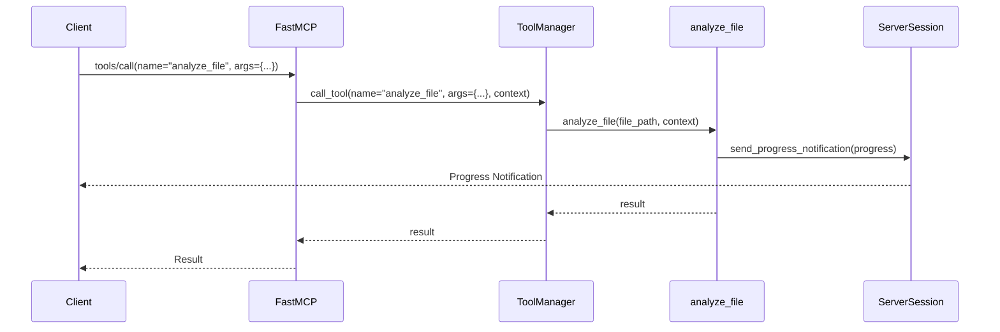

# Chapter 4: `Context` (FastMCP)

Welcome back! In [Chapter 3: `Resource`](03__resource__.md), you learned how `Resource`s allow LLMs to access data. Now, let's explore the `Context` object and how it can help you build more powerful and informative tools and resources.

## The Problem: Tools Need to Communicate

Imagine you're building a tool that analyzes a large file. You want to let the user know how the analysis is progressing. Also, sometimes things go wrong, and you want to log error messages so the user knows what happened.

Without a way to communicate back to the client, your tool is like a black box. You provide input, and it gives you output, but you have no idea what's happening in between. The `Context` object solves this problem by providing a way for your tools to:

*   Log messages (info, warnings, errors)
*   Report progress
*   Access other resources

The `Context` object is your tool's window to the outside world, allowing it to interact with the client and provide valuable feedback.

## What is `Context`?

The `Context` object is like a helper object that gets automatically passed to your tool or resource function. It provides access to various MCP (Modular Content Platform) capabilities. You don't need to create it yourself; `FastMCP` handles that for you.

Think of it as a toolbox filled with useful functions for your tool to use.

**Key capabilities provided by `Context`:**

*   **Logging:**  Allows you to send messages to the client (e.g., "Starting analysis...", "Error: File not found").
*   **Progress Reporting:**  Allows you to inform the client about the progress of a long-running operation (e.g., "25% complete...", "50% complete...").
*   **Resource Access:**  Allows you to read other resources from within your tool.
*   **Request Information:** Access the current request's unique ID.

## Using `Context` in a Tool

Let's see how to use the `Context` object in our file analysis tool:

```python
from mcp.server.fastmcp import FastMCP, Context
import time

server = FastMCP()

@server.tool(
    name="analyze_file",
    description="Analyzes a file and reports progress."
)
def analyze_file(file_path: str, ctx: Context) -> str:
    """Analyzes a file (simplified)."""
    ctx.info(f"Starting analysis of {file_path}")

    # Simulate analysis progress
    for i in range(10):
        time.sleep(0.1)  # Simulate some work
        progress = (i + 1) * 10
        ctx.report_progress(progress, 100) #progress and total

    ctx.info(f"Analysis of {file_path} complete.")
    return f"Analysis results for {file_path}"
```

Explanation:

1.  We add a `ctx: Context` parameter to our `analyze_file` function.  This tells `FastMCP` to automatically inject a `Context` object when the tool is called.
2.  We use `ctx.info()` to send informational messages to the client, logging that the analysis has started and completed. The client (LLM, a user interface) is responsible to display it.
3.  We use `ctx.report_progress()` to send progress updates to the client, indicating how far along the analysis is.

## Example Input and Expected High-Level Outcome

Let's see how an MCP client might call the `analyze_file` tool:

```json
{
  "jsonrpc": "2.0",
  "method": "tools/call",
  "params": {
    "name": "analyze_file",
    "arguments": {
      "file_path": "/path/to/my_file.txt"
    }
  },
  "id": "4"
}
```

**High-Level Outcome:**

When this request is sent to the server, the `analyze_file` tool will be executed.  The client will receive the following:

*   Informational log messages: "Starting analysis of /path/to/my\_file.txt" and "Analysis of /path/to/my\_file.txt complete."
*   Progress updates: The client will receive multiple progress notifications (10%, 20%, ..., 100%) while the analysis is in progress. The presentation depends on the Client.
*   The final result:  "Analysis results for /path/to/my\_file.txt".

## Using Context in Resources

The `Context` object can also be used in resources, for example to access configuration or other resources.

```python
from mcp.server.fastmcp import FastMCP, Context

server = FastMCP()

@server.resource(uri="resource://my_config")
async def my_config(ctx: Context) -> str:
    """Accesses a configuration resource (example)."""
    # Assuming you have a resource at "resource://config_data"
    config_data = await ctx.read_resource("resource://config_data")
    # ... process config data ...
    return str(config_data)

```

In this example, the resource `my_config` depends on the resource `config_data`. It uses `ctx.read_resource` to access the underlying data.

## Under the Hood: How `Context` Works

Let's take a look at what happens behind the scenes when the `Context` object is used.

**Simplified Sequence Diagram**



1.  **Client Calls `tools/call`:** The client sends a `tools/call` request to the `FastMCP` server.
2.  **`FastMCP` Delegates to `ToolManager`:** `FastMCP` receives the request and uses its internal `ToolManager` to execute the tool.  A `Context` object is created and passed to the tool.
3.  **`ToolManager` Calls the Function:** The `ToolManager` calls the `analyze_file` function, providing the `file_path` argument and the `Context` object.
4.  **`analyze_file` Uses `Context`:** The `analyze_file` function uses the `Context` object to send progress notifications to the client via the `ServerSession`.
5.  **`FastMCP` Sends Response:** `FastMCP` receives the result from the `ToolManager` and sends it back to the client.

**Code Snippets**

The `Context` class is defined in `src/mcp/server/fastmcp/server.py`:

```python
class Context(BaseModel, Generic[ServerSessionT, LifespanContextT]):
    """Context object providing access to MCP capabilities."""

    _request_context: RequestContext[ServerSessionT, LifespanContextT] | None
    _fastmcp: FastMCP | None

    # ... methods like report_progress, read_resource, log ...
```

The `Context` class holds a reference to the `RequestContext` and the `FastMCP` instance. This allows it to access the underlying MCP session and other server functionalities.

The `get_context` method in `FastMCP` (also in `src/mcp/server/fastmcp/server.py`) is responsible for creating the `Context` object and making it available to tools:

```python
    def get_context(self) -> Context[ServerSession, object]:
        """
        Returns a Context object. Note that the context will only be valid
        during a request; outside a request, most methods will error.
        """
        try:
            request_context = self._mcp_server.request_context
        except LookupError:
            request_context = None
        return Context(request_context=request_context, fastmcp=self)
```

## Conclusion

In this chapter, you've learned about the `Context` object and how it allows your tools to communicate with the client, report progress, and access other resources. Using the `Context` object makes your tools more informative and easier to debug.

In the next chapter, we'll dive deeper into [`ClientSession` & `ServerSession`](05__clientsession_____serversession__.md), exploring how sessions manage communication between clients and the server.


---

Generated by [AI Codebase Knowledge Builder](https://github.com/The-Pocket/Tutorial-Codebase-Knowledge)