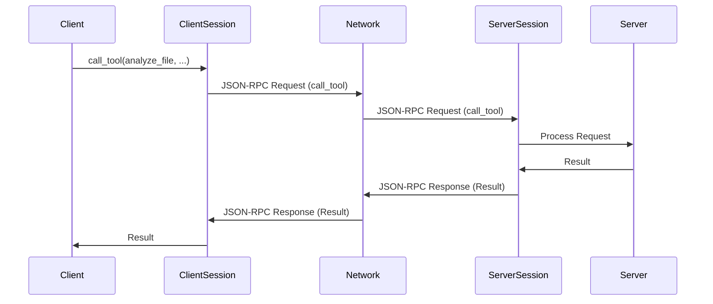

# Chapter 5: `ClientSession` & `ServerSession`

Welcome back! In [Chapter 4: `Context` (FastMCP)](04__context___fastmcp__.md), you learned how the `Context` object helps your tools and resources communicate with the client and report progress. Now, let's talk about the underlying mechanism that makes this communication possible: `ClientSession` and `ServerSession`.

## The Problem: Talking to a Server

Imagine you want to order a pizza online. Your computer (the client) needs to talk to the pizza restaurant's computer (the server). They need a reliable "phone line" to communicate. This "phone line" needs to handle:

*   Sending your order details to the restaurant.
*   Receiving confirmation that your order was received.
*   Handling any errors (e.g., if they're out of pepperoni).
*   Keeping the connection alive while your pizza is being made.

`ClientSession` and `ServerSession` provide this "phone line" for MCP clients and servers. They manage the connection, handle message passing, and deal with errors, so you don't have to worry about the low-level details.

## What are `ClientSession` and `ServerSession`?

Think of `ClientSession` and `ServerSession` as two ends of a telephone line:

*   **`ClientSession`:** Lives on the *client* side. It's responsible for:
    *   Sending requests to the server (e.g., "call_tool", "resources/read").
    *   Receiving responses from the server (e.g., the result of a tool call, the content of a resource).
    *   Handling any errors that occur.
*   **`ServerSession`:** Lives on the *server* side. It's responsible for:
    *   Receiving requests from the client.
    *   Processing the requests (e.g., calling a tool, reading a resource).
    *   Sending responses back to the client.

They work together to provide a reliable and structured way for clients and servers to communicate using the MCP protocol.

## Key Concepts

*   **Connection Management:** Establishing and maintaining the connection between the client and the server.
*   **Message Passing:** Sending and receiving JSON-RPC messages (requests, responses, notifications) between the client and the server.  (We'll learn more about these messages in [Chapter 6: `JSONRPCMessage`](06__jsonrpcmessage__.md).)
*   **Error Handling:** Detecting and handling errors that occur during communication.
*   **Lifecycle Management:** Managing the lifecycle of the connection (e.g., initializing the connection, closing the connection).

## Using `ClientSession` and `ServerSession`

You typically don't interact with `ClientSession` and `ServerSession` directly in `FastMCP`.  `FastMCP` handles their creation and management for you. However, it's essential to understand they are working in the background. You mainly interact with them implicitly via the `Context` object (as shown in [Chapter 4: `Context` (FastMCP)](04__context___fastmcp__.md))!

For example, the `Context` object's `report_progress` method internally uses the `ServerSession` to send progress updates to the client. Similarly, on the client side, calling a tool using the `FastMCPClient` (which uses a `ClientSession` under the hood) sends a request to the server.

Let's revisit our `analyze_file` tool from the previous chapter:

```python
from mcp.server.fastmcp import FastMCP, Context
import time

server = FastMCP()

@server.tool(
    name="analyze_file",
    description="Analyzes a file and reports progress."
)
def analyze_file(file_path: str, ctx: Context) -> str:
    """Analyzes a file (simplified)."""
    ctx.info(f"Starting analysis of {file_path}")

    # Simulate analysis progress
    for i in range(10):
        time.sleep(0.1)  # Simulate some work
        progress = (i + 1) * 10
        ctx.report_progress(progress, 100) #progress and total

    ctx.info(f"Analysis of {file_path} complete.")
    return f"Analysis results for {file_path}"
```

When `ctx.report_progress(progress, 100)` is called, the `Context` object (which has a reference to the `ServerSession`) sends a progress notification to the client using the underlying `ServerSession`. The `ServerSession` takes care of formatting the progress information into a JSON-RPC message and sending it over the connection to the client. The `ClientSession` on the client-side receives this message and handles it accordingly (e.g., displaying a progress bar).

## Under the Hood: How Sessions Work

Let's explore how the `ClientSession` and `ServerSession` manage communication behind the scenes.

**Simplified Sequence Diagram**



1.  **Client Calls Tool:** The client initiates a `call_tool` request.
2.  **`ClientSession` Sends Request:** The `ClientSession` takes the request, formats it into a JSON-RPC message, and sends it over the network.
3.  **`ServerSession` Receives Request:** The `ServerSession` receives the JSON-RPC message from the network.
4.  **`Server` Processes Request:** The `ServerSession` passes the request to the appropriate handler on the server (e.g., the `ToolManager` in `FastMCP`).
5.  **`ServerSession` Sends Response:**  The `ServerSession` receives the result from the handler, formats it into a JSON-RPC message, and sends it back over the network.
6.  **`ClientSession` Receives Response:** The `ClientSession` receives the JSON-RPC message from the network.
7.  **Client Receives Result:** The `ClientSession` extracts the result from the JSON-RPC message and returns it to the client.

**Code Snippets**

Let's look at some relevant code snippets from `src/mcp/client/session.py` and `src/mcp/server/session.py`.

*   **`ClientSession.call_tool`:**

```python
    async def call_tool(
        self,
        name: str,
        arguments: dict[str, Any] | None = None,
        read_timeout_seconds: timedelta | None = None,
    ) -> types.CallToolResult:
        """Send a tools/call request."""
        return await self.send_request(
            types.ClientRequest(
                types.CallToolRequest(
                    method="tools/call",
                    params=types.CallToolRequestParams(name=name, arguments=arguments),
                )
            ),
            types.CallToolResult,
            request_read_timeout_seconds=read_timeout_seconds,
        )
```

This method creates a `CallToolRequest` and uses the `send_request` method to send it to the server.

*   **`ServerSession._received_request`:**

```python
    async def _received_request(
        self, responder: RequestResponder[types.ClientRequest, types.ServerResult]
    ):
        match responder.request.root:
            case types.InitializeRequest(params=params):
                self._initialization_state = InitializationState.Initializing
                self._client_params = params
                with responder:
                    await responder.respond(
                        types.ServerResult(
                            types.InitializeResult(
                                protocolVersion=types.LATEST_PROTOCOL_VERSION,
                                capabilities=self._init_options.capabilities,
                                serverInfo=types.Implementation(
                                    name=self._init_options.server_name,
                                    version=self._init_options.server_version,
                                ),
                                instructions=self._init_options.instructions,
                            )
                        )
                    )
            case _:
                if self._initialization_state != InitializationState.Initialized:
                    raise RuntimeError(
                        "Received request before initialization was complete"
                    )
```

This method handles incoming requests from the client.  It checks for the `InitializeRequest` to ensure the connection is properly initialized.

*   **`BaseSession.send_notification`:**

Both `ClientSession` and `ServerSession` inherit from `BaseSession` and use its `send_notification` method:

```python
    async def send_notification(self, notification: SendNotificationT) -> None:
        """
        Emits a notification, which is a one-way message that does not expect
        a response.
        """
        jsonrpc_notification = JSONRPCNotification(
            jsonrpc="2.0",
            **notification.model_dump(by_alias=True, mode="json", exclude_none=True),
        )

        await self._write_stream.send(JSONRPCMessage(jsonrpc_notification))
```

This method formats the notification into a JSON-RPC message and sends it to the other end of the connection.

## Conclusion

In this chapter, you've learned about `ClientSession` and `ServerSession` and how they act as the communication managers between MCP clients and servers. While you don't directly interact with them in `FastMCP`, understanding their role is crucial for understanding how your tools and resources communicate with the outside world, enabling features such as reporting progress or accessing configuration data.

In the next chapter, we'll explore the [`JSONRPCMessage`](06__jsonrpcmessage__.md) format, which is used to structure the messages that are sent between the client and the server.


---

Generated by [AI Codebase Knowledge Builder](https://github.com/The-Pocket/Tutorial-Codebase-Knowledge)