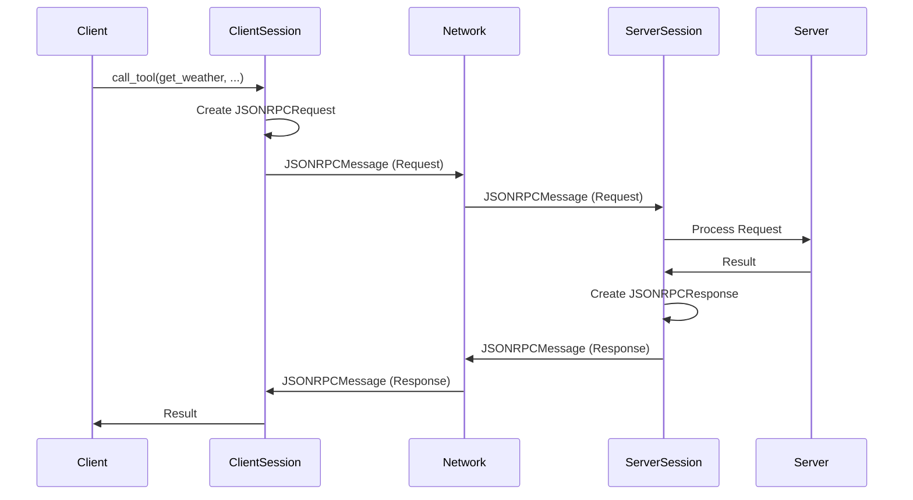

# Chapter 6: `JSONRPCMessage`

Welcome back! In [Chapter 5: `ClientSession` & `ServerSession`](05__clientsession_____serversession__.md), you learned about how sessions manage the communication between clients and servers. Now, let's talk about the *format* of the messages that are sent back and forth: the `JSONRPCMessage`.

## The Problem: Speaking the Same Language

Imagine two people trying to talk to each other, but they speak different languages and have no agreed-upon structure. It would be chaos! Similarly, MCP clients and servers need a standard way to format their messages so they can understand each other.

The `JSONRPCMessage` solves this problem by providing a standardized "envelope" for all communication. It ensures that clients and servers can reliably exchange requests, responses, notifications, and errors.

**Analogy:** Think of a `JSONRPCMessage` as a postal envelope. It contains information about:

*   **Who it's for:** (The server or client)
*   **What's inside:** (The actual request, response, or notification)
*   **Important details:** (Like the protocol version and message ID)

By using this standard "envelope," everyone knows how to package and read the message, making communication much smoother.

## What is a `JSONRPCMessage`?

A `JSONRPCMessage` is the fundamental unit of communication in MCP. It's a structured JSON object that can represent four different types of messages:

1.  **Request:** A message from the client to the server asking it to do something (e.g., call a tool, read a resource). It *requires* a response.
2.  **Response:** A message from the server to the client, providing the result of a request.
3.  **Notification:** A one-way message from either the client or the server, informing the other party about something (e.g., progress update, logging message). It *doesn't* require a response.
4.  **Error:** A message indicating that something went wrong.

**Key Concepts:**

*   **`jsonrpc`:** A string indicating the version of the JSON-RPC protocol being used (always `"2.0"` in MCP).
*   **`id`:** A unique identifier for each request, used to match responses to requests.  Notifications don't have an `id`.
*   **`method`:** A string specifying the operation to be performed (e.g., `"tools/call"`, `"resources/read"`).
*   **`params`:** A JSON object containing the parameters for the method.
*   **`result`:** A JSON object containing the result of the method (only in responses).
*   **`error`:** A JSON object containing information about an error (only in error messages).

## Example `JSONRPCMessage` Types

Let's look at some examples of different `JSONRPCMessage` types.

**1. Request:**

```json
{
  "jsonrpc": "2.0",
  "method": "tools/call",
  "params": {
    "name": "get_weather",
    "arguments": {
      "city": "London"
    }
  },
  "id": "123"
}
```

Explanation:

*   `jsonrpc`:  Indicates that this is a JSON-RPC 2.0 message.
*   `method`:  Specifies that we want to call the `"tools/call"` method.
*   `params`:  Provides the name of the tool (`"get_weather"`) and its arguments (`{ "city": "London" }`).
*   `id`:  A unique identifier (`"123"`) so the client can match this request with the server's response.

**2. Response:**

```json
{
  "jsonrpc": "2.0",
  "id": "123",
  "result": {
    "content": [
      {
        "type": "text",
        "text": "The weather in London is sunny with a temperature of 20°C."
      }
    ],
    "isError": false
  }
}
```

Explanation:

*   `jsonrpc`:  Indicates that this is a JSON-RPC 2.0 message.
*   `id`:  Matches the `id` of the original request (`"123"`).
*   `result`:  Contains the result of the `get_weather` tool call, which is the weather information.

**3. Notification:**

```json
{
  "jsonrpc": "2.0",
  "method": "notifications/progress",
  "params": {
    "progressToken": "123",
    "progress": 50,
    "total": 100
  }
}
```

Explanation:

*   `jsonrpc`:  Indicates that this is a JSON-RPC 2.0 message.
*   `method`:  Specifies that this is a `"notifications/progress"` notification.
*   `params`:  Provides the progress information (50% complete).
*   Notice that there is *no* `id` because notifications don't require a response.

**4. Error:**

```json
{
  "jsonrpc": "2.0",
  "id": "123",
  "error": {
    "code": -32602,
    "message": "Invalid params",
    "data": "Missing required parameter: city"
  }
}
```

Explanation:

*   `jsonrpc`:  Indicates that this is a JSON-RPC 2.0 message.
*   `id`:  Matches the `id` of the original request (`"123"`).
*   `error`:  Contains information about the error, including a code, a message, and optional data.

## How `JSONRPCMessage`s Are Used

You don't typically create `JSONRPCMessage` objects directly in `FastMCP`. The `ClientSession` and `ServerSession` (covered in [Chapter 5: `ClientSession` & `ServerSession`](05__clientsession_____serversession__.md)) handle the creation and parsing of these messages for you.

For example, when you call `ctx.report_progress()` in your tool function, the `ServerSession` automatically creates a `JSONRPCMessage` of type `Notification` and sends it to the client. Similarly, when the client calls `client.call_tool()`, the `ClientSession` creates a `JSONRPCMessage` of type `Request` and sends it to the server.

## Under the Hood: How `JSONRPCMessage` Works

Let's take a simplified look at how `JSONRPCMessage`s are used in the communication flow.

**Simplified Sequence Diagram**



1.  **Client Calls Tool:** The client initiates a `call_tool` request.
2.  **`ClientSession` Creates `JSONRPCRequest`:** The `ClientSession` takes the request parameters and creates a `JSONRPCMessage` of type `Request`.
3.  **`ClientSession` Sends `JSONRPCMessage`:** The `ClientSession` sends the `JSONRPCMessage` over the network.
4.  **`ServerSession` Receives `JSONRPCMessage`:** The `ServerSession` receives the `JSONRPCMessage` from the network.
5.  **`Server` Processes Request:** The `ServerSession` extracts the request parameters and passes them to the appropriate handler on the server.
6.  **`ServerSession` Creates `JSONRPCResponse`:** The `ServerSession` receives the result from the handler and creates a `JSONRPCMessage` of type `Response`.
7.  **`ServerSession` Sends `JSONRPCMessage`:** The `ServerSession` sends the `JSONRPCMessage` back over the network.
8.  **`ClientSession` Receives `JSONRPCMessage`:** The `ClientSession` receives the `JSONRPCMessage` from the network.
9.  **Client Receives Result:** The `ClientSession` extracts the result from the `JSONRPCMessage` and returns it to the client.

**Code Snippets**

The `JSONRPCMessage` class is defined in `src/mcp/types.py`:

```python
class JSONRPCMessage(
    RootModel[JSONRPCRequest | JSONRPCNotification | JSONRPCResponse | JSONRPCError]
):
    pass
```

It's a `RootModel` that can hold any of the four message types.

The `BaseSession` class (used by both `ClientSession` and `ServerSession`) handles the creation and parsing of `JSONRPCMessage`s. For example, the `send_request` method in `BaseSession` creates a `JSONRPCRequest`:

```python
        jsonrpc_request = JSONRPCRequest(
            jsonrpc="2.0",
            id=request_id,
            **request.model_dump(by_alias=True, mode="json", exclude_none=True),
        )

        await self._write_stream.send(JSONRPCMessage(jsonrpc_request))
```

This code snippet shows how a `JSONRPCRequest` is created with the correct `jsonrpc` version, a unique `id`, and the request parameters. It's then wrapped in a `JSONRPCMessage` and sent over the network.

## Conclusion

In this chapter, you've learned about the `JSONRPCMessage` format and how it provides a standardized way for MCP clients and servers to communicate. You've seen examples of the four different message types (Request, Response, Notification, and Error) and how they are used in the communication flow. Understanding `JSONRPCMessage` is crucial for understanding how MCP works under the hood, even though you don't directly interact with them in `FastMCP`.

In the next chapter, we'll take a lower-level look at building an MCP [`Server` (lowlevel)](07__server___lowlevel__.md) without using `FastMCP`.


---

Generated by [AI Codebase Knowledge Builder](https://github.com/The-Pocket/Tutorial-Codebase-Knowledge)