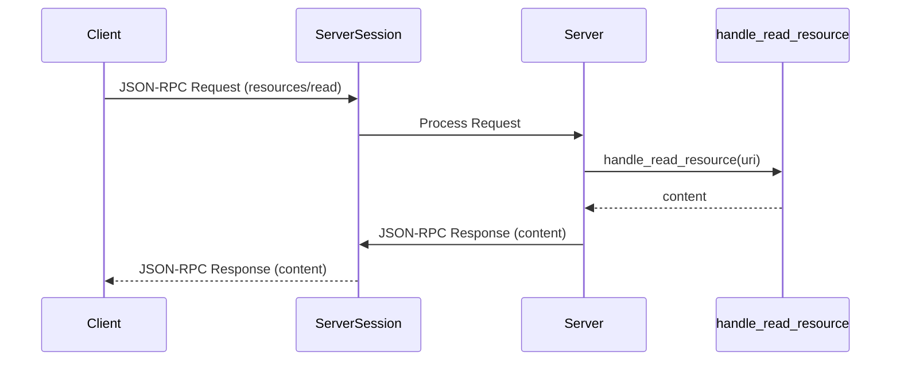

# Chapter 7: `Server` (lowlevel)

Welcome back! In [Chapter 6: `JSONRPCMessage`](06__jsonrpcmessage__.md), you learned about the format of messages exchanged between MCP clients and servers. Now, let's go a level deeper and explore how to build an MCP server from scratch, without using `FastMCP`. This chapter introduces the lowlevel `Server` class, offering a more granular approach to server development.

## The Problem: Complete Control

Imagine you're building a very specialized MCP server. You need to customize *everything* – the way requests are handled, the format of responses, and even the underlying communication protocol. `FastMCP`, while convenient, might not give you enough control for such a project.

**Central Use Case: A Highly Customized Resource Server**

Let's say you want to build a server that provides access to a database, but you want to implement custom authentication, fine-grained access control, and a specialized caching mechanism. `FastMCP`'s building blocks might not fit your exact needs. You need more direct control over the server's internals.

The lowlevel `Server` class allows you to build your MCP server piece by piece. It's like building a car engine from individual parts instead of using a pre-built engine block. It requires more work, but it gives you the freedom to optimize and customize every aspect of your server.

## Key Concepts

The lowlevel `Server` handles several core concepts:

1.  **Request Handlers:** Functions that are called when the server receives a specific type of request (e.g., `resources/read`).
2.  **Notification Handlers:** Functions that handle notifications sent by the client.
3.  **Initialization Options:** Configuration settings for the server, such as its name, version, and supported capabilities.
4.  **Server Session:** Manages the communication channel between the client and the server, handling message passing and error handling (just like in [Chapter 5: `ClientSession` & `ServerSession`](05__clientsession_____serversession__.md)).
5.  **Lifespan Context:** Manages the server's startup and shutdown processes, allowing you to perform tasks like initializing resources or cleaning up connections.

## Building a Simple Resource Server

Let's build a very basic resource server that provides access to a static string:

```python
import asyncio
import mcp.types as types
from mcp.server.lowlevel import Server, NotificationOptions
from mcp.server.models import InitializationOptions
from anyio.streams.memory import MemoryObjectReceiveStream, MemoryObjectSendStream

async def main():
    server = Server("MyResourceServer")

    @server.read_resource()
    async def handle_read_resource(uri: str) -> str:
        if uri == "resource://my_data":
            return "Hello from the lowlevel server!"
        else:
            raise ValueError(f"Unknown resource: {uri}")

    async with mcp.server.stdio.stdio_server() as (read_stream, write_stream):
        await server.run(
            read_stream,
            write_stream,
            InitializationOptions(
                server_name="MyResourceServer",
                server_version="1.0",
                capabilities=server.get_capabilities(
                    notification_options=NotificationOptions(),
                    experimental_capabilities={},
                ),
                instructions="Provides access to a static string.",
            ),
        )

asyncio.run(main())
```

Explanation:

1.  We create an instance of the `Server` class, giving it a name: `server = Server("MyResourceServer")`.
2.  We define a request handler for reading resources using the `@server.read_resource()` decorator. This decorator associates the `handle_read_resource` function with the `resources/read` method.
3.  Inside `handle_read_resource`, we check the requested URI and return a static string if it matches "resource://my\_data".
4.  We use `mcp.server.stdio.stdio_server()` to create input and output streams for communication.
5. We call the `server.run` function to begin processing requests from a client.
6.  We construct `InitializationOptions`, specifying the server's name, version, and capabilities. The `get_capabilities` method tells the server what types of requests it can handle.

To run this server, you would need an MCP client to send a `resources/read` request with the URI "resource://my\_data". The server would then respond with the string "Hello from the lowlevel server!".

Example Client Input:
```json
{
  "jsonrpc": "2.0",
  "method": "resources/read",
  "params": {
    "uri": "resource://my_data"
  },
  "id": "1"
}
```

High-Level Expected Output: The server will send back a JSON-RPC response with the string "Hello from the lowlevel server!".

## Under the Hood: How the Lowlevel `Server` Works

Let's explore the internal workings of the lowlevel `Server`.

**Simplified Sequence Diagram**



1.  **Client Sends Request:** The client sends a `resources/read` request to the server.
2.  **`ServerSession` Receives Request:** The `ServerSession` receives the JSON-RPC message.
3.  **`Server` Processes Request:** The `Server` receives the request from the `ServerSession` and determines the appropriate handler.
4.  **`handle_read_resource` Executes:** The `Server` calls the `handle_read_resource` function, passing the URI as an argument.
5.  **`Server` Sends Response:** The `Server` receives the content from `handle_read_resource` and uses the `ServerSession` to send a JSON-RPC response back to the client.

**Code Snippets**

Let's examine some code snippets from `src/mcp/server/lowlevel/server.py`.

*   **`Server.read_resource`:**

```python
    def read_resource(self):
        def decorator(
            func: Callable[
                [AnyUrl], Awaitable[str | bytes | Iterable[ReadResourceContents]]
            ],
        ):
            logger.debug("Registering handler for ReadResourceRequest")

            async def handler(req: types.ReadResourceRequest):
                result = await func(req.params.uri)
                # ... (Code to format the result) ...

            self.request_handlers[types.ReadResourceRequest] = handler
            return func

        return decorator
```

This code shows how the `@server.read_resource` decorator registers a handler function for the `ReadResourceRequest`. The `handler` function is responsible for calling the user-defined function and formatting the result into a `ServerResult`.

*   **`Server._handle_request`:**

```python
    async def _handle_request(
        self,
        message: RequestResponder[types.ClientRequest, types.ServerResult],
        req: Any,
        session: ServerSession,
        lifespan_context: LifespanResultT,
        raise_exceptions: bool,
    ):
        logger.info(f"Processing request of type {type(req).__name__}")
        if type(req) in self.request_handlers:
            handler = self.request_handlers[type(req)]
            logger.debug(f"Dispatching request of type {type(req).__name__}")

            # ... (Code to call the handler and send the response) ...
```

This code snippet shows how the `Server` class receives a request and dispatches it to the appropriate handler function. It retrieves the handler from the `self.request_handlers` dictionary and calls it with the request parameters.

## Conclusion

In this chapter, you've learned how to build an MCP server from scratch using the lowlevel `Server` class. You've seen how to define request handlers, configure the server with initialization options, and handle communication using the `ServerSession`. This approach gives you maximum control over your server's behavior, allowing you to build highly customized solutions.

In the next chapter, we'll explore the different [`types`](08__types__.md) used in the `python-sdk`, which define the structure of requests, responses, and other data exchanged between clients and servers.


---

Generated by [AI Codebase Knowledge Builder](https://github.com/The-Pocket/Tutorial-Codebase-Knowledge)