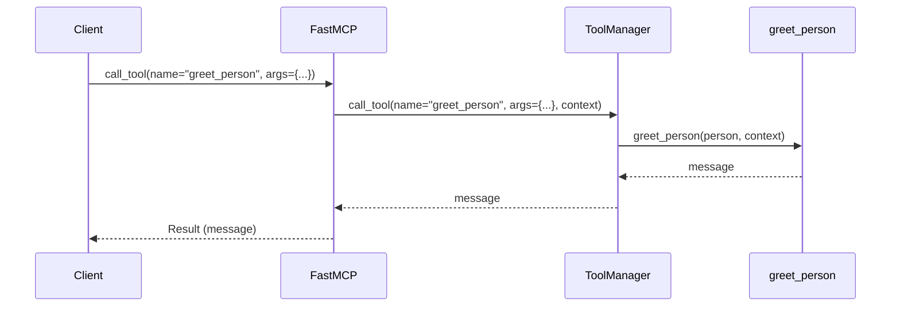

# Chapter 8: `types`

Welcome back! In [Chapter 7: `Server` (lowlevel)](07__server___lowlevel__.md), you learned how to build an MCP server from scratch using the lowlevel `Server` class. Now, let's zoom out and look at the bigger picture: all the different `types` that are used in the `python-sdk` library.

## The Problem: A Shared Vocabulary

Imagine you're trying to build a Lego castle with a friend. But you each have a different set of instructions and call the same pieces by different names! It would be very difficult to build anything together.

Similarly, in MCP, clients and servers need to agree on a common vocabulary for the data they exchange. This is where the `types` module comes in. It defines all the data structures used for MCP communication, like the shapes and names of all the Lego bricks in our analogy.

**Central Use Case: Defining a `Tool` and its Input**

Let's say you want to define a tool that takes a person's name and age as input. You need a way to specify the structure of this input data so that both the client (which calls the tool) and the server (which executes the tool) understand it the same way. The `types` module provides the building blocks for defining this structure.

By using the `types` defined in the `python-sdk`, we ensure that clients and servers can seamlessly exchange information according to the MCP specification. Think of it as having a standardized dictionary for MCP communication.

## Key Concepts

The `types` module defines data structures for:

1.  **Requests:** Messages from the client to the server (e.g., `CallToolRequest`, `ReadResourceRequest`).
2.  **Responses:** Messages from the server to the client, providing the results of requests (e.g., `CallToolResult`, `ReadResourceResult`).
3.  **Notifications:** One-way messages, typically for updates or logging (e.g., `ProgressNotification`, `LoggingMessageNotification`).
4.  **Data Types:** The building blocks for the above, such as `Tool`, `Resource`, `Prompt`, and basic data types like strings, numbers, and booleans.

Let's dive into some of these key types.

*   **`Tool`:** Represents a function that can be called by the client. It includes the tool's name, description, and input schema (what arguments it accepts). We covered this in [Chapter 2: `Tool`](02__tool__.md).

*   **`Resource`:** Represents a data source that the client can access. It includes the resource's URI, name, and description. We covered this in [Chapter 3: `Resource`](03__resource__.md).

*   **`CallToolRequest`:** A specific type of request that asks the server to execute a `Tool`. It includes the name of the tool and the arguments to pass to it.

*   **`CallToolResult`:** The response from the server after executing a `Tool`. It includes the result of the tool and an indicator of whether an error occurred.

## Using `types` to Define a Tool

Let's revisit our "name and age" tool and see how we can use the `types` module to define its input:

```python
from pydantic import BaseModel, Field

class PersonInput(BaseModel):
    name: str = Field(description="The person's name")
    age: int = Field(description="The person's age")
```

Explanation:

1.  We use Pydantic's `BaseModel` to define a class called `PersonInput`. This class will represent the input data for our tool.
2.  We define two fields: `name` (a string) and `age` (an integer).
3.  We use `Field` to provide descriptions for each field. These descriptions are important for the client to understand what data is expected.

Now, let's define the tool using `FastMCP`:

```python
from mcp.server.fastmcp import FastMCP, Context
from typing import Annotated

server = FastMCP()

@server.tool(
    name="greet_person",
    description="Greets a person with their name and age."
)
def greet_person(person: Annotated[PersonInput, "The person to greet"], ctx: Context) -> str:
    """Greets the person."""
    message = f"Hello, {person.name}! You are {person.age} years old."
    ctx.info(message)
    return message
```

Explanation:

1. We use `PersonInput` as an annotation for parameter `person` in the `greet_person` tool.

2.  `FastMCP` will automatically generate the `inputSchema` for the `greet_person` tool from `PersonInput`, including the field descriptions.

Example Input from Client:
```json
{
  "jsonrpc": "2.0",
  "method": "tools/call",
  "params": {
    "name": "greet_person",
    "arguments": {
      "person": {
        "name": "Alice",
        "age": 30
      }
    }
  },
  "id": "1"
}
```

High-Level Expected Outcome: The server will execute the `greet_person` tool with the provided name and age, and send back a greeting message to the client, for example: "Hello, Alice! You are 30 years old.".

## Under the Hood: How `types` Work

The `types` module provides the data structures, and libraries like `pydantic` enable validation and serialization.

**Simplified Sequence Diagram**



1.  **Client Calls Tool:** The client sends a `call_tool` request to the `FastMCP` server, specifying the tool's name and arguments (including `person` with `name` and `age`).
2.  **`FastMCP` Delegates to `ToolManager`:** `FastMCP` receives the request and uses its internal `ToolManager` to locate and execute the requested tool.
3.  **`ToolManager` Calls the Function:** The `ToolManager` calls the registered function, in this case, `greet_person`, providing the necessary arguments. Pydantic automatically validates and converts the JSON data to the `PersonInput` type.
4.  **Function Executes:** The `greet_person` function uses the `name` and `age` fields from the `PersonInput` object to construct the greeting message.
5.  **`FastMCP` Sends Response:** `FastMCP` receives the result from the `ToolManager` and sends it back to the client in a JSON-RPC response.

**Code Snippets**

The `types` module defines many classes like `Tool`, `Resource`, `CallToolRequest`, etc. (See `src/mcp/types.py`). Libraries like `pydantic` are used extensively for data validation and serialization.

For instance, when processing a `CallToolRequest`, `FastMCP` uses Pydantic to validate the input arguments against the tool's `inputSchema`. If the input data doesn't match the schema, Pydantic will raise an error, preventing the tool from being executed with invalid data.

## Conclusion

In this chapter, you've learned about the importance of the `types` module in defining a shared vocabulary for MCP communication. You've seen how to use these types, along with Pydantic, to define the structure of data exchanged between clients and servers, ensuring seamless and reliable communication. Understanding the `types` module is crucial for building robust and well-defined MCP applications. You can explore all `types` in `src/mcp/types.py`.

Congratulations! You have now completed the core tutorials for `python-sdk`. You can now go back and dive deeper into any chapter and read the source code!


---

Generated by [AI Codebase Knowledge Builder](https://github.com/The-Pocket/Tutorial-Codebase-Knowledge)